# FOSS Training — The Definitive Powerhouse Expansion Roadmap

> **Document Status**: Strategic Vision & Technical Specification  
> **Target Platforms**: Backend (`foss-training-api`), Web Client (`foss-training-web`), iOS Native (`foss-training-ios`)  
> **Core Tenet**: 100% Data Sovereignty, Scientific Parity, Zero Vendor Lock-in, Offline-First Resiliency

---

## Table of Contents
1. [Executive Summary & Architectural North Star](#1-executive-summary--architectural-north-star)
2. [Endurance & Multi-Sport Science: Cycling, Running, Swimming & Triathlon](#2-endurance--multi-sport-science-cycling-running-swimming--triathlon)
   - [2.1 Cycling Performance Metrics & Engine](#21-cycling-performance-metrics--engine)
   - [2.2 Running Dynamics & Biomechanics Engine](#22-running-dynamics--biomechanics-engine)
   - [2.3 Swimming Lap & Stroke Analytics Engine](#23-swimming-lap--stroke-analytics-engine)
   - [2.4 Triathlon & Multi-Discipline Architecture](#24-triathlon--multi-discipline-architecture)
   - [2.5 Standard Telemetry Ingestion (FIT, GPX, TCX, BLE FTMS)](#25-standard-telemetry-ingestion-fit-gpx-tcx-ble-ftms)
3. [Strategic Evaluation: Monetization & Advertising (Is Google AdSense the Best Option?)](#3-strategic-evaluation-monetization--advertising-is-google-adsense-the-best-option)
   - [3.1 Critical Flaws of Google AdSense for FOSS Training](#31-critical-flaws-of-google-adsense-for-foss-training)
   - [3.2 The Superior Advertising Alternatives](#32-the-superior-advertising-alternatives)
   - [3.3 Higher-Yield FOSS Monetization Models](#33-higher-yield-foss-monetization-models)
   - [3.4 Concrete Implementation Architecture for Ad Slots](#34-concrete-implementation-architecture-for-ad-slots)
4. [Strategy for the Premium Feature (Hiding for Now & Future Phasing)](#4-strategy-for-the-premium-feature-hiding-for-now--future-phasing)
   - [4.1 Why Hiding Premium Now is Essential](#41-why-hiding-premium-now-is-essential)
   - [4.2 Code-Level Feature Flag Implementation](#42-code-level-feature-flag-implementation)
   - [4.3 Future Rollout Roadmap for Premium Tiers](#43-future-rollout-roadmap-for-premium-tiers)
5. [The Exhaustive Powerhouse Addition Catalog](#5-the-exhaustive-powerhouse-addition-catalog)
   - [5.1 Wearable, Hardware & Real-Time Sensor Ecosystem](#51-wearable-hardware--real-time-sensor-ecosystem)
   - [5.2 Computer Vision & Biomechanical Video Tracking](#52-computer-vision--biomechanical-video-tracking)
   - [5.3 Advanced Exercise Science, Recovery & HRV Physiology](#53-advanced-exercise-science-recovery--hrv-physiology)
   - [5.4 Algorithmic Periodization & Intelligent Program Generator](#54-algorithmic-periodization--intelligent-program-generator)
   - [5.5 Nutrition, Hydration & Intra-Workout Fueling Engine](#55-nutrition-hydration--intra-workout-fueling-engine)
   - [5.6 Coaching Portal, Multi-Tenancy & Social Competition](#56-coaching-portal-multi-tenancy--social-competition)
   - [5.7 Ecosystem Parity: Apple Watch, Dynamic Island & Garmin Connect IQ](#57-ecosystem-parity-apple-watch-dynamic-island--garmin-connect-iq)
6. [Phased Implementation Roadmap & Prioritization Matrix](#6-phased-implementation-roadmap--prioritization-matrix)
7. [Scientific References & Evidence-Based Authority Framework](#7-scientific-references--evidence-based-authority-framework)
   - [7.1 Resistance Training, Hypertrophy & Strength Development](#71-resistance-training-hypertrophy--strength-development)
   - [7.2 Workload Management, Fatigue Modeling & Injury Prevention (ACWR & Banister)](#72-workload-management-fatigue-modeling--injury-prevention-acwr--banister)
   - [7.3 Cycling Power Dynamics, Critical Power & Coggan Zones](#73-cycling-power-dynamics-critical-power--coggan-zones)
   - [7.4 Running Biomechanics, Economy & Graded Pace (Minetti & VDOT)](#74-running-biomechanics-economy--graded-pace-minetti--vdot)
   - [7.5 Swimming Energetics, Critical Swim Speed & SWOLF](#75-swimming-energetics-critical-swim-speed--swolf)
   - [7.6 Triathlon Transitions, Brick Kinetics & Race Fueling](#76-triathlon-transitions-brick-kinetics--race-fueling)
   - [7.7 Autonomic Recovery & Heart Rate Variability (HRV)](#77-autonomic-recovery--heart-rate-variability-hrv)
   - [7.8 Hydration, Electrolytes & Ergogenic Supplementation](#78-hydration-electrolytes--ergogenic-supplementation)
   - [7.9 Female Athlete Physiology & Cycle Phase Periodization](#79-female-athlete-physiology--cycle-phase-periodization)
   - [7.10 Velocity-Based Training (VBT) & Barbell Kinematics](#710-velocity-based-training-vbt--barbell-kinematics)
   - [7.11 In-App "Evidence Pill" & Educational Architecture](#711-in-app-evidence-pill--educational-architecture)
8. [The Universal Open Database: Exercises, Sessions & Periodized Training Programs](#8-the-universal-open-database-exercises-sessions--periodized-training-programs)
   - [8.1 Curated Exercise Master Catalog (1,000+ Movements)](#81-curated-exercise-master-catalog-1000-movements)
   - [8.2 Curated Workout Session Template Library (150+ Templates)](#82-curated-workout-session-template-library-150-templates)
   - [8.3 Proven Periodized Training Program Library (Multi-Week Cycles)](#83-proven-periodized-training-program-library-multi-week-cycles)
   - [8.4 Technical Architecture: Offline-First Seeding & Community Open Data Standard](#84-technical-architecture-offline-first-seeding--community-open-data-standard)
9. [Scalable Multi-Language Architecture (i18n & l10n)](#9-scalable-multi-language-architecture-i18n--l10n)
   - [9.1 Cross-Platform Single Source of Truth (SSOT) & Codegen](#91-cross-platform-single-source-of-truth-ssot--codegen)
   - [9.2 Platform-Specific Integration Stack (iOS, Web & Backend)](#92-platform-specific-integration-stack-ios-web--backend)
   - [9.3 Zero-Migration Database Localization (Exercises & Programs)](#93-zero-migration-database-localization-exercises--programs)
   - [9.4 Community GitOps Translation Pipeline (Weblate / Crowdin)](#94-community-gitops-translation-pipeline-weblate--crowdin)
   - [9.5 Linguistic Nuances: ICU Pluralization, Japanese Typography & German Layouts](#95-linguistic-nuances-icu-pluralization-japanese-typography--german-layouts)
   - [9.6 Phased Language Rollout Matrix (EN, ES, FR → DE, JA, IT)](#96-phased-language-rollout-matrix-en-es-fr--de-ja-it)

---

## 1. Executive Summary & Architectural North Star

**FOSS Training** is positioned to become the premier open-source physical performance and sports science platform in the world. While modern commercial platforms (Garmin Connect, Strava, TrainingPeaks, Whoop, Strong, Hevy) trap athletic data behind proprietary silos, high monthly paywalls, and privacy-invasive ad trackers, FOSS Training provides:

- **Uncompromising Scientific Accuracy**: Validated formulas for energy systems, workload progression, fatigue modeling, and power curves.
- **Cross-Platform Hermetic Parity**: Identical computational models running across **Java 26 / Spring Boot** (backend), **Angular 22 / Signals** (web client), and **Swift 6 / SwiftUI** (native iOS).
- **Pure Data Sovereignty**: Offline-first operation, zero vendor lock-in, open JSON/FIT exports, and local-first encryption.

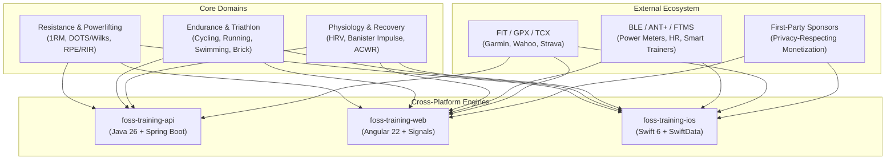

---

## 2. Endurance & Multi-Sport Science: Cycling, Running, Swimming & Triathlon

To compete with and surpass platforms like TrainingPeaks, Wahoo SYSTM, and intervals.icu, FOSS Training must treat endurance disciplines as first-class mathematical and biomechanical domains.

### 2.1 Cycling Performance Metrics & Engine

Cycling training is governed by power output (Watts), cadence, and metabolic fatigue.

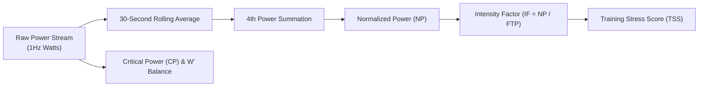

#### Key Metrics & Formulas:
1. **Functional Threshold Power (FTP)**:
   - Highest average power sustainable for approximately 1 hour in Watts ($W$).
   - Supported protocols: Standard 20-min test ($FTP = P_{\text{20min}} \times 0.95$), 2x8-min test ($P_{\text{8min}} \times 0.90$), and Ramp Test (incremental 20W/min steps to failure, $FTP = P_{\text{max\_step}} \times 0.75$).
2. **Normalized Power (NP)**:
   - Factors in physiological cost of surges and coasting using Dr. Andrew Coggan's formula:
     $$NP = \sqrt[4]{\frac{1}{N} \sum_{i=1}^{N} \left( \overline{P}_{30s, i} \right)^4}$$
3. **Intensity Factor (IF)**:
   - Ratio of Normalized Power to FTP:
     $$IF = \frac{NP}{FTP}$$
     - `< 0.75`: Recovery / Long Endurance ride
     - `0.75 - 0.85`: Tempo / Sweet Spot
     - `0.85 - 0.95`: Aerobic Threshold ride
     - `0.95 - 1.05`: Time Trial effort / 1-hour race
     - `> 1.05`: Criterium / Short Track / High Anaerobic surges
4. **Cycling Training Stress Score (TSS)**:
   - Quantifies total physiological training load:
     $$TSS = \frac{t \times NP \times IF}{FTP \times 3600} \times 100$$
     *(where $t$ is duration in seconds).*
5. **Critical Power (CP) & $W'$ Balance (Anaerobic Work Capacity)**:
   - Two-parameter hyperbolic power-duration model:
     $$P(t) = CP + \frac{W'}{t}$$
   - Dynamic real-time $W'$ expenditure and recovery modeling (Dr. Phil Skiba algorithm):
     $$W'_{\text{bal}}(t) = W'_0 - \int_0^t (P(u) - CP) \cdot e^{-\frac{t-u}{\tau_{W'}}} du$$
     *Enables live display of remaining anaerobic "battery" on iOS and Web.*
6. **Pedaling Dynamics & Biomechanics**:
   - **Left/Right Balance**: Percentage distribution (e.g., $51\% \text{ Left} / 49\% \text{ Right}$).
   - **Torque Effectiveness (TE)**: Ratio of positive torque to total torque per pedal revolution (target: $70-90\%$).
   - **Pedal Smoothness (PS)**: Ratio of average torque to peak torque per stroke (target: $15-40\%$).
   - **Cadence Bands**: Optimal revolutions per minute (RPM) tracking (85–95 RPM flat, 70–80 RPM climbing).
7. **Climbing & Aerodynamics**:
   - **VAM (Velocità Ascensionale Media)**: Vertical meters climbed per hour:
     $$VAM = \frac{\Delta \text{Elevation (m)} \times 3600}{\text{Elapsed Seconds}}$$
   - **Estimated Aerodynamic Drag ($CdA$) & Rolling Resistance ($Crr$)**:
     $$P_{\text{total}} = P_{\text{aero}} + P_{\text{rolling}} + P_{\text{gravity}} = \frac{1}{2} \rho CdA v^3 + Crr m g v + m g v \sin(\theta)$$
8. **Coggan 7-Zone Power Profiling**:
   - Zone 1: Active Recovery ($< 55\%$ FTP)
   - Zone 2: Endurance ($56 - 75\%$ FTP)
   - Zone 3: Tempo ($76 - 90\%$ FTP)
   - Zone 4: Lactate Threshold & Sweet Spot ($91 - 105\%$ FTP)
   - Zone 5: $VO_2\text{max}$ ($106 - 120\%$ FTP)
   - Zone 6: Anaerobic Capacity ($121 - 150\%$ FTP)
   - Zone 7: Neuromuscular Power ($> 150\%$ FTP)

---

### 2.2 Running Dynamics & Biomechanics Engine

Running combines cardiovascular demand with significant eccentric muscular and joint loading.

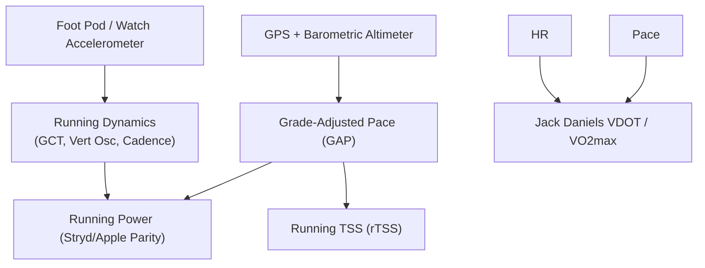

#### Key Metrics & Formulas:
1. **Critical Speed ($CS$) / Functional Threshold Pace (FTPace)**:
   - Maximal pace sustainable in a quasi-steady state without progressive lactate accumulation (expressed in $\text{min/km}$ or $\text{m/s}$).
2. **Grade-Adjusted Pace (GAP)**:
   - Normalizes running pace across uphill and downhill terrain using the Minetti metabolic cost equation:
     $$C_r(i) = 155.4 i^5 - 30.4 i^4 - 32.8 i^3 + 43.7 i^2 + 19.2 i + 3.6 \quad (\text{J} \cdot \text{kg}^{-1} \cdot \text{m}^{-1})$$
   - Computes equivalent flat-ground pace so athletes do not over-exert on steep climbs.
3. **Running Dynamics (Sensor Parity with Stryd, Garmin HRM-Pro, Apple Watch)**:
   - **Ground Contact Time (GCT)**: Milliseconds feet spend on the ground per step (elite: $180-220\text{ms}$, recreational: $240-300\text{ms}$).
   - **GCT Balance**: Left/right foot contact symmetry ($50.0\% / 50.0\%$).
   - **Vertical Oscillation**: Up-and-down torso bounce in centimeters (efficient: $6.0-8.5\text{cm}$).
   - **Vertical Ratio**: $\frac{\text{Vertical Oscillation}}{\text{Stride Length}} \times 100\%$ (target: $< 6-8\%$, lower = more energy directed forward).
   - **Cadence / Stride Frequency**: Steps per minute (SPM, target: $170-185\text{ SPM}$).
   - **Stride Length**: Calculated from speed and cadence ($L = \frac{v}{\text{cadence}}$).
4. **Running Power (Watts)**:
   - Direct mechanical wattage from Stryd or native Apple HealthKit running power.
   - Breakdown: Horizontal Propulsion Power, Form Power (energy expended without moving forward), and Leg Spring Stiffness ($LSS$ in $\text{kN/m}$).
5. **Cardiovascular & Economy Metrics**:
   - **Jack Daniels VDOT / $VO_2\text{max}$ Estimate**: Calculated from recent race or time-trial performances:
     $$VO_2 = \frac{-4.60 + 0.182258 \cdot v + 0.000104 \cdot v^2}{0.8 + 0.1894393 \cdot e^{-0.012778 \cdot t} + 0.2989558 \cdot e^{-0.1932605 \cdot t}}$$
   - **Running Economy ($RE$)**: Oxygen or energy consumption per kilometer at submaximal pace ($\text{ml} \cdot \text{kg}^{-1} \cdot \text{km}^{-1}$).
   - **Running Training Stress Score ($rTSS$)**:
     $$rTSS = \frac{t \times \text{NGP} \times IF_{\text{run}}}{\text{FTPace} \times 3600} \times 100$$
     *(where $\text{NGP}$ is Normalized Graded Pace).*

---

### 2.3 Swimming Lap & Stroke Analytics Engine

Swimming requires tracking lap times, stroke efficiency, distance per stroke, and open-water drift.

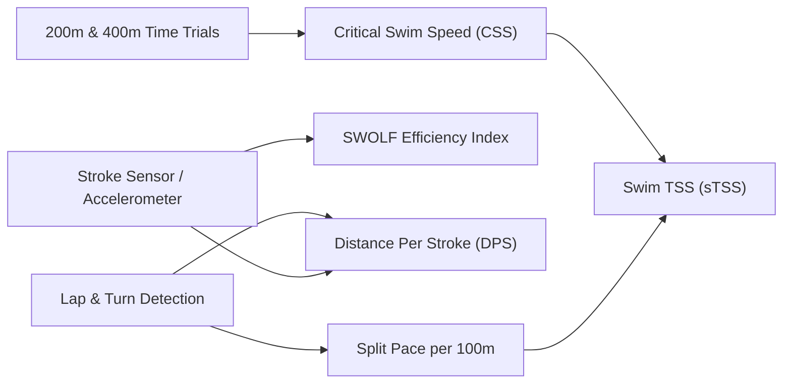

#### Key Metrics & Formulas:
1. **Critical Swim Speed (CSS)**:
   - Aerobic threshold swim pace (expressed as pace per $100\text{m}$).
   - Derived from hermetic $400\text{m}$ and $200\text{m}$ maximum efforts:
     $$CSS = \frac{400 - 200}{T_{400} - T_{200}} \quad (\text{m/s})$$
   - Formatted as `min:sec / 100m`.
2. **SWOLF Score (Stroke Efficiency)**:
   - Measures stroke efficiency per length of the pool:
     $$\text{SWOLF} = \text{Time (seconds for length)} + \text{Number of stroke cycles}$$
   - Lower SWOLF indicates greater distance per stroke with minimal drag.
3. **Stroke Dynamics & Mechanics**:
   - **Stroke Rate (Cadence)**: Strokes per minute (SPM).
   - **Distance Per Stroke (DPS)**:
     $$DPS = \frac{\text{Pool Length (m)} - \text{Push-off Glide (m)}}{\text{Stroke Count}}$$
   - **Automated Stroke Type Classification**:
     - Freestyle (Front Crawl), Backstroke, Breaststroke, Butterfly, Individual Medley (IM), and Kickboard/Drill mode.
4. **Pool & Open Water Support**:
   - Configurable pool dimensions: $25\text{m}$, $50\text{m}$ (Olympic), $25\text{yd}$, $33.3\text{m}$, or custom user-defined lengths.
   - Open Water GPS tracking: Automatic turn buoy detection, Kalman-filter GPS track smoothing, and tidal/current drift compensation.
5. **Swim Training Stress Score ($sTSS$)**:
   $$sTSS = \frac{t \times \left( \frac{\text{Normalized Speed}}{CSS} \right)^3}{3600} \times 100$$

---

### 2.4 Triathlon & Multi-Discipline Architecture

Triathlon requires orchestrating three disparate sports into a unified aggregate entity.

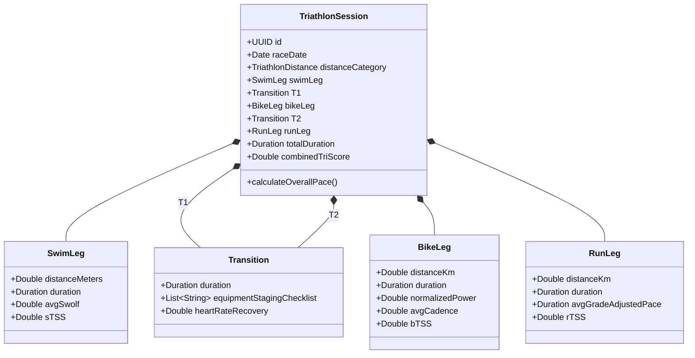

#### Core Triathlon Capabilities:
1. **Multi-Segment Linked Sessions**:
   - Continuous workout flow: `Swim` $\rightarrow$ `T1` $\rightarrow$ `Bike` $\rightarrow$ `T2` $\rightarrow$ `Run`.
   - Brick Workout modeling (e.g. 90km Bike + 15km Run) with **Neuromuscular Adaptation Index** (measures pace and cadence degradation during the first 3km of running off the bike).
2. **Transition Analytics (T1 & T2)**:
   - Staging checklists (helmet, race belt, nutrition, sock selection, sunglasses).
   - Split transition timing and heart rate recovery curves during gear changes.
3. **Race Simulation & Dynamic Pacing Engine**:
   - Standard distances supported:
     - **Sprint**: $750\text{m}$ Swim / $20\text{km}$ Bike / $5\text{km}$ Run
     - **Olympic / Standard**: $1.5\text{km}$ Swim / $40\text{km}$ Bike / $10\text{km}$ Run
     - **Half Ironman (70.3)**: $1.9\text{km}$ Swim / $90\text{km}$ Bike / $21.1\text{km}$ Run
     - **Full Ironman (140.6)**: $3.8\text{km}$ Swim / $180\text{km}$ Bike / $42.2\text{km}$ Run
   - Course-profile pacing generator: Ingests GPX elevation profiles, simulates wind and elevation gradients, and allocates power/pace targets to prevent glycogen depletion before the marathon run leg.
4. **Systemic Stress Normalization (Multi-Sport Tri-Score)**:
   - Blends non-weight-bearing cardiovascular load (swim/bike) with high eccentric musculoskeletal damage (run):
     $$\text{Tri-Load} = sTSS \times 0.90 + bTSS \times 1.00 + rTSS \times 1.25$$
   - Feeds into the unified Banister Impulse-Response Fitness/Fatigue engine.
5. **Gear & Equipment Wear Tracking**:
   - Running shoes: Distance accumulated with retirement alerts at $500-800\text{km}$.
   - Road & TT Bikes: Component wear tracking (chains: waxing alert every $300\text{km}$, replacement at $3000\text{km}$; cassette, chainrings, brake pads, tires).
   - Wetsuits: Salt/chlorine wash logs and storage alerts.

---

### 2.5 Standard Telemetry Ingestion (FIT, GPX, TCX, BLE FTMS)

To ensure zero vendor lock-in, FOSS Training will natively ingest standard industry telemetry:

- **Garmin Flexible and Interoperable Data Transfer (FIT)**: Binary protocol parser for sub-second sensor records (power, heart rate, cadence, temperature, GPS coordinates, developer fields).
- **GPX (GPS Exchange Format) & TCX (Training Center XML)**: XML activity and course imports/exports.
- **Bluetooth Low Energy (BLE) FTMS (Fitness Machine Service)**: Real-time protocol streaming from smart trainers (Wahoo KICKR, Tacx Neo, Saris H3) and smart treadmills directly to iOS and Web (via Web Bluetooth API).
- **Strava & intervals.icu API Sync**: Automated bidirectional OAuth2 syncing for athletes transitioning from other ecosystems.

---

## 3. Strategic Evaluation: Monetization & Advertising (Is Google AdSense the Best Option?)

The user asked:
> *"I want to add the possibility of adding ads, so I don't know if Google Ad Sense is the best option or not."*

### 3.1 Critical Flaws of Google AdSense for FOSS Training

**Recommendation: Google AdSense is NOT the best option for FOSS Training.**

Here is the objective engineering and business breakdown of why AdSense is problematic for this project:

| Factor | Google AdSense Reality | Impact on FOSS Training |
|---|---|---|
| **Privacy & FOSS Ethos** | Injects third-party tracking scripts, canvas fingerprinting, cross-site tracking cookies. | Violates the core promise of open-source data sovereignty. Leads to harsh community backlash on GitHub, Reddit, Hacker News. |
| **Ad-Blocker Rate** | Tech-savvy athletes and open-source users have an ad-blocker adoption rate between **65% and 85%** (uBlock Origin, Brave, Pi-hole, Safari Content Blockers). | Up to 85% of users will never see an ad. Expected revenue will be microscopic (typically **$0.30 - $1.50 RPM**). |
| **Performance & UI** | Injects heavy JavaScript bundles (~1.2MB), introduces Layout Shifts (CLS), degrades Core Web Vitals (LCP, INP). | Destroys our dark glassmorphic Apple-inspired design system with flashing, bright, un-themed generic banner ads. |
| **Mobile App Incompatibility** | **AdSense is strictly for websites.** It cannot be embedded in native iOS apps. Google requires **Google AdMob** for iOS. | In iOS, AdMob requires Apple's **App Tracking Transparency (ATT)** permission prompt (*"Allow FOSS Training to track you across apps and websites?"*). 90%+ of users tap "Ask App not to Track", dropping mobile eCPMs to cents. |
| **SPA / PWA Policy Violations** | AdSense crawlers struggle with single-page applications (Angular 22). Google frequently bans utility SPAs citing "insufficient original content" or "site navigation issues". | Risk of sudden account termination without recourse. |

---

### 3.2 The Superior Advertising Alternatives

If advertising is desired, the following alternatives deliver **higher revenue**, **zero privacy violations**, and **seamless visual integration**:

```mermaid
flowchart TD
    subgraph "Ad Options Comparison"
        AdSense["Google AdSense<br/>(Heavy Tracking, Blocked by 80%, $1 CPM)"]
        Ethical["EthicalAds / Carbon Ads<br/>(Privacy-First, Developer-Friendly, $3-$6 CPM)"]
        FirstParty["First-Party Direct Sponsors<br/>(Self-Hosted API, 0% Blocked, $20-$50 CPM)"]
    end

    AdSense -.->|Poor Match| FOSS["FOSS Training Platform"]
    Ethical ==>|Good Match (Web)| FOSS
    FirstParty ==>|Best Match (Web + iOS)| FOSS
```

#### Alternative 1: First-Party / Self-Hosted Sponsor Network (The Gold Standard)
- **How It Works**: Ads are served directly from our own backend (`GET /api/sponsors/banners`) as clean JSON containing an image URL, title, link, and tracking ID.
- **Why It Wins**:
  1. **100% Ad-Blocker Immune**: Because the banner comes from `yourdomain.com/api/sponsors` and not from a third-party ad network domain, uBlock Origin and Brave will not block it.
  2. **100% Privacy Respecting**: Zero external scripts, zero user profiling cookies. Fully compliant with GDPR, CCPA, and Apple App Store guidelines without requiring ATT permissions.
  3. **High-Value Niche Fitness CPMs**: Instead of generic $1 CPM programmatic ads, partner directly with endurance brands (e.g. Rogue Fitness, Eleiko, Maurten, Precision Hydration, Stryd, local marathon/triathlon races). Direct sponsorships command **$20 - $50 CPM**.
  4. **Perfect Design Harmony**: Displayed using native Angular glassmorphic cards and SwiftUI native views matching the user's selected accent color and OLED Pure Black theme.

#### Alternative 2: EthicalAds & Carbon Ads (Privacy-Preserving Web Networks)
- **EthicalAds** (created by the *Read the Docs* team for open-source projects):
  - Strictly non-tracking; ads are targeted by site content and category (Fitness/Open-Source/Tech) rather than personal tracking.
  - Allowed by default in many ad blockers.
  - Clean text + single image cards.
- **Carbon Ads** (by BuySellAds):
  - Single, unobtrusive ad per page.
  - Premium tech and sports fitness advertisers.

---

### 3.3 Higher-Yield FOSS Monetization Models

Open-source and fitness apps typically generate **10x to 50x more revenue** through community and service models than through programmatic banner ads:

1. **"Sync as a Service" (The Bitwarden / Obsidian / Ghost Model)**:
   - Self-hosted backend with Docker/PostgreSQL remains **100% free forever**.
   - Optional managed cloud sync ($2.99 / month or $29 / year) for athletes who want instant multi-device backup without maintaining their own server.
2. **Open Collective & GitHub Sponsors Tip Jar**:
   - An in-app "Support FOSS Training" card where satisfied athletes can contribute via GitHub Sponsors, Stripe, or Apple In-App Purchase tips.
3. **Curated Gear Affiliate Recommendations**:
   - In the Equipment Tracker (e.g. barbell, bike chain, running shoes), include optional affiliate links (e.g., Amazon Associates, Running Warehouse, Chain Reaction Cycles). When athletes replace worn shoes, you earn 4–8% commission.

---

### 3.4 Concrete Implementation Architecture for Ad Slots

To ensure clean code separation, we define an abstract ad slot system that can render first-party sponsors, privacy networks, or be completely disabled:

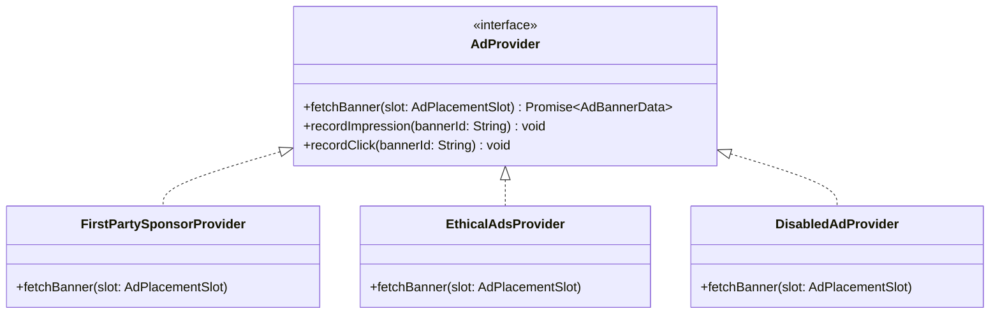

#### Placement Guidelines (Never Disrupt Workouts):
- **PROHIBITED PLACEMENTS**: Never display ads during active set logging, interval timers, running GPS tracking, or rest countdowns.
- **PERMITTED PLACEMENTS**:
  1. Bottom of the completed workout summary screen (celebration card).
  2. Footer of the Exercise Catalog browse page.
  3. Bottom of the Analytics / 1RM Calculator dashboard.

---

## 4. Strategy for the Premium Feature (Hiding for Now & Future Phasing)

The user asked:
> *"For the moment, I want to hyde the premium feature."*

### 4.1 Why Hiding Premium Now is Essential

1. **User Trust & Adoption**: When launching an open-source tool, displaying a "Premium (Cloud API)" badge creates suspicion that features are crippled or paywalled behind a subscription.
2. **Zero Confusion During Initial Testing**: When users test the application after holidays, they should experience a cohesive, fully functional system without incomplete billing sheets or locked options.
3. **Decoupled Architecture**: In `foss-training-ios`, cloud API communication is currently labeled "Premium (Cloud API)" in `AppTierMode`. By feature-flagging or relabeling this, we retain the complete cloud-sync infrastructure while presenting a clean, unified experience.

### 4.2 Code-Level Feature Flag Implementation

To hide the premium feature cleanly across the entire stack:

#### 1. Native iOS Client (`foss-training-ios`):
In `SettingsView.swift` and `AppEnvironment.swift`:
```swift
// Feature Flag configuration
public enum FeatureFlags {
    /// Controls whether the Premium tier selector and cloud sync buttons are exposed in UI
    public static let isPremiumTierVisible: Bool = false
}
```
When `FeatureFlags.isPremiumTierVisible == false`:
- The segmented picker in `SettingsView` is hidden.
- The app defaults seamlessly to **Local-First (SwiftData)** mode.
- All cloud sync code remains intact in `Remote*Repository` for future activation.

#### 2. Web Client (`foss-training-web`):
In `environment.ts`:
```typescript
export const environment = {
  production: false,
  features: {
    showPremiumBadges: false,
    enableAds: false,
    adProvider: 'none' // 'none' | 'firstParty' | 'ethicalAds'
  }
};
```

#### 3. Backend REST API (`foss-training-api`):
In `application.yml`:
```yaml
foss-training:
  features:
    monetization:
      enabled: false
      sponsor-banners: false
```

### 4.3 Future Rollout Roadmap for Premium Tiers

When the application is mature and ready for monetization:
- **Phase 1 (Current)**: 100% Free, Local-First, Zero Paywalls, Premium UI hidden.
- **Phase 2 (Growth)**: Introduce first-party sponsor banners on completion cards. Add voluntary GitHub Sponsors / In-App Tip Jar.
- **Phase 3 (SaaS Tier)**: Re-enable cloud sync as "FOSS Training Cloud" for multi-device sync, web-app sharing, and automated cloud backups.

---

## 5. The Exhaustive Powerhouse Addition Catalog

To make FOSS Training as powerful as possible, here is the complete catalog of high-impact expansions organized across 8 technical domains.

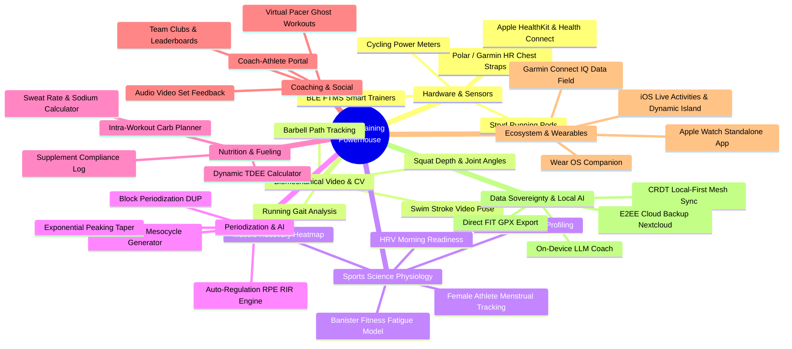

---

### 5.1 Wearable, Hardware & Real-Time Sensor Ecosystem

1. **Bluetooth Low Energy (BLE) FTMS Protocol**:
   - Connect directly to smart bike trainers (Wahoo KICKR, Tacx, Elite Direto) in ERG mode (sets target wattage automatically based on workout interval).
   - Real-time cadence, speed, and power streaming.
2. **Polar / Garmin / Wahoo Heart Rate Straps**:
   - High-frequency BLE connection capturing true **R-R intervals** (beat-to-beat intervals in milliseconds) for accurate real-time HRV and respiration rate estimation.
3. **Cycling Power Meters (ANT+ & BLE)**:
   - Dual-sided power meters (Garmin Rally, Favero Assioma, Stages) streaming L/R balance, torque effectiveness, and pedal smoothness.
4. **Stryd Running Foot Pods**:
   - Ingestion of running power, form power, leg spring stiffness, and ground contact time at 100Hz.
5. **Barbell Velocity Sensors (VBT)**:
   - Integration with open BLE velocity transducers (RepOne, GymAware, Speed4Lifts) measuring Mean Concentric Velocity (MCV) and Peak Velocity ($m/s$) to auto-regulate barbell loading.

---

### 5.2 Computer Vision & Biomechanical Video Tracking

1. **On-Device Barbell Path & Trajectory Analyzer**:
   - Uses Apple CoreML / Vision framework (iOS) and MediaPipe WebAssembly (Web).
   - Tracks the barbell end-cap during Squats, Bench Press, Deadlifts, and Olympic Snatch/Clean & Jerk.
   - Overlays a visual bar-path trace (deviation from vertical mid-foot line), calculates eccentric/concentric velocity ($m/s$), and flags sticking points.
2. **Squat Depth & Joint Flexion Verification**:
   - Detects hip crease and knee joint landmarks in real-time camera feed.
   - Displays a green confirmation badge when the hip crease dips below the top of the patella (IPF powerlifting legal depth).
3. **Running Gait Kinematics**:
   - Detects foot strike angle (heel vs. midfoot vs. forefoot) and forward trunk lean angle ($5-10^\circ$ optimal) from slow-motion smartphone video.

---

### 5.3 Advanced Exercise Science, Recovery & HRV Physiology

1. **Banister Impulse-Response Fitness-Fatigue Engine (CTL, ATL, TSB)**:
   - **Chronic Training Load (CTL / Fitness)**: 42-day exponentially weighted moving average of daily TSS.
   - **Acute Training Load (ATL / Fatigue)**: 7-day exponentially weighted moving average of daily TSS.
   - **Training Stress Balance (TSB / Form)**:
     $$TSB = CTL - ATL$$
     - `TSB > +15`: Transitional / Tapering (High freshness, risk of losing fitness if prolonged)
     - `TSB -10 to +10`: Optimal Race Form / Neutral
     - `TSB -10 to -30`: Optimal Training Stimulus / Overload
     - `TSB < -30`: High Risk of Overreaching / Injury
2. **Heart Rate Variability (HRV) Morning Readiness Engine**:
   - Morning 60-second measurement using phone camera photoplethysmography (PPG) or BLE chest strap.
   - Computes **rMSSD** (root mean square of successive differences) and **SDNN**.
   - Compares score against athlete's personal 60-day baseline range (normal distribution band).
   - Generates actionable daily recommendations: *"Green: High Readiness — push hard"*, *"Amber: Moderate Fatigue — stick to planned volume"*, *"Red: Parasympathetic saturation/depletion — active recovery or rest"*.
3. **Interactive 3D/2D Muscle Recovery Heatmap**:
   - Visual body map (anterior and posterior anatomy) displaying muscle fatigue levels in real-time.
   - Calculates muscle recovery based on hours elapsed, volume (number of sets), RPE, and exercise eccentric demand.
   - Muscles transition from Red (fatigued) $\rightarrow$ Yellow (recovering) $\rightarrow$ Green (fully primed).
4. **Female Athlete Menstrual Cycle Periodization**:
   - Tracks follicular phase (higher estrogen, optimal for maximal strength and high-intensity glycolytic work) vs. luteal phase (higher progesterone, higher core body temperature, shift toward steady-state endurance and higher hydration requirements).

---

### 5.4 Algorithmic Periodization & Intelligent Program Generator

1. **Algorithmic Multi-Week Program Generator**:
   - Athletes specify: Primary Goal (Powerlifting Meet, Marathon, Sprint Triathlon, Hypertrophy, General Fitness), Days per Week (2–6), Experience Level, and Available Equipment (Full Gym, Barbell + Rack, Dumbbells Only, Bodyweight).
   - Program engine builds periodized mesocycles with calculated progressions, rest weeks, and deload protocols.
2. **Advanced Periodization Models**:
   - **Daily Undulating Periodization (DUP)**: Alternating Hypertrophy (8-12 reps), Strength (4-6 reps), and Power (1-3 reps) days within each week.
   - **Block Periodization**: Accumulation block (volume) $\rightarrow$ Transmutation block (specialized intensity) $\rightarrow$ Realization block (peaking).
   - **Conjugate / Westside System**: Max Effort (ME) and Dynamic Effort (DE) speed days with accommodating resistance (bands/chains).
3. **Auto-Regulatory Progression Engine**:
   - Analyzes logged RPE/RIR against prescribed targets.
   - If athlete logs RPE 7 on a prescribed RPE 8 set, auto-suggest $+2.5\text{kg}$ for next set. If athlete exceeds RPE 9.5, suggest $-5\%$ back-off weight to protect nervous system.
4. **Exponential Peaking & Tapering Calculator**:
   - Calculates volume reductions (typically $40-60\%$ volume drop over 8–14 days while maintaining intensity) to maximize glycogen replenishment and muscle enzyme activity before race/meet day.

---

### 5.5 Nutrition, Hydration & Intra-Workout Fueling Engine

1. **Dynamic Energy Expenditure (TDEE)**:
   - Calculates Basal Metabolic Rate using Katch-McArdle (based on lean body mass) and Cunningham formulas.
   - Adds daily training expenditure calculated directly from cycling kJ and running metabolic equivalent of task (METs).
2. **Intra-Workout Carbohydrate & Fueling Planner**:
   - Calculates hourly carbohydrate requirements for endurance sessions based on duration and intensity:
     - `< 60 min`: Water only / optional mouth rinse
     - `60 - 150 min`: $30 - 60\text{g} / \text{hour}$ (1:0 glucose-to-fructose)
     - `> 150 min`: $60 - 90\text{g} / \text{hour}$ (2:1 glucose-to-fructose multi-transportable carbs)
     - Extreme Ultras: up to $100 - 120\text{g} / \text{hour}$ (1:0.8 ratio)
3. **Sweat Rate & Sodium Replacement Calculator**:
   - Pre- and post-workout bodyweight delta, accounting for fluid consumed and urine output:
     $$\text{Sweat Rate} = \frac{(W_{\text{pre}} - W_{\text{post}}) + \text{Fluid Consumed (L)} - \text{Urine (L)}}{\text{Duration (hours)}}$$
   - Recommends personalized electrolyte (sodium, potassium, magnesium) concentrations based on ambient temperature and sweat rate.
4. **Ergogenic Supplement Timing & Compliance Log**:
   - Caffeine timing protocol: $3 - 6\text{mg/kg}$ taken $45-60$ minutes prior to competition.
   - Creatine monohydrate daily compliance tracking ($3-5\text{g/day}$).
   - Beta-alanine buffering tracking.

---

### 5.6 Coaching Portal, Multi-Tenancy & Social Competition

1. **Coach-Athlete Portal**:
   - Coaches manage multiple athlete calendars, prescribe multi-week programs, and review live logged workouts.
   - Two-way messaging with time-stamped video/audio notes on individual exercise sets.
2. **Team & Club Leaderboards**:
   - Club creation (e.g. "Local Tri Club", "Barbell Club").
   - Weekly/monthly challenges: Total kilometers run, total cycling climbing elevation, 1000lb Powerlifting Total Club.
3. **Virtual Pacer & "Ghost Workout"**:
   - Race in real-time against your previous Personal Record or a teammate's historical activity. The app displays real-time seconds ahead or behind on iOS and Apple Watch.

---

### 5.7 Ecosystem Parity: Apple Watch, Dynamic Island & Garmin Connect IQ

1. **Standalone Apple Watch Application**:
   - Run workouts without the iPhone: native SwiftData sync via WatchConnectivity.
   - Haptic feedback when resting timer expires or pace falls outside the target zone.
   - Native optical heart rate and accelerometer cadence logging.
2. **iOS Live Activities & Dynamic Island**:
   - Displays current set, active rest countdown timer, and next exercise target weight on the Lock Screen and Dynamic Island while multitasking in other apps.
3. **Garmin Connect IQ Data Field / Widget**:
   - Custom Connect IQ data field displaying FOSS Training target power and interval countdowns directly on Garmin Edge bike computers and Forerunner watches.

---

### 5.8 Data Sovereignty, Local-First Mesh Sync & On-Device AI

1. **Local-First Conflict-Free Replicated Data Types (CRDTs)**:
   - Synchronize workouts seamlessly across multiple devices (iPhone, iPad, Web, Laptop) offline and online without merge conflicts or data loss.
2. **Private End-to-End Encrypted (E2EE) Cloud Backups**:
   - Backup directly to athlete's personal Nextcloud, WebDAV server, iCloud Drive, or Google Drive with client-side AES-256-GCM encryption.
3. **100% On-Device / Self-Hosted AI Sports Scientist**:
   - Integrates with local LLMs (Apple Intelligence / CoreML on iOS, Ollama / LocalAI on self-hosted backend).
   - Generates natural language workout advice and plan adjustments without leaking sensitive biometrics to third-party proprietary APIs.
4. **Biometric Anomaly Detection**:
   - Flags early warning signs of overtraining or illness (e.g. resting heart rate elevated by $>7\text{ BPM}$ or heart rate decouple from power during steady Zone 2 rides).

---

## 6. Phased Implementation Roadmap & Prioritization Matrix

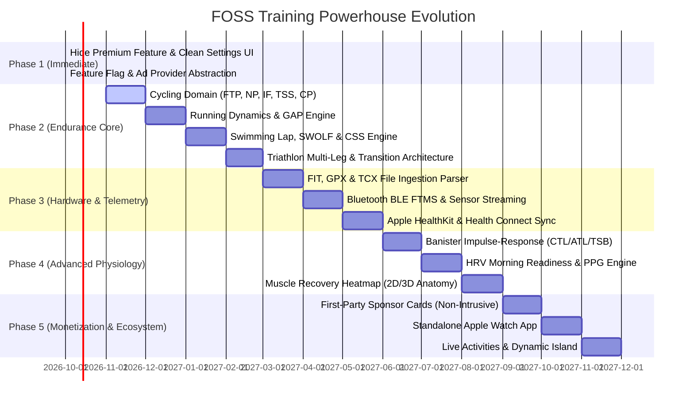

### Prioritization Summary Table

| Initiative | Impact | Complexity | Priority | Recommended Target Platform |
|---|---|---|---|---|
| **Hide Premium UI / Feature Flag** | High | Low | **P0 (Immediate)** | iOS, Web, API |
| **Cycling Metrics (FTP, NP, IF, TSS)** | High | Medium | **P1 (Near Term)** | Java Domain, Web, iOS |
| **Running GAP & Biomechanics** | High | Medium | **P1 (Near Term)** | Java Domain, Web, iOS |
| **Swimming SWOLF & CSS Analytics** | High | Medium | **P1 (Near Term)** | Java Domain, Web, iOS |
| **Triathlon Multi-Sport Linking & T1/T2** | High | Medium | **P1 (Near Term)** | Java Domain, Web, iOS |
| **FIT / GPX / TCX Telemetry Parsers** | High | High | **P2 (Mid Term)** | Java Infrastructure, iOS |
| **BLE FTMS & Sensor Connectivity** | High | High | **P2 (Mid Term)** | iOS, Web (Web Bluetooth) |
| **First-Party Sponsor Engine (No AdSense)** | Medium | Low | **P2 (Mid Term)** | Web, iOS, API |
| **Banister Impulse (CTL/ATL/TSB)** | High | Medium | **P2 (Mid Term)** | Java Domain, Web, iOS |
| **HRV Morning Readiness (rMSSD)** | High | High | **P3 (Future)** | iOS, Web |
| **Standalone Apple Watch App** | High | High | **P3 (Future)** | iOS (watchOS target) |
| **On-Device Bar Path CV Tracking** | High | High | **P3 (Future)** | iOS (CoreML/Vision) |

---

## 7. Scientific References & Evidence-Based Authority Framework

To build unwavering authority and trust—especially for novice athletes who do not yet know how to structure their training—every single calculation, target range, and workout recommendation in FOSS Training is grounded directly in peer-reviewed sports science literature.

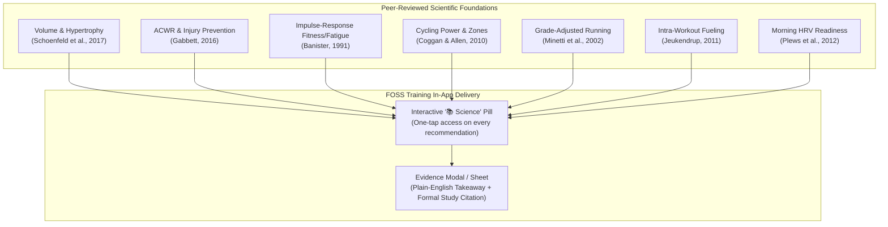

---

### 7.1 Resistance Training, Hypertrophy & Strength Development

#### 1. Weekly Set Volume & Dose-Response Relationship
* **Citation**: Schoenfeld, B. J., Ogborn, D., & Krieger, J. W. (2017). *Dose-response relationship between weekly resistance training volume and increases in muscle mass: A systematic review and meta-analysis*. **Journal of Sports Sciences**, 35(11), 1073–1082. [DOI: 10.1080/02640414.2016.1210197](https://doi.org/10.1080/02640414.2016.1210197)
* **Key Finding**: Graded dose-response relationship between weekly resistance training volume and muscle hypertrophy. Significant increases in muscle mass are observed with $\ge 10$ working sets per muscle group per week compared to $< 5$ sets ($+3.9\%$ additional size). The optimal dose for intermediate-to-advanced athletes plateaus between 12–20 weekly sets.
* **FOSS Training Application**:
  - The Muscle Volume Tracker flags muscle groups with $< 10$ weekly sets as **Under-Stimulated**, $10-20$ sets as **Optimal Hypertrophy Zone**, and $> 22$ sets as **Diminishing Returns / Junk Volume Warning**.
* **Beginner Takeaway**: *"You don't need to do 30 sets a day. Aim for 10 to 15 hard sets per muscle group spread across the entire week."*

#### 2. Auto-Regulation via Repetitions in Reserve (RIR) and RPE
* **Citation**: Helms, E. R., Cronin, J., Storey, A., & Zourdos, M. C. (2016). *Application of the Repetitions in Reserve-Based Rating of Perceived Exertion Scale for Resistance Training*. **Strength and Conditioning Journal**, 38(4), 42–49. [DOI: 10.1519/SSC.0000000000000218](https://doi.org/10.1519/SSC.0000000000000218)
* **Key Finding**: The RIR-based RPE scale accurately reflects proximity to muscular failure (e.g. RPE $8 = 2$ reps remaining before failure). Training consistently between 1 to 3 RIR yields comparable hypertrophy and strength adaptations to training to absolute failure, with significantly less central nervous system fatigue and faster 48-hour recovery.
* **FOSS Training Application**:
  - Recommends working sets at RPE $7.5 - 8.5$ ($1.5 - 2.5$ RIR) for compound movements (Squat, Deadlift, Bench), reserving RPE $9.5 - 10$ exclusively for isolation movements or peaking weeks.
* **Beginner Takeaway**: *"Stop your sets when you feel you could still complete 1 or 2 more clean reps. You will build just as much muscle with half the injury risk."*

#### 3. Inter-Set Rest Intervals for Hypertrophy and Strength
* **Citation**: Schoenfeld, B. J., Pope, Z. K., Benik, F. M., et al. (2016). *Longer Interset Rest Periods Enhance Muscle Strength and Hypertrophy in Resistance-Trained Men*. **Journal of Strength and Conditioning Research**, 30(7), 1805–1812. [DOI: 10.1519/JSC.0000000000001272](https://doi.org/10.1519/JSC.0000000000001272)
* **Key Finding**: Rest periods of 3 minutes between multi-joint compound sets produced significantly greater increases in maximal 1RM strength and muscle thickness compared to short 1-minute rests, due to higher sustained load and mechanical tension across subsequent sets.
* **FOSS Training Application**:
  - Defaults rest timers for compound lifts to **180 seconds** and isolation exercises to **90–120 seconds**, alerting athletes via sensory haptics when complete.
* **Beginner Takeaway**: *"Don't rush between heavy barbell sets. Resting 2 to 3 minutes allows your nervous system to regenerate ATP so you can lift heavier on your next set."*

#### 4. One Repetition Maximum Prediction Models
* **Citation 1**: Epley, B. (1985). *Poundage Chart*. Boyd Epley Workout, Lincoln, NE.
* **Citation 2**: Brzycki, M. (1993). *Strength testing—Predicting a one-rep max from reps-to-fatigue*. **Journal of Physical Education, Recreation & Dance**, 64(1), 88–90. [DOI: 10.1080/07303084.1993.10606684](https://doi.org/10.1080/07303084.1993.10606684)
* **Key Finding**: Submaximal repetitions to fatigue (between 2 and 10 reps) reliably predict true 1RM within $2-4\%$ accuracy without the orthopedic risk of attempting maximal single lifts.
* **FOSS Training Application**:
  - Implements 6 validated prediction curves with rep-range boundary checks (e.g., Brzycki for $r \le 10$, Epley for general resistance, Lombardi for higher rep sets).
* **Beginner Takeaway**: *"You never have to risk injury testing a dangerous 1-rep maximum. Logging a solid set of 5 reps tells the app exactly what your maximum strength is."*

---

### 7.2 Workload Management, Fatigue Modeling & Injury Prevention (ACWR & Banister)

#### 1. The Acute:Chronic Workload Ratio (ACWR) & The Injury Prevention Paradox
* **Citation**: Gabbett, T. J. (2016). *The training—injury prevention paradox: should athletes be training smarter and harder?* **British Journal of Sports Medicine**, 50(5), 273–280. [DOI: 10.1136/bjsports-2015-095788](https://doi.org/10.1136/bjsports-2015-095788)
* **Key Finding**: Injury risk is not caused by high training volume alone, but by sudden spikes in training volume relative to what the athlete is accustomed to. 
  - ACWR between **$0.80$ and $1.30$** constitutes the **"Sweet Spot"** (lowest relative injury risk, $< 5\%$).
  - ACWR $\ge 1.50$ represents the **"Danger Zone"**, where injury risk increases exponentially by $200-400\%$.
* **FOSS Training Application**:
  - Automatically compares the athlete's 7-day rolling load (Acute) against their 28-day average load (Chronic).
  - Displays color-coded risk indicators: Green for Sweet Spot ($0.8-1.3$), Amber for Elevated ($1.3-1.5$), Red for Danger ($\ge 1.5$).
* **Beginner Takeaway**: *"Consistency is safety. Never increase your weekly training volume by more than 10-15% compared to the past month."*

#### 2. The Banister Impulse-Response Fitness-Fatigue Model
* **Citation**: Banister, E. W. (1991). *Modeling Elite Athletic Performance*. In: MacDougall, J. D., Wenger, H. A., & Green, H. J. (Eds.), **Physiological Testing of the High-Performance Athlete** (2nd ed., pp. 403–424). Human Kinetics Books, Champaign, IL.
* **Key Finding**: Human athletic performance at any moment ($P(t)$) is the mathematical difference between long-term Fitness ($CTL$, time constant $\tau_1 \approx 42\text{ days}$) and short-term Fatigue ($ATL$, time constant $\tau_2 \approx 7\text{ days}$):
  $$P(t) = P_0 + k_1 \sum CTL(t) - k_2 \sum ATL(t)$$
* **FOSS Training Application**:
  - Computes daily Chronic Training Load (Fitness), Acute Training Load (Fatigue), and Training Stress Balance ($TSB = CTL - ATL$).
  - Guides competition peaking by targeting a positive TSB ($+10\text{ to }+20$) on race day.
* **Beginner Takeaway**: *"Fitness builds slowly over 6 weeks; fatigue fades quickly over 7 days. By cutting back volume 1 week before a competition, fatigue vanishes while your fitness stays high."*

---

### 7.3 Cycling Power Dynamics, Critical Power & Coggan Zones

#### 1. Normalized Power (NP) and Coggan Training Stress Score (TSS)
* **Citation**: Coggan, A. R., & Allen, H. (2010). *Training and Racing with a Power Meter* (2nd ed.). VeloPress, Boulder, CO.
* **Key Finding**: Biological cost of cycling power output is non-linear and scales to the 4th power due to glycogen depletion, lactate production, and neuromuscular recruitment during anaerobic surges. Standard average power drastically underestimates the physiological toll of variable-intensity rides.
* **FOSS Training Application**:
  - Evaluates 30-second rolling averages raised to the 4th power to output true Normalized Power, Intensity Factor ($IF$), and TSS.
* **Beginner Takeaway**: *"Riding at 200W steady is much easier on your body than alternating between 100W and 300W, even if the average wattage looks identical."*

#### 2. Critical Power and Dynamic Anaerobic Battery ($W'$) Reconstitution
* **Citation 1**: Monod, H., & Scherrer, J. (1965). *The work capacity of a synergic muscular group*. **Ergonomics**, 8(3), 329–338. [DOI: 10.1080/00140136508930810](https://doi.org/10.1080/00140136508930810)
* **Citation 2**: Skiba, P. F., Chidnok, W., Vanhatalo, A., & Jones, A. M. (2012). *Modeling the expenditure and reconstitution of work capacity above critical power*. **Medicine & Science in Sports & Exercise**, 44(8), 1526–1532. [DOI: 10.1249/MSS.0b013e318251250e](https://doi.org/10.1249/MSS.0b013e318251250e)
* **Key Finding**: Above Critical Power ($CP$), an athlete draws upon a finite anaerobic energy reserve ($W'$ in Kilojoules). When power drops below $CP$, $W'$ reconstitutes exponentially according to a recovery time constant $\tau_{W'}$.
* **FOSS Training Application**:
  - Renders a live $W'_{\text{bal}}$ gauge during cycling and indoor smart trainer sessions, warning athletes when their anaerobic battery is under $20\%$.
* **Beginner Takeaway**: *"Think of power above your threshold like a battery. Hard sprints drain it fast. Coasting or pedaling easily recharges it."*

---

### 7.4 Running Biomechanics, Economy & Graded Pace (Minetti & VDOT)

#### 1. Grade-Adjusted Pace via Metabolic Cost Equations
* **Citation**: Minetti, A. E., Moia, C., Roi, G. S., Susta, D., & Ferretti, G. (2002). *Energy cost of walking and running at extreme uphill and downhill slopes*. **Journal of Applied Physiology**, 93(3), 1039–1046. [DOI: 10.1152/japplphysiol.01177.2001](https://doi.org/10.1152/japplphysiol.01177.2001)
* **Key Finding**: Running metabolic cost follows an asymmetric 5th-degree polynomial curve across incline gradients. Uphill running increases metabolic demand drastically, while steep downhills ($< -10\%$) increase eccentric braking forces despite lowering oxygen demand.
* **FOSS Training Application**:
  - Computes Grade-Adjusted Pace (GAP) using Minetti's polynomial so runners maintain true steady aerobic intensity regardless of hilly terrain.
* **Beginner Takeaway**: *"Running 6:00 min/km up an 8% hill costs the same energy as running 4:30 min/km on flat ground. Don't force your flat pace on steep hills."*

#### 2. Jack Daniels VDOT / $VO_2\text{max}$ Pacing Tables
* **Citation**: Daniels, J. (2013). *Daniels' Running Formula* (3rd ed.). Human Kinetics, Champaign, IL.
* **Key Finding**: Running performance integrates $VO_2\text{max}$ and running economy into a single index (VDOT). Training paces are divided into 5 physiological zones: Easy ($E$), Marathon ($M$), Threshold ($T$), Interval ($I$), and Repetition ($R$), each triggering distinct metabolic adaptations.
* **FOSS Training Application**:
  - Takes any recent race result (5K, 10K, Half Marathon) and mathematically computes individual training paces down to the second per kilometer.
* **Beginner Takeaway**: *"You don't need a lab test to find your ideal training paces. One race time unlocks your exact easy, tempo, and interval speeds."*

#### 3. Cadence and Ground Contact Time Optimization
* **Citation**: Heiderscheit, B. C., Chumanov, E. S., Michalski, M. P., et al. (2011). *Effects of step rate manipulation on joint mechanics during running*. **Medicine & Science in Sports & Exercise**, 43(2), 296–302. [DOI: 10.1249/MSS.0b013e3181ebedf4](https://doi.org/10.1249/MSS.0b013e3181ebedf4)
* **Key Finding**: Increasing running step cadence by $5-10\%$ above preferred stride frequency significantly reduces energy absorbed by the knee joint and hip, reduces vertical oscillation, and lowers peak ground reaction forces.
* **FOSS Training Application**:
  - Analyzes sensor step rates and flags overstriding ($< 160\text{ SPM}$) with gentle haptic metronome cues targeting $170-185\text{ SPM}$.
* **Beginner Takeaway**: *"Taking slightly quicker, lighter steps reduces the impact shock on your knees and shins with every single stride."*

---

### 7.5 Swimming Energetics, Critical Swim Speed & SWOLF

#### 1. Critical Swim Speed (CSS) for Aerobic Pacing
* **Citation**: Wakayoshi, K., Ikuta, K., Yoshida, T., et al. (1992). *Determination and validity of critical velocity as an index of swimming performance in the competitive swimmer*. **European Journal of Applied Physiology and Occupational Physiology**, 64(2), 153–157. [DOI: 10.1007/BF00717953](https://doi.org/10.1007/BF00717953)
* **Key Finding**: The slope of the line relating distance to time over maximal 400m and 200m swims reflects the maximal lactate steady-state swimming speed (CSS) that can be sustained without exhaustion.
* **FOSS Training Application**:
  - Computes CSS ($CSS = \frac{400-200}{T_{400}-T_{200}}$) and generates structured interval targets ($100\text{m}$, $200\text{m}$, $400\text{m}$ reps).
* **Beginner Takeaway**: *"Two simple test swims (400m and 200m) tell the app your exact aerobic cruising speed for pool sessions."*

#### 2. Stroke Efficiency via SWOLF Index
* **Citation**: Costill, D. L., Kovaleski, J., Porter, D., et al. (1985). *Energy expenditure during front crawl swimming: predicting success in middle-distance events*. **International Journal of Sports Medicine**, 6(5), 266–270. [DOI: 10.1055/s-2008-1025848](https://doi.org/10.1055/s-2008-1025848)
* **Key Finding**: Competitive swimming economy is dictated by distance per stroke (DPS) rather than raw stroke frequency. Reducing stroke cycles per length while maintaining velocity indicates streamlined hydrodynamics and reduced frontal drag.
* **FOSS Training Application**:
  - Live SWOLF score calculation ($\text{Time in seconds} + \text{Stroke count per lap}$) with automatic efficiency classification.
* **Beginner Takeaway**: *"In swimming, less thrashing is faster. A lower SWOLF score means you are gliding through the water with less resistance."*

---

### 7.6 Triathlon Transitions, Brick Kinetics & Race Fueling

#### 1. Neuromuscular Adaptation in Cycle-to-Run (Brick) Transitions
* **Citation**: Hausswirth, C., Bigard, A. X., & Guezennec, C. Y. (1997). *Relationships between running mechanics and energy cost of running to fatigue in a triathlon*. **Medicine & Science in Sports & Exercise**, 29(7), 958–965. [DOI: 10.1097/00005768-199707000-00015](https://doi.org/10.1097/00005768-199707000-00015)
* **Key Finding**: Running immediately following intense cycling induces an acute elevation in oxygen consumption ($+11-13\%$) and altered forward trunk lean due to neuromuscular fatigue in the quadriceps and calves.
* **FOSS Training Application**:
  - In Brick sessions, tracks the **Neuromuscular Adaptation Index** (pace and stride stability over the first 3km of the run leg).
* **Beginner Takeaway**: *"Your legs will feel heavy for the first 10 minutes of running off the bike. Brick workouts train your nervous system to adapt to this transition."*

#### 2. Endurance Carbohydrate Ingestion Rates
* **Citation**: Jeukendrup, A. E. (2011). *Nutrition for endurance sports: Marathon, triathlon, and road cycling*. **Journal of Sports Sciences**, 29(sup1), S91–S99. [DOI: 10.1080/02640414.2011.610348](https://doi.org/10.1080/02640414.2011.610348)
* **Key Finding**: Intestinal SGLT1 glucose transporters saturate at approximately $60\text{g/hour}$. Utilizing multi-transportable carbohydrates (2:1 Glucose-to-Fructose, engaging GLUT5 transporters) allows exogenous carbohydrate oxidation rates up to $90\text{g/hour}$, preventing glycogen depletion and extending time to exhaustion.
* **FOSS Training Application**:
  - Dynamically calculates hourly carb requirements: sessions $< 1\text{hr}$ (0–30g), $1-2.5\text{hrs}$ (30–60g), $> 2.5\text{hrs}$ (60–90g at 2:1 ratio).
* **Beginner Takeaway**: *"For workouts longer than 90 minutes, taking in 30 to 60 grams of carbs per hour prevents hitting 'the wall'."*

---

### 7.7 Autonomic Recovery & Heart Rate Variability (HRV)

#### 1. Ultra-Short Morning rMSSD for Training Readiness
* **Citation 1**: Plews, D. J., Laursen, P. B., Kilding, A. E., & Buchheit, M. (2012). *Heart rate variability in elite American-Cup triathletes: monitoring training status with mobile applications*. **European Journal of Applied Physiology**, 112(11), 3865–3873. [DOI: 10.1007/s00421-012-2368-3](https://doi.org/10.1007/s00421-012-2368-3)
* **Citation 2**: Buchheit, M. (2014). *Monitoring training status with HR measures: do all roads lead to Rome?* **Frontiers in Physiology**, 5, 73. [DOI: 10.3389/fphys.2014.00073](https://doi.org/10.3389/fphys.2014.00073)
* **Key Finding**: Log-transformed root mean square of successive differences ($\ln rMSSD$) captured upon waking reflects cardiac parasympathetic modulation. Comparing daily values against a 60-day rolling baseline ($\pm 0.5 \text{ to } 1.0\text{ SD}$) accurately identifies autonomic fatigue before symptoms of overreaching appear.
* **FOSS Training Application**:
  - Evaluates morning 60-second HRV against a personalized rolling normal band, recommending whether to push hard, maintain, or take an active recovery day.
* **Beginner Takeaway**: *"A quick 60-second morning heart rate check tells you if your body has truly recovered from yesterday's effort."*

---

### 7.8 Hydration, Electrolytes & Ergogenic Supplementation

#### 1. Fluid Replacement and Sweat Rate Estimation
* **Citation**: Sawka, M. N., Burke, L. M., Eichner, E. R., et al. (2007). *American College of Sports Medicine position stand. Exercise and fluid replacement*. **Medicine & Science in Sports & Exercise**, 39(2), 377–390. [DOI: 10.1249/mss.0b013e31802ca597](https://doi.org/10.1249/mss.0b013e31802ca597)
* **Key Finding**: Dehydration exceeding $2\%$ of body mass significantly impairs aerobic exercise performance and increases core body temperature strain. Individual sweat rates vary from $0.5$ to $> 2.0\text{ L/hour}$.
* **FOSS Training Application**:
  - Ingests pre- and post-workout bodyweight deltas to compute personalized hourly sweat rates and fluid replenishment targets.
* **Beginner Takeaway**: *"Weighing yourself before and after a hot run tells the app exactly how much water and electrolytes you need to replace."*

#### 2. Caffeine Ergogenic Timing Protocol
* **Citation**: Grgic, J., Grgic, I., Pickering, C., et al. (2020). *Wake up and smell the coffee: caffeine supplementation and exercise performance—an umbrella review of 21 published meta-analyses*. **British Journal of Sports Medicine**, 54(11), 681–688. [DOI: 10.1136/bjsports-2018-100278](https://doi.org/10.1136/bjsports-2018-100278)
* **Key Finding**: Caffeine ingested at $3 - 6\text{ mg/kg}$ of body mass approximately 60 minutes prior to exercise reliably improves muscle endurance, maximal strength, sprinting, and aerobic endurance by $2-7\%$.
* **FOSS Training Application**:
  - Pre-workout supplement alert calculated from athlete bodyweight (e.g. $70\text{kg} \rightarrow 210-280\text{mg}$ caffeine suggested 45–60 min before key sessions).
* **Beginner Takeaway**: *"A cup of coffee 45 minutes before training provides a scientifically proven, legal boost to your endurance and strength."*

#### 3. Creatine Monohydrate Loading and Maintenance
* **Citation**: Kreider, R. B., Kalman, D. S., Antonio, J., et al. (2017). *International Society of Sports Nutrition position stand: safety and efficacy of creatine supplementation in exercise, sport, and medicine*. **Journal of the International Society of Sports Nutrition**, 14(1), 18. [DOI: 10.1186/s12970-017-0173-z](https://doi.org/10.1186/s12970-017-0173-z)
* **Key Finding**: Daily supplementation with $3 - 5\text{g}$ of creatine monohydrate increases intramuscular phosphocreatine stores, enhancing high-intensity exercise capacity, power output, and lean body mass accumulation with decades of proven safety.
* **FOSS Training Application**:
  - Daily compliance tracker with optional 5-day saturation phase ($20\text{g/day}$) followed by $3-5\text{g/day}$ maintenance.
* **Beginner Takeaway**: *"Taking 3 to 5 grams of creatine every day is the most thoroughly tested, safe, and effective supplement for strength gains."*

---

### 7.9 Female Athlete Physiology & Cycle Phase Periodization

#### 1. Menstrual Cycle Phase Performance Considerations
* **Citation 1**: McNulty, K. L., Elliott-Sale, K. J., Dolan, E., et al. (2020). *The effects of menstrual cycle phase on exercise performance in eumenorrheic women: a systematic review and meta-analysis*. **Sports Medicine**, 50(10), 1813–1827. [DOI: 10.1007/s40279-020-01319-3](https://doi.org/10.1007/s40279-020-01319-3)
* **Citation 2**: Mountjoy, M., Sundgot-Borgen, J. K., Burke, L. M., et al. (2018). *The IOC consensus statement: relative energy deficiency in sport (RED-S)*. **British Journal of Sports Medicine**, 52(11), 687–697. [DOI: 10.1136/bjsports-2018-099193](https://doi.org/10.1136/bjsports-2018-099193)
* **Key Finding**: During the follicular phase (lower core temperature, dominant estrogen), carbohydrate oxidation is favored, making it optimal for high-intensity interval and maximal strength work. During the luteal phase (elevated progesterone, increased core temperature by $0.3-0.5^\circ\text{C}$), fat oxidation and thermoregulatory strain increase, favoring steady-state endurance and aggressive hydration.
* **FOSS Training Application**:
  - Optional female athlete cycle tracking adapts hydration alerts and periodizes high-glycolytic sessions during the follicular window.
* **Beginner Takeaway**: *"Listening to your cycle allows you to schedule your hardest strength days when your body is naturally primed to lift heavy."*

---

### 7.10 Velocity-Based Training (VBT) & Barbell Kinematics

#### 1. Mean Concentric Velocity (MCV) as an Objective Load Measure
* **Citation**: González-Badillo, J. J., & Sánchez-Medina, L. (2010). *Movement velocity as a measure of loading intensity in resistance training*. **International Journal of Sports Medicine**, 31(5), 347–352. [DOI: 10.1055/s-0030-1248333](https://doi.org/10.1055/s-0030-1248333)
* **Key Finding**: Barbell velocity ($m/s$) is inversely and almost perfectly linear ($R^2 > 0.98$) with $\% 1RM$. Regardless of daily strength fluctuations, when Mean Concentric Velocity on the squat drops to $0.30\text{ m/s}$, the athlete is at approximately 1RM / failure.
* **FOSS Training Application**:
  - Barbell video tracking measures bar velocity ($m/s$). If the first rep of an 80% set moves at $> 0.65\text{ m/s}$ (faster than expected), the app signals high readiness and suggests an auto-regulated $+2.5\text{kg}$ bump.
* **Beginner Takeaway**: *"The speed at which the barbell moves tells the app how strong you are today without you having to guess your numbers."*

---

### 7.11 In-App "Evidence Pill" & Educational Architecture

To make this scientific authority immediately helpful for people who don't know how to train, the user interface will feature an interactive **"Evidence Pill"** design pattern:

```
┌────────────────────────────────────────────────────────┐
│  Squat (Barbell) — Set 2 of 4                          │
│  Recommended: 100 kg × 5 reps @ RPE 8.0               │
│                                                        │
│  [ Rest Timer: 3:00 ]   [ 📚 Why 3 min rest? ] <───────┼── Interactive Evidence Pill
└────────────────────────────────────────────────────────┘
```

When tapped, a lightweight, beautiful bottom sheet slides up:
1. **Plain-English Takeaway**: A 2-sentence explanation written in simple, encouraging language.
2. **The Mechanism**: What happens in the muscles, nervous system, or heart.
3. **The Formal Study**: Full APA citation with a clickable link to PubMed/DOI.
4. **Confidence Badge**: *"Verified Sports Science Standard"*.

This transforms FOSS Training from a passive recording tool into an **authoritative, trustworthy coach** that educates the athlete with every workout.

---

## 8. The Universal Open Database: Exercises, Sessions & Periodized Training Programs

A major friction point for athletes using new training apps is the "empty slate" problem—being forced to manually type in dozens of exercises, sets, and training routines before they can even start working out. 

To solve this permanently, FOSS Training will incorporate a **curated, pre-loaded, open-source database** covering over 1,000+ multi-disciplinary movements, 150+ ready-to-run workout session templates, and battle-tested periodized training programs spanning powerlifting, bodybuilding, running, cycling, swimming, and triathlon.

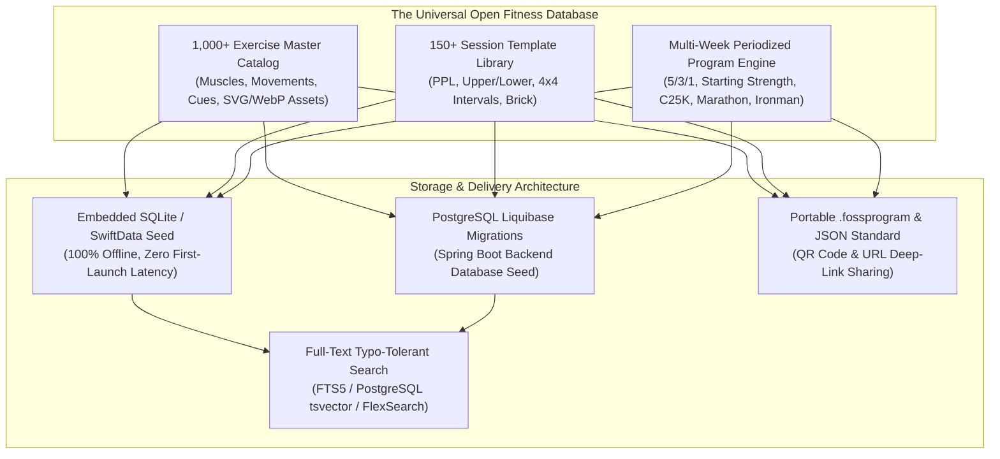

---

### 8.1 Curated Exercise Master Catalog (1,000+ Movements)

The exercise library is organized as a multi-disciplinary, relational catalog spanning every major athletic modality:

```
Universal Exercise Database (1,000+ Items)
├── 1. Resistance & Weightlifting (600+ movements)
│   ├── Barbell (Squats, Presses, Deadlifts, Rows, Cleans, Snatches)
│   ├── Dumbbell (Unilateral presses, Flyes, Rows, Lunges, Carries)
│   ├── Cable & Pulley (Crossovers, Face pulls, Lateral raises, Triceps pushdowns)
│   ├── Machine & Plate-Loaded (Leg press, Hack squat, Chest press, Lat pulldown)
│   ├── Kettlebell (Swings, Turkish get-ups, Cleans, Snatches, Windmills)
│   └── Bodyweight & Calisthenics (Pull-ups, Dips, Push-ups, Muscle-ups, Handstands)
├── 2. Endurance & Cardiovascular (150+ movements)
│   ├── Running (Outdoor road, Trail, Track repeats, Treadmill incline intervals)
│   ├── Cycling (Road endurance, Gravel, Mountain bike, Smart trainer ERG workouts)
│   ├── Swimming (Freestyle crawl, Backstroke, Breaststroke, Butterfly, Kick/Pull drills)
│   ├── Rowing / Ergometer (Concept2 damper settings, Slide pacing, Sprint intervals)
│   └── SkiErg & AirBike (WattBike, Assault Bike, Echo Bike intervals)
├── 3. Mobility, Stretching & Joint Health (150+ movements)
│   ├── Dynamic Warmups (Leg swings, Arm circles, World's Greatest Stretch, Inchworms)
│   ├── Static Flexibility (Couch stretch, Pigeon pose, Hamstring stretches, Doorway chest)
│   ├── PNF Stretching (Contract-relax protocols for hamstrings, hips, shoulders)
│   └── Joint Mobility & CARs (Controlled Articular Rotations for shoulder, hip, ankle)
└── 4. Plyometrics & Explosive Power (100+ movements)
    ├── Lower Body Plyo (Box jumps, Depth drops, Broad jumps, Lateral bounds)
    └── Upper Body Power (Medicine ball slams, Chest passes, Rotational wall tosses)
```

#### Anatomical & Biomechanical Data Schema per Exercise:
For every single exercise in the database, the record includes:
1. **Canonical Name & Aliases**: Primary name plus common gym aliases (e.g. `Romanian Deadlift` $\rightarrow$ `RDL`, `Stiff-Legged Deadlift variation`).
2. **Biomechanical Movement Pattern**:
   - `Squat` (Knee dominant)
   - `Hip Hinge` (Posterior chain / hip dominant)
   - `Horizontal Push` (Bench press, Push-up)
   - `Horizontal Pull` (Barbell row, Cable row)
   - `Vertical Push` (Overhead press, Pike push-up)
   - `Vertical Pull` (Pull-up, Lat pulldown)
   - `Lunge / Single-Leg` (Split squat, Walking lunge, Step-up)
   - `Carry / Locomotion` (Farmer's walk, Suitcase carry)
   - `Core Anti-Extension` (Ab wheel roll-out, Plank)
   - `Core Anti-Rotation` (Pallof press, Cable woodchop)
   - `Core Anti-Lateral Flexion` (Side plank, Suitcase deadlift)
3. **Muscle Target Weighting**:
   - **Primary Muscle Group** ($100\%$ stimulus credit in Volume Tracker, e.g. Quads for Squats).
   - **Secondary Muscle Groups** ($50\%$ stimulus credit, e.g. Glutes and Lower Back for Squats).
4. **Equipment Substitution Matrix**:
   - Direct equipment mapping with 1-tap intelligent replacements:
     - *Barbell Bench Press* $\rightarrow$ *Dumbbell Bench Press* or *Weighted Dip* or *Machine Chest Press*.
     - *Pull-Up* $\rightarrow$ *Lat Pulldown* or *Band-Assisted Pull-Up* or *Inverted Row*.
5. **Technique Coaching Points**:
   - Step-by-step setup and execution instructions.
   - Top 3 common mistakes and corrective cues (e.g. *"Knee valgus collapse"*, *"Lumbar hyperextension"*).
   - Target joint angles and tempo recommendations (e.g. `3-1-1-0`).
6. **Visual Assets**:
   - High-contrast, dark-mode optimized vector SVG anatomical body maps highlighting active muscles.
   - Lightweight, looping 60fps WebP/Vector exercise demonstrations showing proper form without buffering or heavy video payloads.
7. **Multi-Language Localization**:
   - Initial translations in English, Spanish, French, German, Italian, Portuguese, and Japanese.

---

### 8.2 Curated Workout Session Template Library (150+ Ready-to-Train Templates)

Athletes can select any pre-built session and immediately start a workout:

#### 1. Strength & Hypertrophy Splits:
* **Push / Pull / Legs (PPL)**:
  - *Push A* (Chest focus: Barbell Bench, Incline DB, Dips, Lateral Raises, Triceps)
  - *Pull A* (Back width: Pull-ups, Barbell Row, Face Pulls, Biceps Curls)
  - *Legs A* (Quad focus: Barbell Back Squats, Romanian Deadlifts, Bulgarian Split Squats, Calves)
  - *Push B / Pull B / Legs B* (Shoulder, back thickness, and hamstring variations)
* **Upper / Lower Split (4-Day Classic)**:
  - Upper Strength / Lower Strength / Upper Hypertrophy / Lower Hypertrophy
* **Full Body Routines**:
  - Full Body 3x/Week (A/B alternating, ideal for busy professionals and beginners)
  - Full Body Minimalist (3 exercises, 30 minutes, maximum compound efficiency)
* **Bodyweight & Travel Workouts**:
  - Hotel Room Zero-Equipment (Push-up variations, Pike push-ups, Single-leg squats, Doorframe pulls)
  - Park Calisthenics Routine (Pull-ups, Dips, Muscle-ups, Hanging leg raises)
* **Kettlebell Complexes**:
  - *Simple & Sinister* (100 One-arm swings + 10 Turkish get-ups)
  - *Armor Building Complex* (2 Cleans, 1 Press, 3 Squats with double kettlebells)

#### 2. Structured Endurance Workouts:
* **Running Sessions**:
  - *Zone 2 Base Run* (60-90 min aerobic fat-oxidation run at $< 75\%$ HRmax)
  - *Norwegian 4x4 VO2max Intervals* (4 rounds of 4 min at $90-95\%$ HRmax with 3 min active jog recovery)
  - *Track Repeats 8x400m* (Fast cadence work at $3K-5K$ goal race pace with 200m jog recovery)
  - *Yasso 800s* (Marathon pace predictor: 10x800m with equal recovery time)
  - *Progressive Fartlek* (30-45 min alternating 1 min fast / 1 min easy)
* **Cycling Sessions**:
  - *Sweet Spot 2x20min* (Two 20-minute efforts at $88-93\%$ FTP with 5-minute recovery)
  - *Over-Unders 3x12min* (Alternating 2 min at $95\%$ FTP and 1 min at $105\%$ FTP to train lactate clearance)
  - *Tabata Micro-Bursts* (2 sets of 8x 20s all-out / 10s easy spin)
  - *Active Recovery Spin* (45 min Zone 1 spin at $< 55\%$ FTP, high cadence)
* **Swimming Sessions**:
  - *CSS Threshold 10x100m* (Targeting Critical Swim Speed pace with exactly 15 seconds rest)
  - *Aerobic Ladder 2,000m* (100m, 200m, 300m, 400m, 400m, 300m, 200m, 100m with stroke pacing)
  - *Technique Drill & Kick Set* (Catch-up drill, fingertip drag, bilateral breathing drills)

#### 3. Hybrid, Functional Fitness & Multi-Sport:
* **Hyrox Benchmark Simulations**:
  - *Hyrox Full Simulation* (8x 1km run interspersed with 1km SkiErg, 50m Sled Push, 50m Sled Pull, 80m Burpee Broad Jumps, 1km Rowing, 200m Farmers Carry, 100m Sandbag Lunges, 100 Wall Balls).
  - *Hyrox Half / Express Prep* (4km run + 4 station split).
* **Triathlon Brick Workouts**:
  - *Sprint Brick* (20km hard cycling $\rightarrow$ 3km immediate transition run).
  - *Olympic Brick* (40km steady-state cycling $\rightarrow$ 5km tempo run).
* **CrossFit Classic Benchmarks (Open Data WODs)**:
  - *Murph* (1-mile run, 100 pull-ups, 200 push-ups, 300 air squats, 1-mile run with 20lb vest).
  - *Cindy* (20-min AMRAP: 5 pull-ups, 10 push-ups, 15 air squats).
  - *Fran* (21-15-9 Thrusters @ 95lbs and Pull-ups).

---

### 8.3 Proven Periodized Training Program Library (Multi-Week Cycles)

The database includes complete, multi-week programs with automated progression rules, weight calculations, and deload weeks:

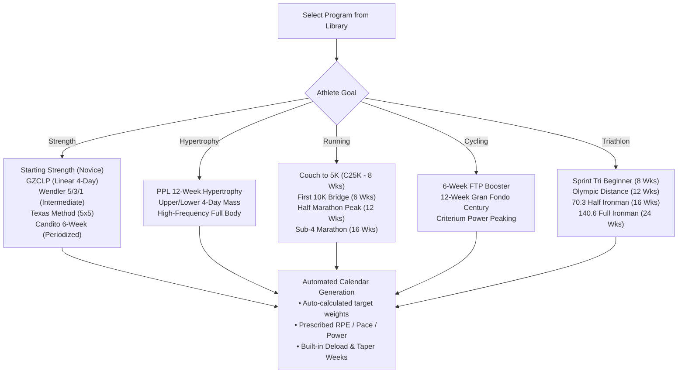

#### Detailed Program Specifications:
1. **Starting Strength Novice Progression (Mark Rippetoe)**:
   - 3-phase linear progression (Squat 3x5 every session, alternating Bench/Press and Deadlift/Power Clean).
   - Automated progression: $+2.5\text{kg}$ per session on upper body, $+5\text{kg}$ per session on lower body until first plateau triggers auto-reset.
2. **Jim Wendler's 5/3/1**:
   - 4-week monthly cycle based on $90\%$ of true 1RM (Training Max).
   - Week 1: $3 \times 5$ ($65\%, 75\%, 85\%+$)
   - Week 2: $3 \times 3$ ($70\%, 80\%, 90\%+$)
   - Week 3: $5/3/1$ ($75\%, 85\%, 95\%+$)
   - Week 4: Deload ($40\%, 50\%, 60\%$)
   - Supported variations: *Boring But Big (BBB)* (5x10 back-off sets), *First Set Last (FSL)*.
3. **GZCLP Linear Progression (Cody Lefever)**:
   - Tier 1 (Heavy primary lift: $5 \times 3 \rightarrow 6 \times 2 \rightarrow 10 \times 1$ auto-progression on failure).
   - Tier 2 (Volume secondary lift: $3 \times 10 \rightarrow 3 \times 8 \rightarrow 3 \times 6$).
   - Tier 3 (Accessories: $3 \times 15+$ to build work capacity).
4. **Couch to 5K (C25K)**:
   - 8-week gentle progression for absolute beginners starting with 60-second running intervals and 90-second walking intervals, building to a continuous 30-minute / 5km run.
5. **Sub-4 Hour Marathon 16-Week Blueprint**:
   - Periodized mileage ramping up to 65km/week.
   - Long runs progressing from 16km to 32km at Marathon Pace $+30\text{s/km}$.
   - Includes 3-week exponential volume taper ($60\% \rightarrow 40\% \rightarrow 20\%$) to peak for race day.
6. **Sprint & Olympic Triathlon Programs**:
   - Balanced weekly layout: 2 swim sessions, 2 bike sessions, 2 run sessions, 1 weekend brick workout, 1 complete rest day.
   - Auto-calibrates paces using athlete's CSS swim speed, cycling FTP, and running threshold pace.

---

### 8.4 Technical Architecture: Offline-First Seeding & Community Open Data Standard

To ensure high performance, total privacy, and open collaboration:

#### 1. Zero-Latency Hermetic Offline Seed (iOS & Web):
- Pre-compiled SQLite database bundled directly inside the iOS app bundle (`ExerciseDatabase.sqlite`) and compressed JSON assets in Angular web client.
- On first launch, the app is **100% functional with zero network connection required**.
- No spin wheels, no mandatory cloud sign-ins, no "downloading catalog..." delays.

#### 2. Liquibase Migration Seeds (Spring Boot Backend):
- Backend PostgreSQL instances are automatically populated via Liquibase YAML changesets:
  - `db.changelog-seed-exercises.yaml`
  - `db.changelog-seed-sessions.yaml`
  - `db.changelog-seed-programs.yaml`
- Ensures complete data parity between local SwiftData, Angular SPA, and self-hosted PostgreSQL.

#### 3. Typo-Tolerant Full-Text Search (FTS):
- Integrated with SQLite **FTS5** (iOS) and PostgreSQL **tsvector / pg_trgm** (Backend).
- Supports instantaneous searching across exercise names, aliases, target muscles, and equipment with fuzzy matching:
  - *"db bench"* $\rightarrow$ finds `Dumbbell Bench Press`
  - *"rdl"* $\rightarrow$ finds `Romanian Deadlift`
  - *"pullup"* $\rightarrow$ finds `Pull-Up`
  - *"hiit"* $\rightarrow$ finds high-intensity interval sessions

#### 4. The Open `.fossprogram` & `.fosssession` Data Standard:
- An open, versioned JSON schema specification allowing coaches and athletes to share custom routines and programs with a single click:
  ```json
  {
    "$schema": "https://fosstraining.org/schemas/v1/program.json",
    "id": "wendler-531-bbb",
    "name": "5/3/1 Boring But Big",
    "version": "1.0.0",
    "durationWeeks": 4,
    "author": "Jim Wendler",
    "license": "Creative Commons Attribution",
    "schedule": [ ... ]
  }
  ```
- Instant sharing via **QR code scanning** on iOS, direct deep links (`fosstraining://program/import?id=...`), or file air-dropping.

#### 5. Open Data Community Repository:
- The entire database will be hosted in an open GitHub repository (`foss-training/open-fitness-database`).
- Any coach, athlete, or sports scientist worldwide can submit new exercises, anatomical illustrations, translations, or training programs via standard GitHub Pull Requests, making FOSS Training the "Wikipedia of Athletic Performance".

---

## 9. Scalable Multi-Language Architecture (i18n & l10n)

To make FOSS Training truly accessible across the globe, the internationalization (i18n) and localization (l10n) infrastructure must be designed from day one to scale seamlessly. 

The immediate launch targets **English (`en`)**, **Spanish (`es`)**, and **French (`fr`)**, with an automated, zero-friction architecture to add **German (`de`)**, **Japanese (`ja`)**, **Italian (`it`)**, and community languages in the future without code refactoring or database migrations.

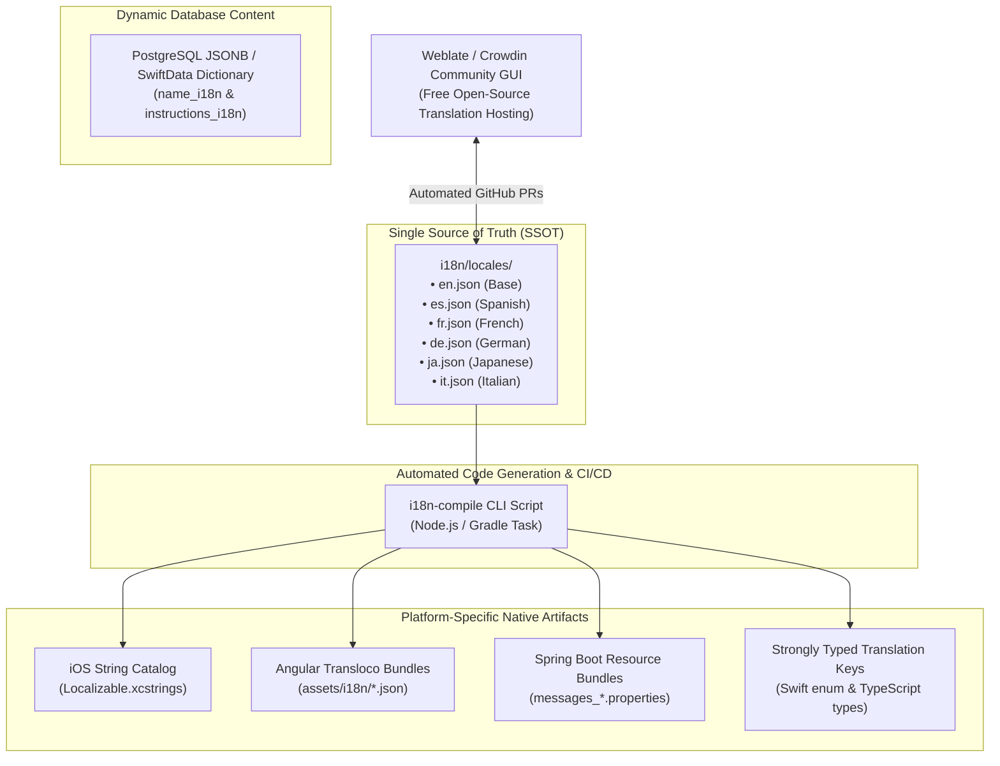

---

### 9.1 Cross-Platform Single Source of Truth (SSOT) & Codegen

The traditional anti-pattern in cross-platform development is maintaining three separate translation formats independently:
- iOS engineers edit `.xcstrings` or `.strings`.
- Web engineers edit Angular `.json` files.
- Backend engineers edit Spring `messages.properties`.

This leads to catastrophic key desynchronization, untranslated screens, and high friction when adding new languages.

#### The Unified SSOT Architecture:
1. **Central Locale Directory**:
   - Stored in the monorepo root at `i18n/locales/`:
     ```
     i18n/
     ├── locales/
     │   ├── en.json       # Canonical English (base)
     │   ├── es.json       # Spanish
     │   ├── fr.json       # French
     │   ├── de.json       # German
     │   ├── ja.json       # Japanese
     │   └── it.json       # Italian
     └── scripts/
         └── compile-i18n.ts
     ```
2. **Automated Codegen Build Pipeline (`npm run i18n:build`)**:
   - A single compilation script reads `i18n/locales/*.json` and automatically outputs:
     - **iOS**: Synthesizes `foss-training-ios/FOSSTraining/Resources/Localizable.xcstrings` (Xcode 15/16 native String Catalog format).
     - **Web**: Distributes optimized route bundles to `foss-training-web/src/assets/i18n/`.
     - **Backend**: Generates UTF-8 encoded `foss-training-api/src/main/resources/messages_{locale}.properties`.
     - **Type Safety**: Generates compile-time Swift (`AppString.Workout.start`) and TypeScript (`TKeys.Workout.Start`) enums, completely preventing typo errors at compile time.
3. **Adding a New Language (e.g. Japanese or German)**:
   - Add a single file (`i18n/locales/ja.json`).
   - Run `npm run i18n:build`.
   - All three platforms (iOS, Web, API) are immediately localized with **zero manual copying**.

---

### 9.2 Platform-Specific Integration Stack (iOS, Web & Backend)

#### 1. Native iOS Client (`foss-training-ios`):
- **Apple String Catalogs (`.xcstrings`)**:
  - Xcode 15/16 native JSON-based format that automatically tracks translation completion percentages per language.
  - Zero runtime parsing penalty: Compiled into binary `.stringsdict` during app archive.
- **SwiftUI Integration**:
  - Direct string key references:
    ```swift
    Text("workout.start_session", comment: "Button label to initiate workout execution")
    Text("workout.sets_remaining \(count)")
    ```
- **In-App Language Override**:
  - Athletes can choose their preferred application language in Settings independent of the iOS system language:
    ```swift
    @AppStorage("app_language") private var selectedLanguage: String = "system"
    // Injected into SwiftUI root:
    .environment(\.locale, selectedLanguage == "system" ? Locale.current : Locale(identifier: selectedLanguage))
    ```

#### 2. Web Client (`foss-training-web`):
- **Stack: `@ngneat/transloco`**:
  - The premier Angular 22 signals-compatible i18n library.
  - Supports instant runtime language switching without requiring full-page reloads.
- **Signal-Based Reactive Translation**:
  ```typescript
  // Inside Angular Standalone Component:
  readonly transloco = inject(TranslocoService);
  readonly currentLang = toSignal(this.transloco.langChanges$);
  ```
  ```html
  <button class="glass-btn">
    {{ 'workout.start_session' | transloco }}
  </button>
  ```
- **Scoped Lazy-Loading**:
  - Translation files are split into feature chunks (`common.json`, `exercises.json`, `analytics.json`), ensuring minimal initial page load weight.

#### 3. Backend REST API (`foss-training-api`):
- **Spring Boot `ResourceBundleMessageSource`**:
  - Auto-configured with fallback to `Locale.ENGLISH`.
- **Locale Resolution via HTTP Header**:
  - Ingests standard `Accept-Language` header (`Accept-Language: es-ES,es;q=0.9,en;q=0.8`).
- **Localized Bean Validation & Exceptions**:
  ```java
  @NotBlank(message = "{validation.exercise.name.required}")
  private String name;
  ```
  - `GlobalExceptionHandler` resolves error codes dynamically into the caller's language, ensuring localized API validation messages across Web and iOS.

---

### 9.3 Zero-Migration Database Localization (Exercises & Programs)

A critical architectural pitfall in database design is adding columns like `name_en`, `name_es`, `name_fr`, `name_de`. Every time a new language is added, developers must write painful database schema migrations and rebuild entity classes.

#### The Scalable Solution: Dynamic Key-Value Map Localization

#### 1. PostgreSQL Schema (`foss-training-api`):
Instead of fixed language columns, localized text is stored using PostgreSQL `JSONB`:

```sql
CREATE TABLE exercises (
    id BIGSERIAL PRIMARY KEY,
    canonical_key VARCHAR(100) NOT NULL UNIQUE,
    name_i18n JSONB NOT NULL DEFAULT '{"en": ""}'::jsonb,
    description_i18n JSONB NOT NULL DEFAULT '{"en": ""}'::jsonb,
    instructions_i18n JSONB NOT NULL DEFAULT '{"en": []}'::jsonb,
    created_at TIMESTAMP WITH TIME ZONE DEFAULT CURRENT_TIMESTAMP
);

-- Fast GIN index for search across all languages simultaneously:
CREATE INDEX idx_exercise_name_i18n ON exercises USING gin (name_i18n);
```

**Example JSONB Payload**:
```json
{
  "en": "Barbell Back Squat",
  "es": "Sentadilla Trasera con Barra",
  "fr": "Squat Arrière avec Barre",
  "de": "Kniebeuge mit Langhantel",
  "ja": "バーベルバックスクワット",
  "it": "Squat con Bilanciere"
}
```

**Query with Graceful Fallback**:
```sql
SELECT 
    id,
    COALESCE(name_i18n ->> :requestedLocale, name_i18n ->> 'en') AS localized_name
FROM exercises;
```

#### 2. SwiftData On-Device Model (`foss-training-ios`):
In SwiftData, exercises store translations as a lightweight dictionary:

```swift
@Model
public final class SDExercise {
    public var id: Int
    public var canonicalKey: String
    public var nameTranslations: [String: String]
    public var instructionsTranslations: [String: [String]]

    public func localizedName(for locale: String = Locale.current.language.languageCode?.identifier ?? "en") -> String {
        nameTranslations[locale] ?? nameTranslations["en"] ?? "Unnamed Exercise"
    }
}
```

**The Scalability Advantage**:
When adding **German**, **Japanese**, or **Italian**, **zero database migrations are required**. You simply update the seed JSON records. The database architecture is completely future-proof.

---

### 9.4 Community GitOps Translation Pipeline (Weblate / Crowdin)

Open-source applications thrive when their global user community can contribute translations effortlessly.

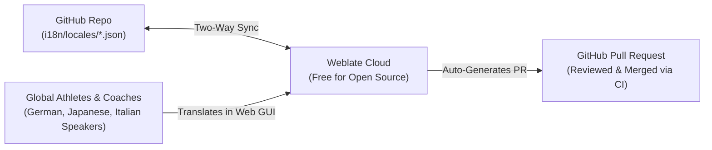

#### Recommended Platform: Weblate
1. **100% Free Hosting for Open Source**: Weblate provides free hosting for verified FOSS projects.
2. **GitOps Native**: Connects directly to the GitHub repository via Webhooks.
3. **Automated Pull Requests**: When a community member completes 100% of the Japanese (`ja.json`) or Italian (`it.json`) translation, Weblate automatically opens a clean GitHub Pull Request.
4. **Quality Gates & Validation**:
   - Flags missing formatting specifiers (`%@`, `{count}`).
   - Warns when translated strings exceed character length limits.
   - Prevents untranslated English strings from slipping into production releases.

---

### 9.5 Linguistic Nuances: ICU Pluralization, Japanese Typography & German Layouts

Translating a sports science app is more than swapping words; it requires handling deep linguistic and visual nuances:

#### 1. Pluralization Rules (ICU MessageFormat):
Different languages have completely different plural categories:
* **English, Spanish, French**: 2 categories (`one` vs `other`):
  - English: `1 set` / `3 sets`
  - Spanish: `1 serie` / `3 series`
* **Japanese (`ja`)**: 0 plural categories (Japanese nouns do not inflect for plurals):
  - `1セット` / `3セット` (always uses `other`)
* **Polish / Russian**: 3 to 4 plural categories (special rules for numbers ending in 2, 3, 4 vs 5-20):
  - ICU handles this automatically:
    ```icu
    {count, plural,
      one {# set completed}
      few {# sets completed}
      many {# sets completed}
      other {# sets completed}
    }
    ```

#### 2. Text Expansion & German Layout Ergonomics:
* German words are frequently **$30\% - 50\%$ longer** than English equivalents:
  - *"Rep Range"* $\rightarrow$ *"Wiederholungsbereich"*
  - *"Powerlifting"* $\rightarrow$ *"Kraftdreikampf"*
  - *"Heart Rate Variability"* $\rightarrow$ *"Herzfrequenzvariabilität"*
* **UI Design Rule for iOS and Web**:
  - Never use fixed-width buttons (`width: 120px`).
  - Use flexible SwiftUI `.frame(minWidth: ...)` and Tailwind `flex-wrap` / `min-w-fit`.
  - In SwiftUI, configure text labels with `.minimumScaleFactor(0.75)` and `.lineLimit(1)` on dense dashboard cards so German text scales gracefully without being truncated with ellipses (`...`).

#### 3. Japanese & East Asian Character Rendering:
* Japanese combines Kanji, Hiragana, and Katakana.
* Requires slightly increased vertical line-height (`line-height: 1.5` in Tailwind, `.lineSpacing(4)` in SwiftUI) to prevent dense Kanji characters from crowding.
* Avoid full-capitalization CSS (`uppercase`), which distorts Latin terms embedded inside Japanese fitness text (e.g. `1RM`, `RPE`, `FTP`).

#### 4. Locale-Aware Numbers, Decimals & Units:
* **Decimal Separator**:
  - English / Japanese: `100.5 kg`
  - Spanish / French / German / Italian: `100,5 kg`
* **Formatting Rule**:
  - Always use native `NumberFormatter` (Swift) and Angular `DecimalPipe` (`{{ weight | number:'1.1-2' }}`) rather than hardcoded `.toString()`, so athletes naturally see their native decimal commas or periods.

---

### 9.6 Phased Language Rollout Matrix

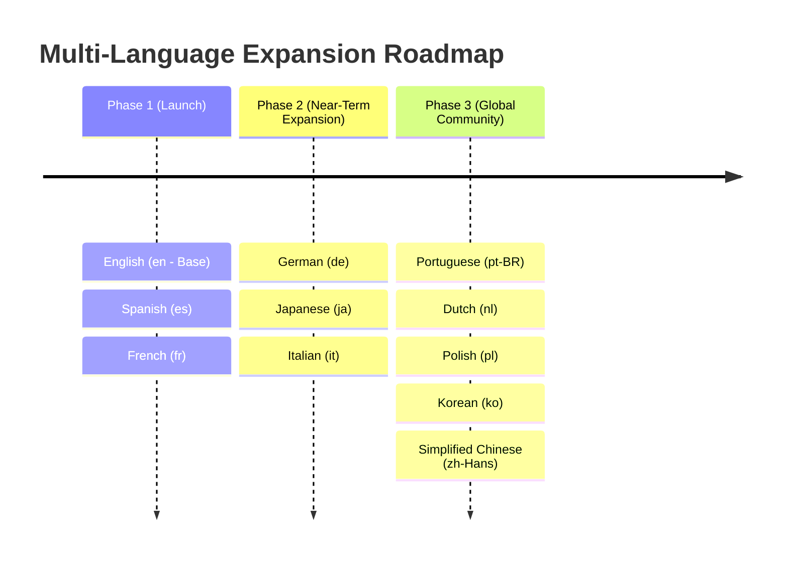

| Language Code | Language | Market Rationale & Fitness Culture | Target Phase |
|---|---|---|:---:|
| **`en`** | English | Global default language, international fitness standard. | **Phase 1 (Launch)** |
| **`es`** | Spanish | Spain & Latin America; massive running, triathlon, and gym community. | **Phase 1 (Launch)** |
| **`fr`** | French | France, Canada, Belgium; prominent cycling and trail running culture. | **Phase 1 (Launch)** |
| **`de`** | German | Germany, Austria, Switzerland; largest European fitness and endurance market. | **Phase 2 (Expansion)** |
| **`ja`** | Japanese | Japan; passionate marathon culture (Ekiden), cycling, and tech adoption. | **Phase 2 (Expansion)** |
| **`it`** | Italian | Italy; premier road cycling, endurance, and powerlifting heritage. | **Phase 2 (Expansion)** |
| **`pt-BR`** | Portuguese | Brazil; booming bodybuilding, fitness, and running community. | **Phase 3 (Community)** |
| **`pl`** | Polish | Strong powerlifting and strongman community. | **Phase 3 (Community)** |

---
*Created for FOSS Training. Maintain full data sovereignty.*


