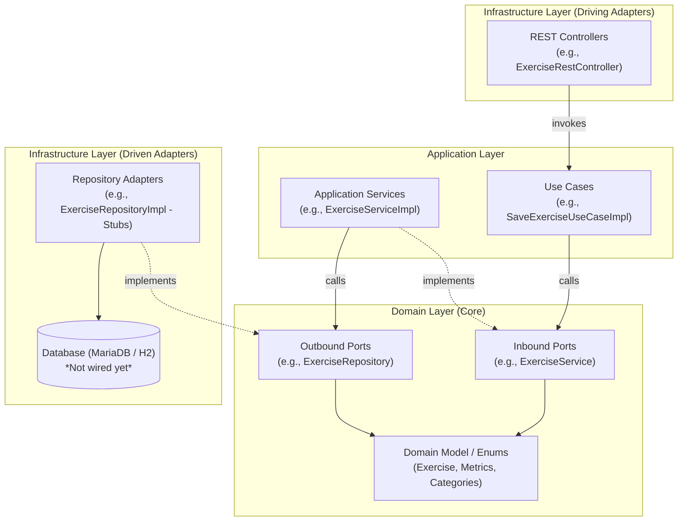

# Architectural Analysis: FOSS Training API

## Executive Summary

The `foss-training-api` module is the backend core for the **FOSS Training** project, built with **Java 21** and **Spring Boot 3.4.4**. The project is designed around **Hexagonal Architecture (Ports and Adapters)**, aiming to keep core training domain logic isolated from external frameworks, persistence mechanisms, and transport protocols.

While the domain classifications and scientific grounding are comprehensive, the architectural implementation exhibits several key strengths, design tensions, redundant layers of indirection, and notable anti-patterns that need to be addressed before persistence and frontend integrations are introduced.

---

## Architecture Overview & Component Diagram

The application implements a 3-tier Hexagonal (Clean) Architecture consisting of **Domain**, **Application**, and **Infrastructure** layers.



---

## Layer-by-Layer Architectural Assessment

### 1. Domain Layer (`domain/`)

The domain layer represents pure business concepts without framework dependencies.

```
domain/
├── model/
│   ├── exercise/       # Exercise entity, Enums, Metrics (Resistance, Endurance, Mobility)
│   ├── session/        # Session, SessionExercise, SessionPart
│   └── training/       # Training (placeholder)
└── ports/
    ├── in/             # Inbound contracts (e.g. ExerciseService, JointService)
    └── out/            # Outbound contracts (e.g. ExerciseRepository, JointRepository)
```

#### Key Strengths
- **Strict Boundary Isolation**: No Spring, JPA, or database annotations leak into the domain models.
- **Rich Domain Knowledge**: Domain enums like [`ExerciseCategory`](file:///home/deivision/Projects/Programming/Spring/foss-training/foss-training-api/src/main/java/com/david13penalver/foss_training_api/domain/model/exercise/ExerciseCategory.java), [`EnduranceType`](file:///home/deivision/Projects/Programming/Spring/foss-training/foss-training-api/src/main/java/com/david13penalver/foss_training_api/domain/model/exercise/endurance/EnduranceType.java), [`MovementPattern`](file:///home/deivision/Projects/Programming/Spring/foss-training/foss-training-api/src/main/java/com/david13penalver/foss_training_api/domain/model/exercise/mobility/MovementPattern.java), and [`MuscleGroup`](file:///home/deivision/Projects/Programming/Spring/foss-training/foss-training-api/src/main/java/com/david13penalver/foss_training_api/domain/model/exercise/resistance/MuscleGroup.java) contain rich metadata and helper methods (`isCompound()`, `isHighIntensity()`, `getByCategory()`).

#### Weaknesses & Structural Inconsistencies
> [!WARNING]
> **Polymorphic / Inheritance Disconnect in Session Modeling**
> In [`SessionExercise.java`](file:///home/deivision/Projects/Programming/Spring/foss-training/foss-training-api/src/main/java/com/david13penalver/foss_training_api/domain/model/session/SessionExercise.java), the class is declared `abstract` but contains concrete fields for `ResistanceSessionExercise`, `EnduranceSessionExercise`, and `MobilitySessionExercise`. Meanwhile, those specialized classes do **not** extend `SessionExercise`. This creates a hybrid composition/inheritance bug.

> [!WARNING]
> **Misplaced Enums**
> [`MovementPattern.java`](file:///home/deivision/Projects/Programming/Spring/foss-training/foss-training-api/src/main/java/com/david13penalver/foss_training_api/domain/model/exercise/mobility/MovementPattern.java) is located under `exercise/mobility/`, yet movement patterns (Push, Pull, Squat, Hinge, Lunge) are fundamental biomechanical patterns used extensively by `ResistanceMetrics`.

- **Anemic Domain Entities**: Entities like [`Exercise`](file:///home/deivision/Projects/Programming/Spring/foss-training/foss-training-api/src/main/java/com/david13penalver/foss_training_api/domain/model/exercise/Exercise.java) rely on Lombok `@Data` with public getters and setters, lacking business invariant enforcement or encapsulation.
- **Empty Artifacts**: [`Training.java`](file:///home/deivision/Projects/Programming/Spring/foss-training/foss-training-api/src/main/java/com/david13penalver/foss_training_api/domain/model/training/Training.java) is currently a blank 0-byte file.

---

### 2. Application Layer (`application/`)

The application layer coordinates business use cases and orchestrates data flow between inbound and outbound ports.

```
application/
├── services/           # Implementation of domain/ports/in/ (e.g. ExerciseServiceImpl)
└── usecases/           # Single-action use case interfaces and implementations
```

#### Major Architectural Concern: Redundant Indirection
In the current design, every request goes through:
`RestController` $\rightarrow$ `UseCaseImpl` $\rightarrow$ `ServiceImpl` $\rightarrow$ `RepositoryImpl`

| Class | Role | Example Operation |
|---|---|---|
| [`SaveExerciseUseCaseImpl`](file:///home/deivision/Projects/Programming/Spring/foss-training/foss-training-api/src/main/java/com/david13penalver/foss_training_api/application/usecases/exercise/exercise/impl/SaveExerciseUseCaseImpl.java) | Use Case | `return exerciseService.save(exercise);` |
| [`ExerciseServiceImpl`](file:///home/deivision/Projects/Programming/Spring/foss-training/foss-training-api/src/main/java/com/david13penalver/foss_training_api/application/services/exercise/ExerciseServiceImpl.java) | Domain/App Service | `return exerciseRepository.save(exercise);` |

> [!IMPORTANT]
> **Use Case vs. Port In Duplication**
> In standard Hexagonal Architecture:
> - Either **Use Cases ARE the Inbound Ports** (Controllers call Use Case interfaces directly; Use Cases call Repository ports).
> - Or **Inbound Service Interfaces are the Ports** (Controllers call Service ports directly).
> 
> Having both `*UseCase` and `*Service` as pass-throughs results in ~80 extra classes that add zero business logic while doubling the maintenance burden.

- **Framework Annotations in Application Core**: Classes use `@Service` and `@Component` directly in the application layer. In a strict hexagonal setup, beans should be wired via `@Configuration` in the infrastructure layer.

---

### 3. Infrastructure Layer (`infrastructure/`)

The infrastructure layer contains inbound driving adapters (REST controllers) and outbound driven adapters (repositories).

```
infrastructure/
├── adapters/
│   ├── in/rest/exercise/   # 8 Spring REST Controllers
│   ├── in/rest/session/    # (empty)
│   ├── out/exercise/       # 8 Repository implementations (stubs)
│   └── out/session/        # (empty)
└── configuration/          # (empty)
```

#### Critical Anti-Pattern: CRUD on Static Java Enums
Controllers have been generated for 7 static compile-time Java enums:
- `JointRestController`, `EquipmentRestController`, `MovementPatternRestController`, `MuscleGroupRestController`, `StretchTypeRestController`, `EnduranceTypeRestController`, `MobilityTypeRestController`

```java
// Example from JointRestController:
@PostMapping
public ResponseEntity<Joint> createJoint(@RequestBody Joint joint) { ... }

@DeleteMapping("/{name}")
public ResponseEntity<Void> deleteJoint(@PathVariable String name) { ... }
```

> [!CAUTION]
> **Enum REST Mutation Anti-Pattern**
> Java enums are compile-time constants. Exposing `POST`, `PUT`, and `DELETE` endpoints for enums like `Joint` or `Equipment` creates impossible operations (cannot dynamically instantiate or delete enum constants at runtime).
> 
> **Solution**: Metadata enums should either be read-only reference endpoints (`GET /api/reference/joints`, `GET /api/reference/equipment`) or transformed into true database entities if dynamic user-defined equipment/joints are required.

#### Other Infrastructure Deficiencies
1. **Absence of DTOs & Validation**: REST controllers directly accept and return domain entities (`@RequestBody Exercise exercise`). No validation (`@Valid`, `@NotNull`, `@NotBlank`) or request/response DTOs exist.
2. **Missing Global Exception Handling**: No `@RestControllerAdvice` or centralized exception mapper. Business errors (e.g. `IllegalArgumentException`) return unformatted 500 errors.
3. **Unwired Persistence**: `spring-boot-starter-data-jpa` is declared in `pom.xml`, but all repositories return hardcoded dummy values (`List.of()`, `null`, `false`). No JPA entities (`@Entity`), Spring Data interfaces (`JpaRepository`), or database migrations exist.
4. **Empty Configuration**: `infrastructure/configuration/` is empty, and `application.properties` lacks database, server, or profile configurations.

---

### 4. Testing Architecture (`src/test/`)

```
src/test/java/
├── com/david13penalver/foss_training_api/
│   └── FossTrainingApiApplicationTests.java   # Basic Spring Boot context test
└── unitary/com/david13penalver/...            # Unit tests
```

#### Findings
- **Non-Standard Package Structure**: Test classes are placed under `package unitary.com.david13penalver...` rather than mirroring the main source package `com.david13penalver...`.
- **Pass-Through Mock Tests**: Tests verify Mockito call forwarding across the redundant UseCase $\rightarrow$ Service layers without testing real domain invariant rules.
- **Missing Slices**: No `@WebMvcTest` controller tests, no `@DataJpaTest` repository tests, and no integration tests.

---

## Architectural Metrics & Comparison

| Aspect | Current Implementation | Target Hexagonal Standard | Status |
|---|---|---|---|
| **Domain Purity** | No framework dependencies in `domain/` | Pure Java domain | ✅ Good |
| **Domain Richness** | Enums have rich data, entities are anemic `@Data` | Domain encapsulation & validation | 🟡 Moderate |
| **Port / Adapter Flow** | Controller $\rightarrow$ UseCase $\rightarrow$ Service $\rightarrow$ Repo | Controller $\rightarrow$ UseCase (Port In) $\rightarrow$ Repo (Port Out) | ⚠️ Over-engineered |
| **API Transport / DTOs** | Direct domain model serialization | Dedicated Request/Response DTOs & Mappers | ❌ Missing |
| **Enum Management** | Full CRUD REST APIs for static Java Enums | Read-only reference endpoints or DB Entities | ❌ Critical Flaw |
| **Persistence Integration**| Stubbed repositories, no JPA entities | Spring Data JPA + Flyway/Liquibase | ⏳ Pending |
| **Error Handling** | None (Default Spring errors) | Centralized `@RestControllerAdvice` + ProblemDetail | ❌ Missing |
| **Testing Strategy** | Mockito forwarding tests with `unitary.*` package | True unit + WebMvc slice + ArchUnit tests | 🟡 Needs Cleanup |

---

## Actionable Recommendations & Refactoring Roadmap

### Phase 1: Architectural Simplification & Boundary Cleanup (High Priority)
1. **Fix Enum vs Entity Strategy**:
   - For static classifications: Change controllers to read-only endpoints (e.g., `GET /api/reference/equipment`). Remove `Save`, `Delete`, `Exists` use cases and repository stubs for enums.
   - For dynamic items: Convert enums to proper database entities with IDs if users should be able to create custom equipment or muscle groups.
2. **Flatten Application Redundancy**:
   - Adopt single-level Use Cases implementing Inbound Ports directly (`UseCaseImpl` $\rightarrow$ `ExerciseRepository`), removing intermediate pass-through `*ServiceImpl` classes.
3. **Fix Domain Model Flaws**:
   - Refactor `SessionExercise` to either a proper inheritance hierarchy (`ResistanceSessionExercise extends SessionExercise`) or pure composition.
   - Relocate `MovementPattern` to `domain.model.exercise.common` or `domain.model.exercise.resistance`.
   - Remove or implement [`Training.java`](file:///home/deivision/Projects/Programming/Spring/foss-training/foss-training-api/src/main/java/com/david13penalver/foss_training_api/domain/model/training/Training.java).

### Phase 2: API Robustness & Transport Layer (Medium Priority)
1. **Introduce DTOs and Mappers**:
   - Create Request/Response DTOs in `infrastructure/adapters/in/rest/dto/` (e.g., `CreateExerciseRequest`, `ExerciseResponse`).
   - Use MapStruct to map between DTOs and Domain Models.
2. **Add Validation and Exception Handling**:
   - Add `spring-boot-starter-validation` and annotate DTOs (`@NotNull`, `@Size`, `@Positive`).
   - Implement `@RestControllerAdvice` to translate domain exceptions into standardized RFC 7807 `ProblemDetail` responses.

### Phase 3: Persistence & Database Integration (Medium Priority)
1. **JPA Adapters & Schema**:
   - Create JPA entity mappings in `infrastructure/adapters/out/persistence/entity/`.
   - Implement `ExerciseRepositoryImpl` delegating to Spring Data JPA `JpaRepository`.
   - Add Flyway / Liquibase database migrations for MariaDB schema management.

### Phase 4: Test Suite & Governance (Low Priority)
1. **Fix Test Packaging**:
   - Align test packages to match `com.david13penalver.foss_training_api...`.
2. **Add ArchUnit & Slice Tests**:
   - Add ArchUnit tests to automatically verify that Domain never depends on Application/Infrastructure and Application never depends on Infrastructure.
   - Add `@WebMvcTest` controllers test coverage.
