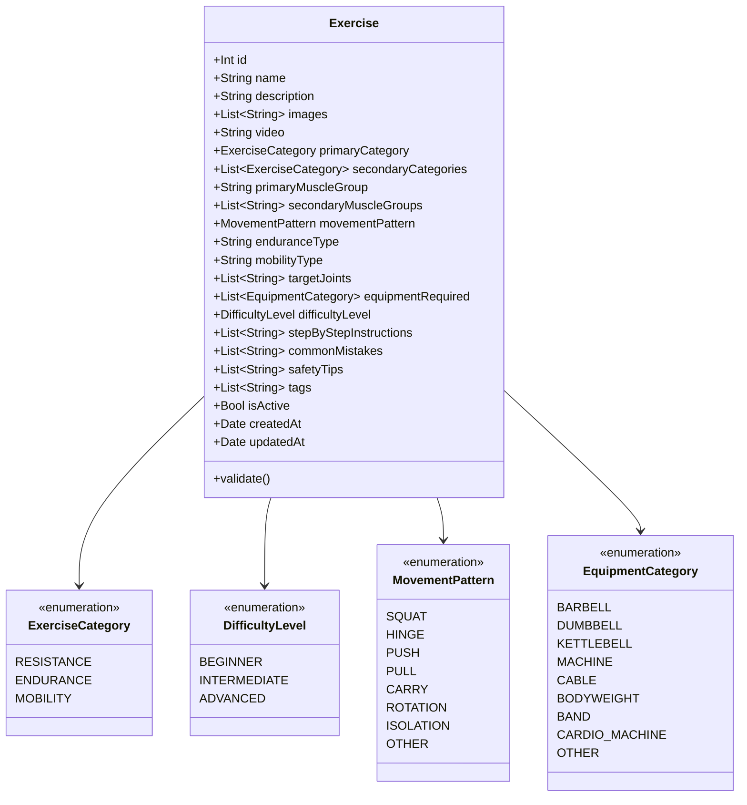

# SPEC-01: Exercise Catalog & Management — Detailed Specification

**Module:** Exercise Management  
**Status:** Ready for Review (Specification Only — No Implementation Yet)  
**Target:** iOS 26+ (Swift 6, SwiftUI, SwiftData, Swift Testing)  
**Backend Parity:** `ExerciseRestController.java` (`foss-training-api`)  

---

## 1. Executive Summary & User Stories

The **Exercise Catalog & Management** module provides athletes with a unified library of physical training movements across three primary modalities: **Resistance**, **Endurance**, and **Mobility**. It enables querying with multi-faceted filtering, detailed biomechanical instruction views, and full CRUD authoring for custom user-created exercises.

### User Stories
- **US-01.1 (Catalog Browsing):** As an athlete, I want to search and filter exercises by category, target muscle, and available equipment so that I can quickly select movements that match my training goals and gym setup.
- **US-01.2 (Biomechanical Details):** As an athlete, I want to inspect step-by-step instructions, movement patterns, safety tips, and common mistakes so that I can perform exercises with proper technique and minimize injury risk.
- **US-01.3 (Custom Movement Creation):** As an athlete, I want to create custom exercises with modality-specific metrics (e.g. primary muscles for resistance, joint targets for mobility) so that my catalog reflects my personalized routine.
- **US-01.4 (Editing & History Preservation):** As an athlete, I want to edit my custom exercises without altering or corrupting previously logged historical workouts that reference them.
- **US-01.5 (Safe Deletion):** As an athlete, I want to delete unwanted custom exercises safely via soft-delete, ensuring that past workout sessions do not suffer from dangling references or missing metadata.

---

## 2. Domain Model & Business Invariants



### 2.1 Invariants & Validation Rules
1. **Name Invariant:** Exercise `name` must be trimmed, non-blank, minimum 2 characters, maximum 100 characters.
2. **Category Invariant:** `primaryCategory` is mandatory.
   - If `primaryCategory == .resistance`: `movementPattern` is required; `primaryMuscleGroup` is recommended.
   - If `primaryCategory == .endurance`: `enduranceType` must specify modality (`Running`, `Cycling`, `Rowing`, etc.).
   - If `primaryCategory == .mobility`: `mobilityType` (`Dynamic`, `Static`, `PNF`) and at least 1 target joint are required.
3. **Equipment Invariant:** At least one `EquipmentCategory` must be specified (defaults to `BODYWEIGHT` if none selected).
4. **Soft-Delete Rule:** Deleting an exercise sets `isActive = false`. It is never physically erased from the database if workouts reference it.
5. **System vs. Custom Flag:** Seeded/System exercises (IDs $1\dots 50$) are marked read-only; user can clone or hide them, but only user-created exercises can be edited or deleted.

---

## 3. Hexagonal Outbound Port Contract

The domain defines the outbound persistence contract via the `ExerciseRepository` protocol.

```swift
public protocol ExerciseRepository: Sendable {
    /// Fetches all active exercises matching optional filters
    func getExercises(
        category: ExerciseCategory?,
        search: String?,
        equipment: [EquipmentCategory]?,
        difficulty: DifficultyLevel?
    ) async throws -> [Exercise]

    /// Retrieves single exercise by ID with full instruction details
    func getExercise(id: Int) async throws -> Exercise?

    /// Saves (creates or updates) an exercise
    func saveExercise(_ exercise: Exercise) async throws -> Exercise

    /// Soft-deletes an exercise by setting isActive = false
    func deleteExercise(id: Int) async throws

    /// Verifies if an exercise ID exists
    func exerciseExists(id: Int) async throws -> Bool
}
```

---

## 4. Dual-Tier Implementation Specifications

### 4.1 Tier 1: Local SwiftData Adapter (`SwiftDataExerciseRepository`)
- **Entity:** `@Model SDExercise`
- **Predicate Filtering:**
  ```swift
  #Predicate<SDExercise> { exercise in
      exercise.isActive == true
  }
  ```
- **Local ID Generation:**
  - System seeds occupy IDs $1\dots 999$.
  - User-created local exercises receive auto-incremented IDs starting from $1000$ (or negative IDs if pending cloud sync).
- **Concurrency:** Uses `ModelContext` isolated on `@MainActor` for seamless UI binding.

### 4.2 Tier 2: Premium REST API Adapter (`RemoteExerciseRepository`)
Directly maps to the Spring Boot endpoints in [`ExerciseRestController.java`](file:///Users/deivision/David/foss-training/foss-training-api/src/main/java/com/david13penalver/foss_training_api/infrastructure/adapters/in/rest/exercise/ExerciseRestController.java):

| Operation | HTTP Method & Path | Query / Body Payload | Response Code & DTO |
| :--- | :--- | :--- | :--- |
| **List Exercises** | `GET /api/exercises` | `?category=RESISTANCE&search=squat` | `200 OK` $\rightarrow$ `[ExerciseResponseDto]` |
| **Search Exercises** | `GET /api/exercises/search` | `?keyword=bench&difficulty=INTERMEDIATE` | `200 OK` $\rightarrow$ `[ExerciseResponseDto]` |
| **Get Exercise by ID** | `GET /api/exercises/{id}` | None | `200 OK` $\rightarrow$ `ExerciseResponseDto` / `404` |
| **Create Exercise** | `POST /api/exercises` | `ExerciseRequestDto` (JSON) | `201 Created` $\rightarrow$ `ExerciseResponseDto` |
| **Update Exercise** | `PUT /api/exercises/{id}` | `ExerciseRequestDto` (JSON) | `200 OK` $\rightarrow$ `ExerciseResponseDto` |
| **Delete Exercise** | `DELETE /api/exercises/{id}` | None | `204 No Content` |
| **Check Existence** | `GET /api/exercises/{id}/exists` | None | `200 OK` $\rightarrow$ `Boolean` |

---

## 5. UI/UX Component Architecture & Flow

```mermaid
graph TD
    A["ExerciseCatalogView<br>• Search bar (.searchable)<br>• Category pills (All, Resistance, Endurance, Mobility)<br>• Filter Drawer trigger<br>• + Add Exercise button"] -->|Tap Exercise| B["ExerciseDetailView<br>• Muscle anatomy badges<br>• Equipment tags<br>• Step-by-step instructions list<br>• Common mistakes & safety<br>• Edit / Delete toolbar"]
    A -->|Tap Filter Button| C["ExerciseFilterSheet<br>• Equipment multi-select<br>• Difficulty level picker<br>• Movement pattern picker"]
    A -->|Tap + Button| D["ExerciseEditorSheet (Mode: Create)<br>• Form with modality-reactive fields<br>• Instructions dynamic list editor<br>• Real-time validation"]
    B -->|Tap Edit (Custom)| E["ExerciseEditorSheet (Mode: Edit)<br>• Pre-populated form"]
```

### 5.1 Component Breakdown

#### 1. `ExerciseCatalogView`
- **Top Bar:** Title `"Exercises"`, native `.searchable(text: $query)`, Filter Drawer icon, and Add Button (`+`).
- **Category Filter Chips Bar:** Sticky horizontal `ScrollView(.horizontal)` with capsule pills:
  - `All`
  - `Resistance` (`dumbbell.fill`)
  - `Endurance` (`figure.run`)
  - `Mobility` (`figure.flexibility`)
- **List Section:** Native SwiftUI `List` styled with `.themedCard()`.
  - Item Row: Name, Primary Category badge, Target Muscle subtitle, Equipment badges.
- **Empty States:** Native `ContentUnavailableView` when search query matches zero records.

#### 2. `ExerciseDetailView`
- **Header Card:** Exercise name, category badge, difficulty badge, optional description.
- **Anatomy & Muscle Section:** Target muscle group badges (Primary highlighted with theme accent color, secondary muscles as secondary capsules).
- **Movement Pattern Card:** Displays functional movement pattern (`Squat`, `Hinge`, `Push`, `Pull`, etc.).
- **Equipment Section:** Flow layout chips of required gear.
- **Instructions Section:** Ordered numbered list ($1, 2, 3\dots$) with highlighted bold step numbers.
- **Common Mistakes & Safety Tips:** Alert-themed cards with warning icons.
- **Action Toolbar:**
  - *Custom Exercise:* Shows "Edit" button and "Delete" button.
  - *System Exercise:* Shows informational badge `"System Movement"`.

#### 3. `ExerciseEditorSheet` (Form Modal)
- Presented via `.sheet(isPresented: $isEditorPresented)`.
- **Section 1: Basic Information:**
  - Name (`TextField` with inline character count).
  - Description (`TextField(axis: .vertical)`).
  - Difficulty Level (`Picker` segmented or menu: Beginner, Intermediate, Advanced).
- **Section 2: Modality Selection:**
  - Segmented Picker: `Resistance` | `Endurance` | `Mobility`.
- **Section 3: Modality Specifics (Dynamic):**
  - *If Resistance:* Primary Muscle Group (`Picker`), Movement Pattern (`Picker`).
  - *If Endurance:* Endurance Type (`TextField` / `Picker`: Running, Cycling, Rowing, etc.).
  - *If Mobility:* Mobility Type (`Picker`: Dynamic, Static, PNF), Target Joints (`Picker` multi-select).
- **Section 4: Equipment Required:**
  - Multi-select toggle grid for equipment (`Barbell`, `Dumbbell`, `Kettlebell`, `Cable`, `Machine`, `Bodyweight`, `Bands`).
- **Section 5: Step-by-Step Instructions:**
  - Dynamic reorderable list of instruction steps.
  - "Add Step" button and swipe-to-delete step.
- **Toolbar:** "Cancel" and "Save" (disabled if validation fails).

---

## 6. ViewModels & State Management

```swift
@Observable
@MainActor
final class ExerciseListViewModel {
    // Dependencies
    private let exerciseRepository: ExerciseRepository

    // State
    var exercises: [Exercise] = []
    var searchQuery: String = ""
    var selectedCategory: ExerciseCategory?
    var selectedEquipment: Set<EquipmentCategory> = []
    var selectedDifficulty: DifficultyLevel?
    var isLoading: Bool = false
    var errorMessage: String?
    
    // Navigation / Modals
    var isFilterSheetPresented: Bool = false
    var isEditorPresented: Bool = false
    var editingExercise: Exercise?

    // Intent Methods
    func loadExercises() async
    func selectCategory(_ category: ExerciseCategory?) async
    func applyFilters(equipment: Set<EquipmentCategory>, difficulty: DifficultyLevel?) async
    func deleteExercise(id: Int) async
}

@Observable
@MainActor
final class ExerciseEditorViewModel {
    // Dependencies
    private let exerciseRepository: ExerciseRepository
    let originalExercise: Exercise?

    // Form Fields
    var name: String = ""
    var exerciseDescription: String = ""
    var category: ExerciseCategory = .resistance
    var difficulty: DifficultyLevel = .beginner
    var primaryMuscleGroup: String = ""
    var secondaryMuscleGroups: [String] = []
    var movementPattern: MovementPattern = .push
    var enduranceType: String = ""
    var mobilityType: String = ""
    var selectedEquipment: Set<EquipmentCategory> = [.bodyweight]
    var instructions: [String] = []
    var tags: [String] = []

    // State
    var isSaving: Bool = false
    var validationError: String?

    // Computed Properties
    var isValid: Bool {
        name.trimmingCharacters(in: .whitespaces).count >= 2 && !selectedEquipment.isEmpty
    }

    // Actions
    func save() async -> Bool
    func addInstructionStep()
    func removeInstructionStep(at index: Int)
}
```

---

## 7. TDD Test Scenarios & Acceptance Criteria

```swift
@Suite("SPEC-01: Exercise Catalog & Management Acceptance Tests")
struct ExerciseManagementSpecTests {
    // 1. Validation Invariants
    @Test("Rejects exercise with blank name")
    func testValidationBlankName()

    @Test("Rejects exercise with empty equipment")
    func testValidationEmptyEquipment()

    // 2. Querying & Filtering
    @Test("Filter by Category isolates Resistance vs Mobility")
    func testCategoryFiltering()

    @Test("Search query matches exercise name or muscle group")
    func testSearchQueryMatching()

    // 3. Persistence CRUD
    @Test("Creating an exercise generates valid ID and persists in SwiftData")
    func testCreateExercisePersistence()

    @Test("Editing exercise updates fields without creating duplicates")
    func testUpdateExercisePersistence()

    @Test("Deleting exercise sets isActive flag to false (soft-delete)")
    func testSoftDeletePreservesHistory()

    // 4. Remote REST Parity
    @Test("Remote adapter correctly encodes ExerciseRequestDto to Spring Boot wire format")
    func testRemoteDtoEncoding()
}
```
