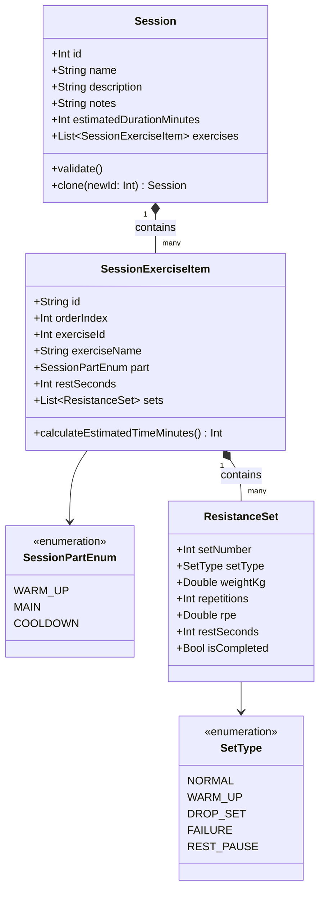
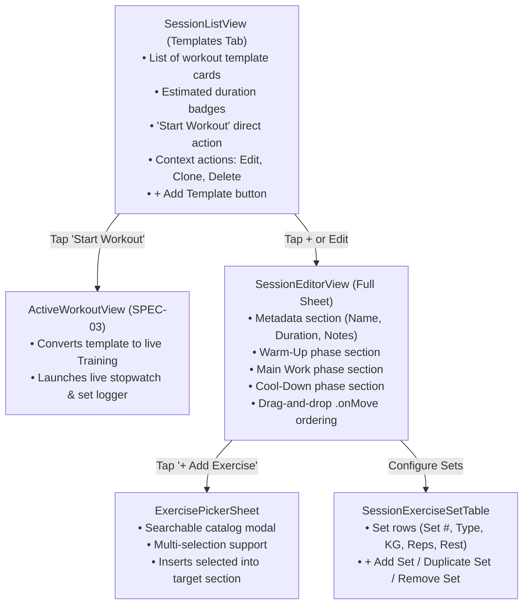

# SPEC-02: Session Templates & Workout Builder — Detailed Specification

**Module:** Session Templates & Workout Builder  
**Status:** Ready for Review (Specification Only — No Implementation Yet)  
**Target:** iOS 26+ (Swift 6, SwiftUI, SwiftData, Swift Testing)  
**Backend Parity:** `SessionRestController.java` (`foss-training-api`)  

---

## 1. Executive Summary & User Stories

A **Session** is a structured workout template that models an ordered sequence of exercises with target sets, repetitions, resistance loads, and rest periods. It acts as the reusable blueprint for live workout executions.

### User Stories
- **US-02.1 (Template Creation):** As an athlete, I want to create workout templates (e.g. "Upper Body Power", "Leg Hypertrophy") so that I can reuse consistent routines without re-entering exercises every workout.
- **US-02.2 (Multi-Part Organization):** As an athlete, I want to divide my session into distinct phases (`Warm-Up`, `Main Work`, `Cool-Down`) so that my workout has a structured, injury-preventive progression.
- **US-02.3 (Exercise Sequencing & Reordering):** As an athlete, I want to reorder exercises via drag-and-drop so that I can prioritize compound lifts before isolation accessories.
- **US-02.4 (Set Target Configuration):** As an athlete, I want to configure target sets, set types (Warm-up, Work set, Drop set, Failure), target weight (kg), target reps, and rest duration (seconds) for each exercise.
- **US-02.5 (1-Tap Cloning):** As an athlete, I want to duplicate existing templates with one tap so that I can quickly create variations (e.g., "Leg Day A" vs. "Leg Day B").
- **US-02.6 (Instant Execution):** As an athlete, I want a 1-tap "Start Workout" button on any template to instantly instantiate and launch an active live workout session.

---

## 2. Domain Model & Business Invariants



### 2.1 Invariants & Business Rules
1. **Name Invariant:** Template `name` must be trimmed, non-blank, $\ge 2$ characters and $\le 100$ characters.
2. **Exercise Count Invariant:** A template must have at least 1 exercise before being saved or launched.
3. **Sequential Ordering Invariant:** Within any section (`WARM_UP`, `MAIN`, `COOLDOWN`), exercise `orderIndex` must be sequential ($0, 1, 2\dots$) with no gaps.
4. **Set Integrity Invariant:**
   - Every `SessionExerciseItem` must contain at least 1 `ResistanceSet`.
   - Set numbers within an exercise must start at $1$ and increment sequentially ($1, 2, 3\dots$).
5. **Rest Duration Bounds:** `restSeconds` must be between $0$ and $600$ seconds (default: $90$ seconds).
6. **Independence Invariant:** Editing or deleting a template must **never** mutate, corrupt, or cascade-delete previously completed `Training` records that were instantiated from it.

---

## 3. Hexagonal Outbound Port Contract

```swift
public protocol SessionRepository: Sendable {
    /// Retrieves all workout templates sorted alphabetically
    func getSessions() async throws -> [Session]

    /// Retrieves a single template by ID
    func getSession(id: Int) async throws -> Session?

    /// Saves (creates or updates) a template
    func saveSession(_ session: Session) async throws -> Session

    /// Deletes a template and its configuration sets
    func deleteSession(id: Int) async throws

    /// Duplicates a template, appending " (Copy)" to its name
    func cloneSession(id: Int) async throws -> Session

    /// Checks if a session template ID exists
    func sessionExists(id: Int) async throws -> Bool
}
```

---

## 4. Dual-Tier Implementation Specifications

### 4.1 Tier 1: Local SwiftData Adapter (`SwiftDataSessionRepository`)
- **Entities:**
  - `@Model SDSession`
  - `@Model SDSessionExercise`
  - `@Model SDResistanceSet`
- **Relationship Rules:**
  ```swift
  @Relationship(deleteRule: .cascade) var exercises: [SDSessionExercise]
  ```
  Deleting an `SDSession` automatically cleans up all associated `SDSessionExercise` and `SDResistanceSet` records without orphaned database rows.
- **Cloning Implementation:**
  - Performs a deep copy of the `SDSession` hierarchy.
  - Automatically calculates the next available local unique integer ID.
  - Appends `" (Copy)"` to the cloned session's name.

### 4.2 Tier 2: Premium REST API Adapter (`RemoteSessionRepository`)
Directly maps to the Spring Boot REST endpoints in [`SessionRestController.java`](file:///Users/deivision/David/foss-training/foss-training-api/src/main/java/com/david13penalver/foss_training_api/infrastructure/adapters/in/rest/session/SessionRestController.java):

| Operation | HTTP Method & Path | Payload / Query | Response Code & DTO |
| :--- | :--- | :--- | :--- |
| **List Templates** | `GET /api/sessions` | None | `200 OK` $\rightarrow$ `[SessionResponseDto]` |
| **Get Template by ID** | `GET /api/sessions/{id}` | None | `200 OK` $\rightarrow$ `SessionResponseDto` / `404` |
| **Create Template** | `POST /api/sessions` | `SessionRequestDto` (JSON) | `201 Created` $\rightarrow$ `SessionResponseDto` |
| **Update Template** | `PUT /api/sessions/{id}` | `SessionRequestDto` (JSON) | `200 OK` $\rightarrow$ `SessionResponseDto` |
| **Delete Template** | `DELETE /api/sessions/{id}` | None | `204 No Content` |
| **Clone Template** | `POST /api/sessions/{id}/clone` | None | `201 Created` $\rightarrow$ `SessionResponseDto` |
| **Check Existence** | `GET /api/sessions/{id}/exists` | None | `200 OK` $\rightarrow$ `Boolean` |

---

## 5. UI/UX Component Architecture & Flow



### 5.1 Component Details

#### 1. `SessionListView` (Main Tab View)
- **Top Bar:** Title `"Templates"`, search bar for template names, and Add button (`+`).
- **Template Card Row:**
  - Header: Name in bold headline, estimated duration pill (`clock` icon: `45 min`).
  - Description / notes snippet.
  - Exercises preview: e.g. *"Barbell Bench Press, Incline Dumbbell Press, Pull-Up (3 exercises, 10 sets)"*.
  - Primary Action Button: Prominent themed *"Start This Workout"* CTA button with `play.fill` icon.
  - Context Actions / Swipe Actions:
    - `Edit` (`pencil`)
    - `Duplicate / Clone` (`doc.on.doc`)
    - `Delete` (`trash` with destructive role)
- **Empty State:** `ContentUnavailableView` encouraging user to create their first workout template.

#### 2. `SessionEditorView` (Template Builder Sheet)
- **Header Section:**
  - Name (`TextField` with autofocus on creation).
  - Description (`TextField` optional).
  - Estimated duration wheel / stepper (15 min to 180 min, step: 5 min).
  - Notes field (e.g. focus cues, mobility requirements).
- **Phased Workout Sections:**
  - `Section("Warm-Up")`: Mobility drills, dynamic stretches, activation exercises.
  - `Section("Main Work")`: Heavy compound lifts, accessory hypertrophy exercises.
  - `Section("Cool-Down")`: Static stretching, foam rolling, breathing.
- **Each Section Features:**
  - Section header action: `+ Add Exercise` button opening the `ExercisePickerSheet`.
  - Reorderable list: Native `.onMove` allowing users to reorder movements within the section or move them between sections.
  - Swipe-to-remove exercise from template.
- **Toolbar:**
  - Leading: "Cancel" (with dirty-state discard confirmation).
  - Trailing: "Save Template" (disabled if name is empty or total exercises is 0).

#### 3. `SessionExerciseSetTable` (Card Inside Editor)
- **Exercise Header:**
  - Exercise title.
  - Rest Duration Picker: Capsule wheel or menu (`30s`, `60s`, `90s`, `120s`, `180s`, `240s`, `300s`).
- **Sets Table Grid:**
  - Column 1: Set Number ($1, 2, 3\dots$).
  - Column 2: Set Type Picker:
    - `Normal` (Work set)
    - `Warm-up` (Reduced load prep)
    - `Drop Set` (Fatigue extension)
    - `Failure` (Max effort)
    - `Rest Pause`
  - Column 3: Target Weight Stepper / Input ($0\dots 500$ kg).
  - Column 4: Target Repetitions Stepper / Input ($1\dots 50$ reps).
  - Column 5: Delete set button (`xmark.circle`).
- **Footer Actions:**
  - `+ Add Set` (copies targets from the previous set).
  - Quick action: "Duplicate Last Set".

#### 4. `ExercisePickerSheet`
- Full-screen or modal sheet.
- Search bar filtering the catalog in real-time.
- Category tabs (`All`, `Resistance`, `Endurance`, `Mobility`).
- Checkbox selection allowing users to select multiple movements at once and insert them directly into the current section.

---

## 6. ViewModels & State Management

```swift
@Observable
@MainActor
final class SessionListViewModel {
    private let sessionRepository: SessionRepository
    private let trainingRepository: TrainingRepository

    // State
    var sessions: [Session] = []
    var searchQuery: String = ""
    var isLoading: Bool = false
    var errorMessage: String?
    
    // Navigation / Modals
    var isEditorPresented: Bool = false
    var editingSession: Session?
    var launchedTraining: Training?

    // Intent Methods
    func loadSessions() async
    func deleteSession(id: Int) async
    func cloneSession(id: Int) async
    func startWorkout(from session: Session) async
}

@Observable
@MainActor
final class SessionEditorViewModel {
    private let sessionRepository: SessionRepository
    let originalSessionId: Int?

    // Form State
    var name: String = ""
    var sessionDescription: String = ""
    var notes: String = ""
    var estimatedDurationMinutes: Int = 60
    
    // Exercise Lists grouped by section
    var warmUpExercises: [SessionExerciseItem] = []
    var mainExercises: [SessionExerciseItem] = []
    var coolDownExercises: [SessionExerciseItem] = []

    // Modals
    var isPickerPresented: Bool = false
    var targetSectionForPicker: SessionPartEnum = .main

    // Computed Properties
    var totalExercisesCount: Int {
        warmUpExercises.count + mainExercises.count + coolDownExercises.count
    }
    
    var isValid: Bool {
        name.trimmingCharacters(in: .whitespaces).count >= 2 && totalExercisesCount > 0
    }

    // Actions
    func addExercises(_ exercises: [Exercise], to part: SessionPartEnum)
    func removeExercise(at index: Int, from part: SessionPartEnum)
    func moveExercises(from source: IndexSet, to destination: Int, in part: SessionPartEnum)
    func addSet(to exerciseId: Int, in part: SessionPartEnum)
    func removeSet(setNumber: Int, from exerciseId: Int, in part: SessionPartEnum)
    func save() async -> Bool
}
```

---

## 7. TDD Test Scenarios & Acceptance Criteria

```swift
@Suite("SPEC-02: Session Templates & Workout Builder Acceptance Tests")
struct SessionTemplateSpecTests {
    // 1. Invariant Tests
    @Test("Rejects session template with blank name")
    func testValidationBlankName()

    @Test("Rejects session template with 0 exercises")
    func testValidationZeroExercises()

    // 2. Multi-Part Sequencing
    @Test("Exercises placed in WARM_UP, MAIN, and COOLDOWN maintain correct orderIndex")
    func testMultiPartSequencing()

    @Test("Reordering exercises inside MAIN work updates orderIndex without gaps")
    func testDragAndDropReordering()

    // 3. Set Configuration
    @Test("Adding a set to an exercise creates sequential set numbers (1, 2, 3...)")
    func testSetNumberSequence()

    // 4. Persistence & Cloning
    @Test("Cloning a template creates a deep copy with (Copy) name suffix and new ID")
    func testDeepCloneTemplate()

    @Test("Deleting a template cascades delete to its child session exercises and sets")
    func testCascadeDeletion()

    // 5. Workout Launch
    @Test("Launching workout from template instantiates a PLANNED Training with identical exercises and sets")
    func testLaunchWorkoutFromTemplate()
}
```
