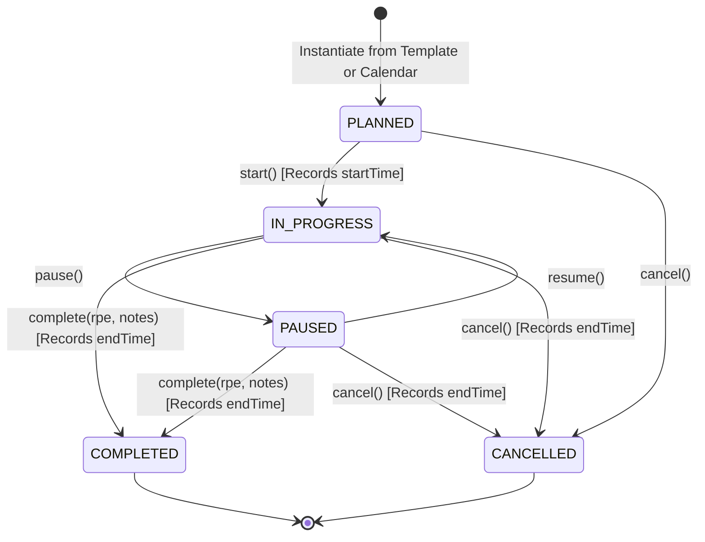
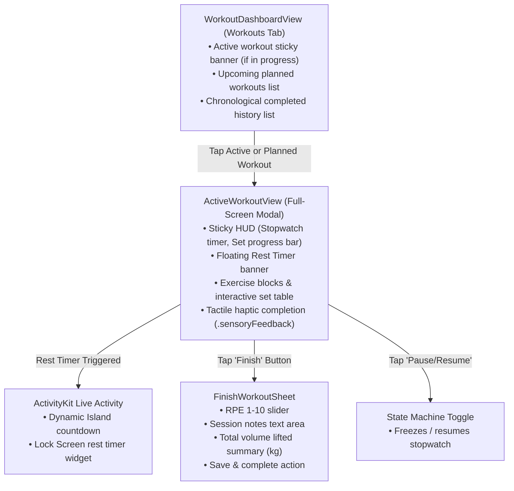

# SPEC-03: Live Workout Execution & Tracker — Detailed Specification

**Module:** Live Workout Execution & Tracker  
**Status:** Ready for Review (Specification Only — No Implementation Yet)  
**Target:** iOS 26+ (Swift 6, SwiftUI, SwiftData, ActivityKit, Swift Testing)  
**Backend Parity:** `TrainingRestController.java` (`foss-training-api`)  

---

## 1. Executive Summary & User Stories

The **Live Workout Execution & Tracker** module governs the real-time logging, timing, and state lifecycle of training sessions. It transforms static workout templates into interactive, tactile gym sessions with rest timers, sensory haptics, and background Lock Screen / Dynamic Island visibility.

### User Stories
- **US-03.1 (Workout Initiation):** As an athlete, I want to instantiate an active workout from a template or start an empty ad-hoc session so that I can immediately begin logging sets in the gym.
- **US-03.2 (Active Workout HUD):** As an athlete, I want a sticky header displaying my elapsed stopwatch timer and total set completion progress so that I can monitor pacing and session density at a glance.
- **US-03.3 (Tactile Set Logging):** As an athlete, I want fast numeric inputs for weight (kg) and reps with a 1-tap completion button that gives satisfying tactile haptic feedback so that logging requires minimal effort between sets.
- **US-03.4 (Automated Rest Countdown):** As an athlete, I want the rest timer to trigger automatically when I complete a set, alerting me via audio cue and haptic double-tap when rest ends.
- **US-03.5 (Lock Screen & Dynamic Island):** As an athlete, I want to lock my phone or change music and still see my rest timer and workout elapsed time via **ActivityKit (Live Activity & Dynamic Island)**.
- **US-03.6 (Pause & Resume):** As an athlete, I want to pause my session if interrupted and resume it without losing timer accuracy or logged sets.
- **US-03.7 (Session RPE & Completion):** As an athlete, I want to record my overall Rate of Perceived Exertion (RPE 1-10) and notes upon completion, receiving an immediate summary of volume lifted and sets achieved.
- **US-03.8 (Workout History):** As an athlete, I want a historical timeline of all completed workouts with volume metrics and status badges.

---

## 2. Workout State Machine & Business Invariants



### 2.1 State Lifecycle Invariants
1. **Valid Transitions:**
   - `PLANNED` can transition to `IN_PROGRESS` or `CANCELLED`.
   - `IN_PROGRESS` can transition to `PAUSED`, `COMPLETED`, or `CANCELLED`.
   - `PAUSED` can transition to `IN_PROGRESS`, `COMPLETED`, or `CANCELLED`.
   - `COMPLETED` and `CANCELLED` are terminal states; no further transitions are allowed.
2. **Timing Invariants:**
   - Calling `start()` sets `startTime = Date()`. If `trainingDate` is nil, it defaults to today's date.
   - Calling `complete()` or `cancel()` sets `endTime = Date()`.
   - Duration is calculated as `max(0, endTime - startTime)`.
3. **Volume Invariant:**
   - Total volume is strictly calculated from **completed** sets:
     $$\text{Total Volume (kg)} = \sum_{s \in \text{sets}, s.\text{isCompleted} == \text{true}} (s.\text{weightKg} \times s.\text{repetitions})$$
   - Uncompleted sets ($isCompleted == false$) contribute $0$ kg to volume.
4. **RPE Invariant:**
   - `overallRpe` must be between $1.0$ and $10.0$ (step: $0.5$).
   - A workout cannot transition to `COMPLETED` without a valid `overallRpe`.

---

## 3. Hexagonal Outbound Port Contract

```swift
public protocol TrainingRepository: Sendable {
    /// Retrieves all historical and planned workouts sorted chronologically
    func getTrainings() async throws -> [Training]

    /// Retrieves a single workout by ID
    func getTraining(id: Int) async throws -> Training?

    /// Instantiates a new PLANNED workout from a session template
    func createTrainingFromSession(sessionId: Int) async throws -> Training

    /// Transitions status to IN_PROGRESS and records startTime
    func startTraining(id: Int) async throws -> Training

    /// Transitions status to PAUSED
    func pauseTraining(id: Int) async throws -> Training

    /// Transitions status back to IN_PROGRESS
    func resumeTraining(id: Int) async throws -> Training

    /// Transitions status to COMPLETED with overall RPE and optional notes
    func completeTraining(id: Int, overallRpe: Double?, notes: String?) async throws -> Training

    /// Transitions status to CANCELLED
    func cancelTraining(id: Int) async throws -> Training

    /// Appends a new set to an exercise in the training
    func logSet(trainingId: Int, exerciseId: Int, set: ResistanceSet) async throws -> ResistanceSet

    /// Updates values or completion status of an existing set
    func updateSet(trainingId: Int, exerciseId: Int, set: ResistanceSet) async throws -> ResistanceSet

    /// Removes a set from an exercise in the training
    func deleteSet(trainingId: Int, exerciseId: Int, setNumber: Int) async throws
}
```

---

## 4. Dual-Tier Implementation Specifications

### 4.1 Tier 1: Local SwiftData Adapter (`SwiftDataTrainingRepository`)
- **Entities:**
  - `@Model SDTraining`
  - `@Relationship(deleteRule: .cascade) var loggedExercises: [SDSessionExercise]`
- **Local Execution:**
  - Timer calculations and set completion toggles save immediately to the local `ModelContext`.
  - Offline-first: Full workout execution requires zero network connectivity.

### 4.2 Tier 2: Premium REST API Adapter (`RemoteTrainingRepository`)
Directly maps to the Spring Boot REST endpoints in [`TrainingRestController.java`](file:///Users/deivision/David/foss-training/foss-training-api/src/main/java/com/david13penalver/foss_training_api/infrastructure/adapters/in/rest/training/TrainingRestController.java):

| Operation | HTTP Method & Path | Body Payload | Response Code & DTO |
| :--- | :--- | :--- | :--- |
| **List Workouts** | `GET /api/trainings` | None | `200 OK` $\rightarrow$ `[TrainingResponseDto]` |
| **Get Workout** | `GET /api/trainings/{id}` | None | `200 OK` $\rightarrow$ `TrainingResponseDto` |
| **Instantiate from Template**| `POST /api/trainings/from-session/{sessionId}` | None | `201 Created` $\rightarrow$ `TrainingResponseDto` |
| **Start Workout** | `POST /api/trainings/{id}/start` | None | `200 OK` $\rightarrow$ `TrainingResponseDto` |
| **Pause Workout** | `POST /api/trainings/{id}/pause` | None | `200 OK` $\rightarrow$ `TrainingResponseDto` |
| **Resume Workout** | `POST /api/trainings/{id}/resume` | None | `200 OK` $\rightarrow$ `TrainingResponseDto` |
| **Complete Workout** | `POST /api/trainings/{id}/complete` | `CompleteTrainingRequestDto` (rpe, notes) | `200 OK` $\rightarrow$ `TrainingResponseDto` |
| **Cancel Workout** | `POST /api/trainings/{id}/cancel` | None | `200 OK` $\rightarrow$ `TrainingResponseDto` |
| **Add Set** | `POST /api/trainings/{id}/exercises/{exId}/sets` | `ResistanceSetDto` (JSON) | `201 Created` $\rightarrow$ `ResistanceSetDto` |
| **Update Set** | `PUT /api/trainings/{id}/exercises/{exId}/sets/{setNum}` | `ResistanceSetDto` (JSON) | `200 OK` $\rightarrow$ `ResistanceSetDto` |
| **Delete Set** | `DELETE /api/trainings/{id}/exercises/{exId}/sets/{setNum}` | None | `204 No Content` |
| **Workout Summary** | `GET /api/trainings/{id}/summary` | None | `200 OK` $\rightarrow$ `TrainingSummaryDto` |

---

## 5. UI/UX Component Architecture & Live Interaction



### 5.1 Component Details

#### 1. `WorkoutDashboardView` (Main Tab View)
- **Active Workout Banner:** If a workout is `IN_PROGRESS` or `PAUSED`, displays a pulsating banner at the top of the tab with an active stopwatch and "Resume Workout" button.
- **Planned Workouts Section:** Shows scheduled upcoming sessions with date badges.
- **Historical Workouts Section:** Chronological list of completed sessions showing:
  - Workout title and date.
  - Overall status badge (`COMPLETED`, `PAUSED`, `CANCELLED`).
  - Volume summary: Total volume lifted ($\text{kg}$) highlighted in accent color.
  - Set completion count: e.g. `12/12 sets`.

#### 2. `ActiveWorkoutView` (Live Session Screen)
- Presented as `.fullScreenCover` to prevent accidental dismissal during exercise.
- **Sticky Top Bar HUD:**
  - Stopwatch: Large monospaced timer (`00:45:12`) driven by `TimelineView(.periodic)`.
  - Progress Gauge: Visual bar showing completed sets vs total sets ($8/15$).
  - Quick Controls: "Pause / Resume" and prominent "Finish" button.
- **Floating Rest Timer Banner:**
  - Appears automatically when a set is completed.
  - Circular progress ring counting down remaining seconds.
  - "Skip Rest" button (+30s / -15s quick adjustment buttons).
  - Triggers audio alert and double-pulse haptic feedback upon expiration.
- **Exercise Logging Blocks:**
  - Grouped by movement.
  - Table Columns:
    - `SET`: Number with set type badge (W = Warm-up, D = Drop set, F = Failure).
    - `KG`: Number stepper or direct decimal pad entry.
    - `REPS`: Number stepper or direct decimal pad entry.
    - `PREV`: Ghost text displaying the weight/reps from the previous workout session for progressive overload reference!
    - `DONE`: Checkbox button with `.sensoryFeedback(.success, trigger: isCompleted)`.
  - Footer Action: `+ Add Set` button.

#### 3. `FinishWorkoutSheet` (Completion Modal)
- **Exertion Rating (RPE Slider):**
  - Slider from $1.0$ to $10.0$ with real-time descriptive labels:
    - $1 - 4$: Very Light / Active Recovery
    - $5 - 6$: Moderate Aerobic / Warm-up Effort
    - $7 - 8$: Hard / 2–3 Reps in Reserve (RIR)
    - $9 - 9.5$: Very Hard / 1 Rep in Reserve
    - $10$: Maximum Effort / Zero Reps in Reserve
- **Workout Notes Field:** Multiline text editor for gym conditions, injuries, or energy levels.
- **Summary Metrics Card:**
  - Total Volume lifted (kg).
  - Total duration (hours, minutes).
  - Completed sets count.
  - Personal Records (PRs) highlighted with celebratory glow.

#### 4. `ActivityKit` (Dynamic Island & Lock Screen)
- **Dynamic Island Compact:** Left: Dumbbell icon. Right: Rest timer countdown (`01:15`).
- **Dynamic Island Expanded:** Workout name, current exercise, and rest countdown ring.
- **Lock Screen Widget:** Rest timer gauge, next exercise preview, and total workout duration.

---

## 6. ViewModels & State Management

```swift
@Observable
@MainActor
final class ActiveWorkoutViewModel {
    private let trainingRepository: TrainingRepository
    
    // Core Workout State
    var training: Training
    var elapsedSeconds: Int = 0
    var isTimerRunning: Bool = false
    
    // Rest Timer State
    var restTimerSecondsRemaining: Int = 0
    var isRestTimerActive: Bool = false
    
    // Completion Form State
    var selectedRpe: Double = 7.5
    var completionNotes: String = ""
    var isCompletionSheetPresented: Bool = false
    var isFinished: Bool = false
    var errorMessage: String?

    // Intent Actions
    func tickStopwatch()
    func toggleSetCompleted(exerciseId: Int, setNumber: Int) async
    func updateSetValues(exerciseId: Int, setNumber: Int, weight: Double, reps: Int) async
    func addSet(to exerciseId: Int) async
    func deleteSet(exerciseId: Int, setNumber: Int) async
    func pauseWorkout() async
    func resumeWorkout() async
    func completeWorkout() async
    func cancelWorkout() async
    func skipRestTimer()
}
```

---

## 7. TDD Test Scenarios & Acceptance Criteria

```swift
@Suite("SPEC-03: Live Workout Execution & Tracker Acceptance Tests")
struct LiveWorkoutSpecTests {
    // 1. State Machine Transitions
    @Test("Starting a PLANNED training transitions to IN_PROGRESS and sets startTime")
    func testStartWorkoutTransition()

    @Test("Pausing and resuming toggles between PAUSED and IN_PROGRESS without resetting startTime")
    func testPauseAndResumeWorkout()

    @Test("Completing workout transitions to COMPLETED, sets endTime, and records overallRpe")
    func testCompleteWorkoutTransition()

    @Test("Terminal states COMPLETED and CANCELLED reject subsequent start or complete calls")
    func testTerminalStateRejection()

    // 2. Set Logging & Volume Calculation
    @Test("Toggling set completed recalculates total completed volume (kg)")
    func testSetCompletionVolumeRecalculation()

    @Test("Incomplete sets are strictly excluded from total volume")
    func testIncompleteSetsVolumeExclusion()

    // 3. Rest Timer Behavior
    @Test("Completing a set automatically initiates the rest countdown matching the set restSeconds")
    func testRestTimerAutoStart()

    // 4. Persistence & Remote Parity
    @Test("Remote adapter correctly maps CompleteTrainingRequestDto to Spring Boot wire format")
    func testCompleteTrainingDtoEncoding()
}
```
