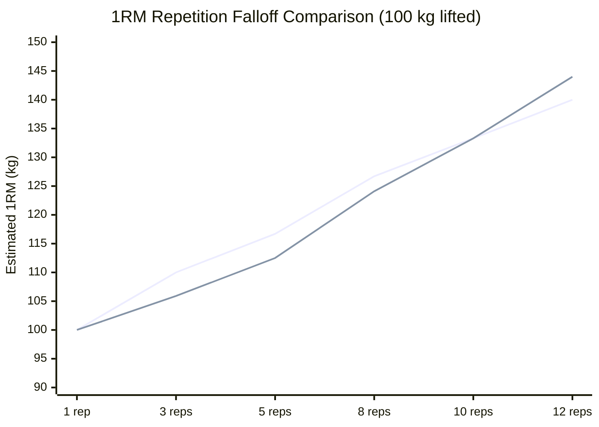

# SPEC-05: Sports Science & Analytics — Detailed Specification

**Module:** Sports Science & Analytics Engine  
**Status:** Ready for Review (Specification Only — No Implementation Yet)  
**Target:** iOS 26+ (Swift 6, SwiftUI, Swift Charts, SwiftData, Swift Testing)  
**Backend Parity:** `AnalyticsRestController.java`, `OneRepMaxFormula.java`, `WorkloadRatioCalculator.java`, `MuscleVolumeCalculator.java` (`foss-training-api`)  

---

## 1. Executive Summary & User Stories

The **Sports Science & Analytics** module delivers evidence-based physiological intelligence to the athlete. By applying established biomechanics and sports medicine algorithms, the engine translates raw gym workout logs into actionable insights: 1RM strength projections, Acute to Chronic Workload Ratios (ACWR) for injury prevention, hypertrophy set volume tracking against landmark thresholds (MEV/MAV/MRV), and exercise progression trajectories.

### User Stories
- **US-05.1 (1RM Estimation Calculator):** As an athlete, I want to input a lifted weight (kg) and rep count to calculate my theoretical 1-Rep Max across 6 canonical scientific formulas (Epley, Brzycki, Lombardi, Mayhew, O'Conner, Wathen) and inspect percentage training tables ($50\%$ to $95\%$).
- **US-05.2 (Personal Record Milestones):** As an athlete, I want automated PR detection that tracks my all-time and recent PRs (Heaviest Weight, Highest Volume, Max Reps, Best Estimated 1RM) per exercise with celebratory gold/silver badges and dates achieved.
- **US-05.3 (ACWR Injury Risk Management):** As an athlete, I want to monitor my 7-day acute workload versus 28-day chronic workload ratio (ACWR) with clear safety zone gauges so that I avoid overreaching spikes and reduce soft-tissue injury risk.
- **US-05.4 (Hypertrophy Volume Tracking):** As an athlete, I want to see my weekly completed sets per muscle group categorized against landmark scientific volume thresholds (Maintenance Volume MV, Minimum Effective Volume MEV, Maximum Adaptive Volume MAV, Maximum Recoverable Volume MRV).
- **US-05.5 (Exercise Progression Trends):** As an athlete, I want to view interactive progression graphs for key compound lifts over time (1, 3, 6, 12 months) showing estimated 1RM growth, volume load, and trend direction.
- **US-05.6 (Heart Rate Zone Distribution):** As an endurance athlete, I want to calculate and view my 5 physiological heart rate training zones using either standard Max HR percentage or the Karvonen Heart Rate Reserve (HRR) formula.
- **US-05.7 (Interactive Swift Charts):** As an athlete, I want fluid, touch-scrubbable native Swift Charts with OLED Pure Black backgrounds and vibrant accent gradients to inspect individual workout data points.

---

## 2. Mathematical Formulations & Scientific Parity

### 2.1 One Repetition Maximum (1RM) Formulas
All outputs must be rounded to 2 decimal places: $\text{round}(raw \times 100.0) / 100.0$. When $\text{reps} == 1$, return $w$ directly without formula distortion.

| Formula | Mathematical Definition | Valid Range & Edge Cases |
|---|---|---|
| **Epley** | $w \times \left(1 + \frac{r}{30}\right)$ | Standard default formula |
| **Brzycki** | $w \times \frac{36}{37 - r}$ | $r < 37$; throws exception or clamps if $r \ge 37$ |
| **Lombardi** | $w \times r^{0.10}$ | Conservative curve for high reps |
| **Mayhew et al.** | $\frac{100 \times w}{52.2 + 41.9 \times e^{-0.055 \times r}}$ | Bench press empirical standard |
| **O'Conner** | $w \times (1 + 0.025 \times r)$ | Linear progression model |
| **Wathen** | $\frac{100 \times w}{48.8 + 53.8 \times e^{-0.075 \times r}}$ | Robust empirical non-linear model |



### 2.2 Acute to Chronic Workload Ratio (ACWR)
Calculates training stress balance and fatigue using Foster's Session-RPE method:

$$\text{Daily Session Workload} = \text{Duration (minutes)} \times \text{Session RPE (1-10)}$$

$$\text{Acute Workload (7d)} = \sum_{t = 0}^{6} \text{Daily Workload}(D - t)$$

$$\text{Chronic Workload (28d)} = \frac{1}{4} \sum_{t = 0}^{27} \text{Daily Workload}(D - t)$$

$$\text{ACWR} = \frac{\text{Acute Workload}}{\text{Chronic Workload}}$$

#### Risk Zone Classifications:
$$\text{ACWR} < 0.80 \implies \textbf{UNDER_TRAINING} \quad \text{(Deconditioning risk)}$$
$$0.80 \le \text{ACWR} < 1.30 \implies \textbf{SWEET_SPOT} \quad \text{(Optimal progression & lowest injury risk)}$$
$$1.30 \le \text{ACWR} < 1.50 \implies \textbf{ELEVATED_RISK} \quad \text{(Fatigue accumulation; monitor)}$$
$$\text{ACWR} \ge 1.50 \implies \textbf{DANGER_ZONE} \quad \text{(High risk of overreaching / soft tissue injury)}$$

### 2.3 Hypertrophy Volume Landmarks (Israetel Model)
Weekly direct hard sets per muscle group ($RPE \ge 7$ or $RIR \le 3$):
- **Below MEV ($< 6$ sets/week):** Sub-stimulative volume, insufficient for growth.
- **Maintenance / MEV ($6 \dots 10$ sets/week):** Preserves or produces baseline gains.
- **Adaptive Range / MAV ($10 \dots 20$ sets/week):** Optimal muscle hypertrophy sweet spot.
- **Approaching MRV ($20 \dots 25$ sets/week):** High fatigue accumulation; monitor recovery.
- **Exceeded MRV ($> 25$ sets/week):** Overreaching; systemic recovery compromised.

---

## 3. Hexagonal Outbound Port Contract

```swift
public protocol AnalyticsRepository: Sendable {
    /// Estimates 1RM across all supported formulas for given weight and reps
    func calculateOneRepMax(weightKg: Double, reps: Int) async throws -> [OneRepMaxEstimate]

    /// Retrieves all-time personal records, optionally filtered by exercise
    func getPersonalRecords(exerciseId: Int?) async throws -> [PersonalRecord]

    /// Calculates Acute to Chronic Workload Ratio as of a reference date
    func calculateAcwr(asOfDate: Date?) async throws -> WorkloadRatio

    /// Calculates weekly direct and indirect set volume grouped by muscle group
    func getWeeklyMuscleVolume(weekStartDate: Date?) async throws -> WeeklyMuscleVolume

    /// Calculates chronological progression history and trend for a specific exercise
    func getExerciseProgression(exerciseId: Int, months: Int) async throws -> ExerciseProgression

    /// Calculates 5-zone heart rate distribution based on resting and max heart rate
    func calculateHeartRateZones(restingHr: Int, maxHr: Int, method: HeartRateZoneMethod) async throws -> HeartRateZones
}
```

---

## 4. Domain Models & Value Objects

```swift
public enum OneRepMaxFormula: String, Codable, CaseIterable, Sendable {
    case epley = "EPLEY"
    case brzycki = "BRZYCKI"
    case lombardi = "LOMBARDI"
    case mayhew = "MAYHEW"
    case oconner = "OCONNER"
    case wathen = "WATHEN"

    public var displayName: String {
        switch self {
        case .epley: return "Epley"
        case .brzycki: return "Brzycki"
        case .lombardi: return "Lombardi"
        case .mayhew: return "Mayhew et al."
        case .oconner: return "O'Conner"
        case .wathen: return "Wathen"
        }
    }
}

public struct OneRepMaxEstimate: Identifiable, Codable, Hashable, Sendable {
    public var id: String { formula.rawValue }
    public let formula: OneRepMaxFormula
    public let estimatedOneRepMax: Double
    public let percentages: [TrainingPercentage]
}

public struct TrainingPercentage: Identifiable, Codable, Hashable, Sendable {
    public var id: Int { percentage }
    public let percentage: Int // e.g. 95, 90, 85...
    public let weightKg: Double
}

public enum AcwrRiskZone: String, Codable, Sendable {
    case underTraining = "UNDER_TRAINING"
    case sweetSpot = "SWEET_SPOT"
    case elevatedRisk = "ELEVATED_RISK"
    case dangerZone = "DANGER_ZONE"

    public var displayName: String {
        switch self {
        case .underTraining: return "Under-training (< 0.8)"
        case .sweetSpot: return "Sweet Spot (0.8 - 1.3)"
        case .elevatedRisk: return "Elevated Risk (1.3 - 1.5)"
        case .dangerZone: return "Danger Zone (≥ 1.5)"
        }
    }
}

public struct DailyWorkload: Identifiable, Codable, Hashable, Sendable {
    public var id: Date { date }
    public let date: Date
    public let workload: Double // duration * RPE
}

public struct WorkloadRatio: Codable, Hashable, Sendable {
    public let acuteWorkload: Double
    public let chronicWorkload: Double
    public let acwrRatio: Double
    public let riskZone: AcwrRiskZone
    public let recommendation: String
    public let dailyWorkloads: [DailyWorkload]
}

public enum HypertrophyVolumeStatus: String, Codable, Sendable {
    case belowMev = "BELOW_MEV"
    case maintenance = "MAINTENANCE"
    case adaptive = "ADAPTIVE"
    case approachingMrv = "APPROACHING_MRV"
    case exceededMrv = "EXCEEDED_MRV"
}

public struct MuscleGroupVolume: Identifiable, Codable, Hashable, Sendable {
    public var id: String { muscleGroup }
    public let muscleGroup: String
    public let directSets: Int
    public let indirectSets: Int
    public let totalSets: Int
    public let status: HypertrophyVolumeStatus
}

public struct WeeklyMuscleVolume: Codable, Hashable, Sendable {
    public let weekStartDate: Date
    public let totalSets: Int
    public let muscleVolumes: [MuscleGroupVolume]
}

public enum ProgressionTrend: String, Codable, Sendable {
    case increasing = "INCREASING"
    case decreasing = "DECREASING"
    case stable = "STABLE"
}

public struct ProgressionDataPoint: Identifiable, Codable, Hashable, Sendable {
    public var id: Date { date }
    public let date: Date
    public let maxWeightKg: Double
    public let estimatedOneRepMax: Double
    public let totalVolumeKg: Double
    public let totalReps: Int
}

public struct ExerciseProgression: Codable, Hashable, Sendable {
    public let exerciseId: Int
    public let exerciseName: String
    public let dataPoints: [ProgressionDataPoint]
    public let trend: ProgressionTrend
    public let percentageChange: Double
}

public struct PersonalRecord: Identifiable, Codable, Hashable, Sendable {
    public var id: String { "\(exerciseId)-\(recordType.rawValue)" }
    public let exerciseId: Int
    public let exerciseName: String
    public let recordType: PRRecordType
    public let value: Double
    public let unit: String
    public let achievedDate: Date
    public let trainingId: Int
}

public enum PRRecordType: String, Codable, Sendable {
    case maxWeight = "MAX_WEIGHT"
    case maxVolume = "MAX_VOLUME"
    case maxEstimated1RM = "MAX_ESTIMATED_1RM"
    case maxReps = "MAX_REPS"
}
```

---

## 5. Dual-Tier Architecture: Local vs. Cloud

### 5.1 Local Offline Execution (`LocalAnalyticsCalculator`)
- **Hermetic Pure Swift Calculators:**
  - `OneRepMaxCalculator.swift`: Calculates all 6 formulas and percentage breakdowns directly on device.
  - `AcwrCalculator.swift`: Queries completed `SDTraining` items from SwiftData in the last 28 days, computes daily session RPE workloads, and evaluates acute/chronic ratios.
  - `MuscleVolumeCalculator.swift`: Iterates completed sets within a target calendar week, groups by exercise primary and secondary muscle groups, and outputs volume landmarks.
  - `PersonalRecordTracker.swift`: Scans historical sets in SwiftData, computes PR values, and persists PR flags.

### 5.2 Premium Cloud Parity (`RemoteAnalyticsRepository`)
- Direct REST invocation of Spring Boot endpoints:
  - `GET /api/analytics/1rm?weightKg=100&reps=5`: Returns 1RM array.
  - `GET /api/analytics/acwr`: Returns ACWR ratio, risk zone, and 28-day workload breakdown.
  - `GET /api/analytics/personal-records`: Returns athlete PRs.
  - `GET /api/analytics/weekly-volume?weekStartDate=YYYY-MM-DD`: Returns muscle group volume landmarks.
  - `GET /api/analytics/progression/{exerciseId}?months=3`: Returns progression timeline data points.

---

## 6. UI / UX Design Specifications & Swift Charts

### 6.1 Analytics Dashboard Hub (`AnalyticsDashboardView`)
- **Segmented Feature Bar:** *Overview*, *1RM Calculator*, *Workload (ACWR)*, *Muscle Volume*, *PR Records*.
- **ACWR Gauge Card:**
  - Radial or linear gauge colored dynamically by risk zone:
    - Green (`.emerald`): Sweet Spot ($0.8 - 1.3$)
    - Blue (`.sky`): Under-training ($< 0.8$)
    - Orange (`.amber`): Elevated Risk ($1.3 - 1.5$)
    - Red (`.rose`): Danger Zone ($\ge 1.5$)
  - Text insight: e.g., *"Workload is optimal (+8% vs chronic avg). Maintain current trajectory."*

### 6.2 Swift Charts Progression Chart (`ExerciseProgressionChart`)
```swift
Chart(progression.dataPoints) { point in
    LineMark(
        x: .value("Date", point.date),
        y: .value("Est 1RM", point.estimatedOneRepMax)
    )
    .interpolationMethod(.catmullRom)
    .foregroundStyle(themeAccentColor.gradient)

    AreaMark(
        x: .value("Date", point.date),
        y: .value("Est 1RM", point.estimatedOneRepMax)
    )
    .foregroundStyle(
        LinearGradient(
            colors: [themeAccentColor.opacity(0.3), .clear],
            startPoint: .top,
            endPoint: .bottom
        )
    )

    PointMark(
        x: .value("Date", point.date),
        y: .value("Est 1RM", point.estimatedOneRepMax)
    )
    .foregroundStyle(themeAccentColor)
}
.chartXAxis { AxisMarks(values: .automatic) }
.chartYAxis { AxisMarks(position: .leading) }
```

### 6.3 1RM Interactive Calculator (`OneRepMaxCalculatorView`)
- **Wheel / Stepper Inputs:** Weight lifted (kg) and Repetitions ($1 \dots 36$).
- **Formula Selector Segment:** Switch between *Epley*, *Brzycki*, or *Average of All*.
- **Training Percentages Table:** Fast grid showing $95\%, 90\%, 85\%, 80\%, 75\%, 70\%, 60\%$ with recommended rep equivalents.

### 6.4 Weekly Hypertrophy Bar Chart (`HypertrophyVolumeChart`)
- Horizontal bar chart with muscle groups on Y-axis and set count on X-axis.
- Target reference lines:
  - Dotted line at $10$ sets (MEV threshold).
  - Dotted line at $20$ sets (MAV ceiling).
- Bars dynamically colored based on `HypertrophyVolumeStatus`.

---

## 7. TDD Test Plan

### 7.1 Mathematical Parity Tests (`OneRepMaxParityTests.swift`)
- [ ] `testEpleyFormula_with100kgAnd10Reps_returns133Point33`
- [ ] `testBrzyckiFormula_with100kgAnd10Reps_returns133Point33`
- [ ] `testBrzyckiFormula_with37Reps_throwsInvalidRepCountError`
- [ ] `testLombardiFormula_with100kgAnd5Reps_returns117Point46`
- [ ] `testSingleRepetition_returnsLiftedWeightExactlyWithoutInflation`

### 7.2 ACWR Workload Tests (`AcwrCalculatorTests.swift`)
- [ ] `testAcwr_withZeroChronicWorkload_handlesDivisionGracefully`
- [ ] `testAcwr_withBalancedWeeklyWorkload_classifiesAsSweetSpot`
- [ ] `testAcwr_withSuddenLoadSpike_classifiesAsDangerZone`
- [ ] `testAcwr_withDeconditionedWeek_classifiesAsUnderTraining`

### 7.3 Hypertrophy Volume Landmark Tests (`MuscleVolumeTests.swift`)
- [ ] `testMuscleVolume_under6Sets_classifiesBelowMev`
- [ ] `testMuscleVolume_between10And20Sets_classifiesAdaptive`
- [ ] `testMuscleVolume_over25Sets_classifiesExceededMrv`

---

## 8. Implementation Checklist

- [ ] **Phase 1 (Domain Models):** Implement `OneRepMaxFormula`, `OneRepMaxEstimate`, `WorkloadRatio`, `AcwrRiskZone`, `WeeklyMuscleVolume`, `ExerciseProgression`, `PersonalRecord`.
- [ ] **Phase 2 (Ports):** Define `AnalyticsRepository` protocol.
- [ ] **Phase 3 (Hermetic Calculators):** Implement `OneRepMaxCalculator`, `AcwrCalculator`, `MuscleVolumeCalculator`, and `PersonalRecordTracker`.
- [ ] **Phase 4 (Local SwiftData Adapter):** Implement `SwiftDataAnalyticsRepository` delegating to local calculators and `ModelContext`.
- [ ] **Phase 5 (Remote REST Adapter):** Implement `RemoteAnalyticsRepository` calling `/api/analytics/*`.
- [ ] **Phase 6 (ViewModels):** Implement `AnalyticsDashboardViewModel`, `OneRepMaxCalculatorViewModel`, `ProgressionChartViewModel`.
- [ ] **Phase 7 (SwiftUI + Swift Charts):** Implement `AnalyticsDashboardView`, `ExerciseProgressionChart`, `OneRepMaxCalculatorView`, `HypertrophyVolumeChart`.
