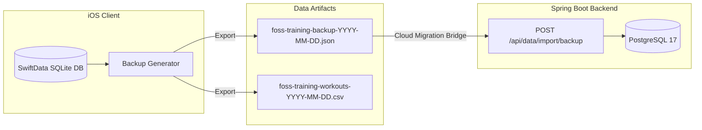

# SPEC-07: Data Sovereignty, Local Backup & Migration Bridge — Detailed Specification

**Module:** Data Sovereignty, Local Backup & Migration Bridge  
**Status:** Ready for Review (Specification Only — No Implementation Yet)  
**Target:** iOS 26+ (Swift 6, SwiftUI, SwiftData, UniformTypeIdentifiers, Swift Testing)  
**Backend Parity:** `DataPortabilityRestController.java`, `FullBackupData.java`, `ExportWorkoutsCsvService.java` (`foss-training-api`)  

---

## 1. Executive Summary & User Stories

The **Data Sovereignty & Migration Bridge** module guarantees that athletes retain 100% ownership and portability of their training data. In adherence to the Free and Open Source Software (FOSS) ethos, users are never locked into a single device or proprietary cloud silo. The iOS app provides complete JSON database backup/restoration identical to the Spring Boot backend schema, tabular CSV export for external spreadsheet analysis, and an automated 1-click cloud sync migration bridge that enables an athlete to transition from pure offline local SwiftData storage to a self-hosted Spring Boot backend.

### User Stories
- **US-07.1 (Full JSON Database Backup):** As an athlete, I want to export my entire local training history (Exercises, Session Templates, Training Programs, Workout Logs with all sets, Bodyweight entries) into a single standard `.json` file that I can store in iCloud Drive, Files, or send via AirDrop.
- **US-07.2 (Database Restore & Conflict Resolution):** As an athlete, I want to import a backup `.json` file into my app with conflict handling options (*Merge / Keep Both*, *Overwrite Existing*, *Skip Existing*), successfully restoring my data whether the backup was generated by another iPhone or exported from the Spring Boot API.
- **US-07.3 (Workout Logs CSV Export):** As an athlete, I want to export my workout history to a spreadsheet-ready `.csv` file formatted with standard column headers so that I can perform custom analysis in Numbers, Excel, or Python/R.
- **US-07.4 (1-Click Cloud Migration Bridge):** As an athlete using the free offline local tier who decides to host their own private server, I want to enter my Spring Boot server URL and tap *"Migrate to Cloud"*, transferring all local SwiftData records to the remote database via `POST /api/data/import/backup` and switching the app into remote client mode without data loss.
- **US-07.5 (Factory Reset / Data Purge):** As an athlete, I want the ability to permanently erase all locally stored data on device with an explicit confirmation modal, honoring total user sovereignty.

---

## 2. Data Schemas & Cross-Platform Parity



### 2.1 Full Backup JSON Schema (`FullBackupData`)
Must conform to exact JSON serialization parity with `FullBackupData.java` and `foss-training-web`:

```json
{
  "exportVersion": "1.0",
  "exportedAt": "2026-10-07T12:00:00Z",
  "exercises": [
    {
      "id": 1,
      "name": "Barbell Back Squat",
      "primaryCategory": "RESISTANCE",
      "isActive": true
    }
  ],
  "sessions": [
    {
      "id": 1,
      "name": "Leg Day Hypertrophy",
      "durationMinutes": 60,
      "sessionExercises": []
    }
  ],
  "programs": [
    {
      "id": 1,
      "name": "12-Week DUP Strength",
      "durationWeeks": 12,
      "periodizationType": "UNDULATING",
      "level": "INTERMEDIATE",
      "workouts": []
    }
  ],
  "trainings": [
    {
      "id": 1,
      "name": "Leg Day Hypertrophy",
      "trainingDate": "2026-10-07",
      "status": "COMPLETED",
      "overallRpe": 8.5
    }
  ],
  "bodyweightEntries": [
    {
      "id": 1,
      "weightKg": 82.4,
      "date": "2026-10-07",
      "notes": "Morning fast"
    }
  ]
}
```

### 2.2 CSV Header Specification
Strict parity with `ExportWorkoutsCsvService.java`:

```csv
training_id,training_date,training_name,training_status,session_rpe,exercise_name,exercise_category,item_number,set_type,weight_kg,reps,set_rpe,distance_m,duration_s,notes
```

---

## 3. Hexagonal Outbound Port Contract

```swift
public protocol DataPortabilityRepository: Sendable {
    /// Generates full JSON backup data aggregate from local storage
    func generateBackup() async throws -> FullBackupData

    /// Restores database entities from full JSON backup snapshot
    func restoreBackup(_ backup: FullBackupData, mode: ImportMode) async throws -> ImportSummary

    /// Generates UTF-8 encoded CSV string of all workout execution history
    func exportWorkoutsCsv() async throws -> String

    /// Imports workout rows from a CSV string
    func importWorkoutsCsv(_ csvContent: String) async throws -> ImportSummary

    /// Transmits local backup payload to remote Spring Boot API and verifies sync
    func migrateToRemoteServer(serverUrl: URL, token: String?) async throws -> ImportSummary

    /// Deletes all local records across all entities
    func purgeLocalDatabase() async throws
}
```

---

## 4. Domain Models & Value Objects

```swift
public enum ImportMode: String, Codable, CaseIterable, Sendable {
    case merge = "MERGE"
    case overwrite = "OVERWRITE"
    case skipExisting = "SKIP_EXISTING"

    public var displayName: String {
        switch self {
        case .merge: return "Merge (Keep Both)"
        case .overwrite: return "Overwrite Existing"
        case .skipExisting: return "Skip Existing"
        }
    }
}

public struct FullBackupData: Codable, Sendable {
    public var exportVersion: String = "1.0"
    public var exportedAt: Date = Date()
    public var exercises: [Exercise] = []
    public var sessions: [Session] = []
    public var programs: [TrainingProgram] = []
    public var trainings: [Training] = []
    public var bodyweightEntries: [BodyweightEntry] = []
}

public struct ImportSummary: Codable, Hashable, Sendable {
    public let exercisesImported: Int
    public let sessionsImported: Int
    public let programsImported: Int
    public let trainingsImported: Int
    public let bodyweightImported: Int

    public var totalImported: Int {
        exercisesImported + sessionsImported + programsImported + trainingsImported + bodyweightImported
    }
}
```

---

## 5. Dual-Tier Persistence Architecture

### 5.1 Local SwiftData Implementation (`SwiftDataPortabilityRepository`)
- **Export Workflow:**
  1. Queries all `SDExercise`, `SDSession`, `SDTrainingProgram`, `SDTraining`, and `SDBodyweightEntry` records in the `ModelContext`.
  2. Maps each SwiftData model to its pure domain entity representation.
  3. Packages into `FullBackupData`.
  4. Encodes using `JSONEncoder` with `.prettyPrinted` and `.iso8601` date formatting.
- **Import Workflow:**
  1. Decodes incoming data.
  2. Iterates each aggregate with the chosen `ImportMode`:
     - If `OVERWRITE`: Deletes matching IDs or matches by name before inserting.
     - If `MERGE`: Generates new auto-increment IDs for collisions.
     - If `SKIP_EXISTING`: Checks primary keys and skips existing entries.
  3. Saves the `ModelContext`.
- **CSV Workflow:**
  - Iterates completed `SDTraining` and child sets, formatting rows matching `CSV_HEADER` with CSV escape rules (quoting strings containing commas or quotes).

### 5.2 Remote REST Parity (`RemotePortabilityRepository`)
- Direct invocation of Spring Boot endpoints:
  - `GET /api/data/export/backup`: Downloads full backup JSON.
  - `GET /api/data/export/workouts.csv`: Downloads CSV string.
  - `POST /api/data/import/backup`: Restores database on remote server.
  - `POST /api/data/import/workouts.csv`: Uploads CSV logs to server.

---

## 6. UI / UX Design Specifications

### 6.1 Data Sovereignty Hub (`DataPortabilityView`)
- **Export Section:**
  - *"Full JSON Database Backup"*: Button triggering native iOS `.fileExporter` with default filename `foss-training-backup-YYYY-MM-DD.json` (UTType `.json`).
  - *"Export Workouts as CSV"*: Button triggering `.fileExporter` with default filename `foss-training-workouts-YYYY-MM-DD.csv` (UTType `.commaSeparatedText`).
- **Import / Restore Section:**
  - *"Restore from JSON Backup"*: Triggers `.fileImporter`.
  - On file selection: Opens `ImportConflictModal` allowing selection between *Merge*, *Overwrite*, or *Skip Existing*.
  - Success banner showing `ImportSummary` chips: `X exercises, Y sessions, Z workouts restored`.
- **Cloud Migration Bridge Section:**
  - Glassmorphic card explaining: *"Migrate local data to a self-hosted Spring Boot backend"*.
  - Input fields: `Server Base URL` (e.g. `https://training.example.com`), `API Key` (optional).
  - Test Connection ping button.
  - Primary button: *"Transfer All Data & Switch to Cloud"*.
- **Danger Zone Section:**
  - Red outlined button: *"Erase All Local Data"*.
  - Secondary confirmation dialog requiring typing `"DELETE"` or double-tap confirmation.

---

## 7. TDD Test Plan

### 7.1 JSON Backup Serialization & Roundtrip (`BackupRoundtripTests.swift`)
- [ ] `testBackupSerialization_containsAll5Aggregates`
- [ ] `testBackupDeserialization_matchesOriginalDomainModels`
- [ ] `testBackupImport_withMergeMode_handlesDuplicateIdsGracefully`
- [ ] `testBackupImport_withOverwriteMode_replacesExistingEntities`
- [ ] `testBackupImport_withSkipMode_preservesLocalData`

### 7.2 CSV Format & Escaping Tests (`WorkoutsCsvExportTests.swift`)
- [ ] `testCsvExport_headerMatchesBackendStandardExactly`
- [ ] `testCsvExport_escapesQuotesAndCommasInExerciseNames`
- [ ] `testCsvExport_handlesEmptyWorkoutsWithoutExercises`

### 7.3 Cloud Migration Bridge Tests (`MigrationBridgeTests.swift`)
- [ ] `testMigrateToRemoteServer_serializesLocalDataAndPushesToEndpoint`
- [ ] `testMigrateToRemoteServer_onNetworkFailure_abortsWithoutPurgingLocalData`

---

## 8. Implementation Checklist

- [ ] **Phase 1 (Domain Models & Types):** Define `FullBackupData`, `ImportSummary`, `ImportMode`.
- [ ] **Phase 2 (Ports):** Define `DataPortabilityRepository` protocol.
- [ ] **Phase 3 (SwiftData Serialization):** Implement `SwiftDataPortabilityRepository` with JSON export/import and CSV generator.
- [ ] **Phase 4 (Remote REST Adapter):** Implement `RemotePortabilityRepository` calling `/api/data/*`.
- [ ] **Phase 5 (Migration Engine):** Implement `CloudMigrationCoordinator` managing the transfer handshake.
- [ ] **Phase 6 (ViewModels):** Implement `DataPortabilityViewModel`.
- [ ] **Phase 7 (SwiftUI Views):** Implement `DataPortabilityView`, `.fileExporter`, `.fileImporter`, and `ImportConflictModal`.
