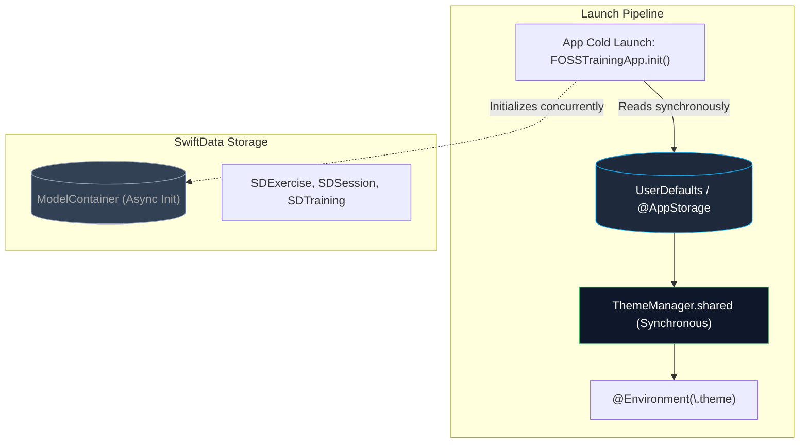

# SPEC-08: Theming, Settings & Ecosystem — Detailed Specification

**Module:** Theming, Settings & Apple Ecosystem Integration  
**Status:** Ready for Review (Specification Only — No Implementation Yet)  
**Target:** iOS 26+ (Swift 6, SwiftUI, UserDefaults, AudioToolbox, Swift Testing)  
**Architectural Invariant:** Theme tokens stored strictly in `UserDefaults`, **never** in SwiftData (zero-flash guarantee)  

---

## 1. Executive Summary & User Stories

The **Theming, Settings & Ecosystem** module controls user personalization, hardware tactile ergonomics, and infrastructure connectivity across the iOS companion app. It implements an instantaneous dark-gym UI design system featuring curated neon accent colors, battery-preserving OLED Pure Black (`#000000`) surfaces, low-latency haptic sensations, audio countdown cues, and runtime switching between offline SwiftData and remote Spring Boot infrastructure.

### User Stories
- **US-08.1 (Accent Color Personalization):** As an athlete, I want to choose my preferred gym accent color (*Volt Lime*, *Amber Blaze*, *Electric Blue*, *Crimson Pulse*, *Cyber Violet*, *Titanium*) with immediate live preview across all cards, charts, and buttons.
- **US-08.2 (OLED Pure Black & Surface Styles):** As an athlete training in dim gyms or preserving battery on long sessions, I want an *OLED Pure Black* mode that turns background pixels completely off, alongside *Charcoal Slate* and *System Adaptive* modes.
- **US-08.3 (Zero-Flash Instant Launch):** As an athlete, I want my selected theme to apply synchronously at cold app launch without visual flashing or database query delays.
- **US-08.4 (Sensory Tactile Haptics):** As an athlete wearing lifting gloves, I want customizable haptic feedback (*Disabled*, *Subtle*, *Crisp*, *Heavy*) on set logging and rest timer expiration so that I feel workout progression without constantly watching the screen.
- **US-08.5 (Rest Timer Audio Cues):** As an athlete listening to music with headphones, I want an optional gentle chime or system sound when rest concludes so that I know exactly when to start my next set.
- **US-08.6 (Connection Tier & Server Settings):** As an athlete, I want a settings panel to toggle between *Local Offline (SwiftData)* and *Self-Hosted Cloud (Spring Boot)*, configuring my backend URL (`http://localhost:8080` or custom domain) with real-time ping verification.
- **US-08.7 (Units & Preferences):** As an athlete, I want to configure default weight units (kg vs lbs) and distance units (meters vs km vs miles).
- **US-08.8 (Dynamic App Icon):** As an athlete, I want the home screen app icon to match my selected theme accent color via alternate app icons.

---

## 2. Architectural Invariants & Storage Guarantees



### 2.1 Theming Invariant: Zero-Flash Isolation
> [!IMPORTANT]
> Theme configuration (`AppAccentColor`, `SurfaceStyle`, `hapticsEnabled`) **must never** be stored in SwiftData. SwiftData requires asynchronous container initialization and context verification, which causes a noticeable 100-300ms visual theme flicker on app startup. All theme tokens are stored synchronously in `UserDefaults` via `ThemeManager`, guaranteeing zero theme flash.

### 2.2 Strict Concurrency & MainActor Isolation
- `ThemeManager` is marked `@Observable` and isolated to `@MainActor` for UI bindings, or conforms to `@unchecked Sendable` with thread-safe `UserDefaults` backed properties.
- Environment injection uses Swift 6 `@Entry public var theme: ThemeManager = .shared`.

---

## 3. Settings & Infrastructure Contract

```swift
public enum AppConnectionMode: String, Codable, CaseIterable, Sendable {
    case localOffline = "LOCAL_OFFLINE"
    case remoteCloud = "REMOTE_CLOUD"

    public var displayName: String {
        switch self {
        case .localOffline: return "Local-First (100% Offline)"
        case .remoteCloud: return "Connected (Spring Boot API)"
        }
    }
}

public protocol SettingsRepository: Sendable {
    func getConnectionMode() -> AppConnectionMode
    func setConnectionMode(_ mode: AppConnectionMode)
    func getRemoteServerUrl() -> URL?
    func setRemoteServerUrl(_ url: URL?)
    func getApiKey() -> String?
    func setApiKey(_ key: String?)
    func pingRemoteServer(url: URL) async -> Bool
}
```

---

## 4. Theme & Settings Value Objects

```swift
public enum AppAccentColor: String, CaseIterable, Identifiable, Sendable {
    case volt = "Volt Lime"
    case amber = "Amber Blaze"
    case electricBlue = "Electric Blue"
    case crimson = "Crimson Pulse"
    case violet = "Cyber Violet"
    case monochrome = "Titanium"

    public var id: String { rawValue }

    public var color: Color {
        switch self {
        case .volt: return Color(red: 0.80, green: 0.98, blue: 0.0) // #CCFA00
        case .amber: return Color(red: 1.00, green: 0.58, blue: 0.0) // #FF9400
        case .electricBlue: return Color(red: 0.04, green: 0.52, blue: 1.0) // #0A84FF
        case .crimson: return Color(red: 1.00, green: 0.18, blue: 0.33) // #FF2D55
        case .violet: return Color(red: 0.69, green: 0.32, blue: 0.87) // #AF52DE
        case .monochrome: return Color(red: 0.92, green: 0.92, blue: 0.94) // Titanium
        }
    }

    public var glowColor: Color {
        color.opacity(0.35)
    }
}

public enum SurfaceStyle: String, CaseIterable, Identifiable, Sendable {
    case oledBlack = "OLED Pure Black"
    case charcoal = "Charcoal Slate"
    case systemAdaptive = "System Adaptive"

    public var id: String { rawValue }

    public var backgroundColor: Color {
        switch self {
        case .oledBlack: return Color.black
        case .charcoal: return Color(red: 0.09, green: 0.09, blue: 0.11)
        case .systemAdaptive: return Color(uiColor: .systemGroupedBackground)
        }
    }

    public var cardBackgroundColor: Color {
        switch self {
        case .oledBlack: return Color(red: 0.08, green: 0.08, blue: 0.09)
        case .charcoal: return Color(red: 0.14, green: 0.14, blue: 0.16)
        case .systemAdaptive: return Color(uiColor: .secondarySystemGroupedBackground)
        }
    }
}

public enum HapticIntensity: String, CaseIterable, Identifiable, Sendable {
    case disabled = "Disabled"
    case subtle = "Subtle"
    case crisp = "Crisp"
    case heavy = "Heavy"

    public var id: String { rawValue }
}
```

---

## 5. Sensory Feedback Engine (Haptics & Audio)

### 5.1 Tactile Haptic System (`HapticManager`)
```swift
@MainActor
public final class HapticManager {
    public static let shared = HapticManager()

    private let lightImpact = UIImpactFeedbackGenerator(style: .light)
    private let mediumImpact = UIImpactFeedbackGenerator(style: .medium)
    private let heavyImpact = UIImpactFeedbackGenerator(style: .heavy)
    private let notificationFeedback = UINotificationFeedbackGenerator()

    public func setCompleted() {
        guard ThemeManager.shared.hapticsEnabled else { return }
        mediumImpact.prepare()
        mediumImpact.impactOccurred()
    }

    public func restTimerExpired() {
        guard ThemeManager.shared.hapticsEnabled else { return }
        notificationFeedback.prepare()
        notificationFeedback.notificationOccurred(.success)
    }

    public func dangerAlert() {
        guard ThemeManager.shared.hapticsEnabled else { return }
        notificationFeedback.prepare()
        notificationFeedback.notificationOccurred(.error)
    }
}
```

### 5.2 Audio Chime System (`SoundManager`)
- Plays system sound ID `1057` or custom synthesized chime when rest timer concludes.
- Checks user setting `soundEffectsEnabled` in `UserDefaults`.
- Respects iOS Mute / Silent switch automatically.

---

## 6. UI / UX Design Specifications

### 6.1 Settings Hub (`SettingsView`)
- **Appearance & Theme Section:**
  - Accent Color Palette: Horizontal row of circular color swatches with active selection ring.
  - Surface Style: 3-way segmented picker (*OLED Black*, *Charcoal*, *System*).
  - App Icon: Grid of alternate app icons previewing accent variations.
- **Gym Ergonomics Section:**
  - Haptic Feedback Toggle and Intensity selector.
  - Rest Timer Audio Cues toggle.
  - Keep Screen Awake while workout is active (`UIApplication.shared.isIdleTimerDisabled`).
- **Data & Connectivity Section:**
  - Connection Mode picker (*Local Offline* vs *Self-Hosted Cloud*).
  - Backend Server Configuration sheet (URL, API Key, Ping test indicator).
  - Data Sovereignty link to `DataPortabilityView` (Export JSON, Export CSV).
- **About & Open Source Section:**
  - Version & Build display.
  - Open source licenses (GPL / MIT).
  - GitHub repository link.

---

## 7. TDD Test Plan

### 7.1 ThemeManager Synchronous Persistence Tests (`ThemeManagerTests.swift`)
- [ ] `testThemeManager_defaultAccent_isVoltLime`
- [ ] `testThemeManager_setAccent_persistsToUserDefaultsSynchronously`
- [ ] `testThemeManager_setSurface_persistsToUserDefaultsSynchronously`
- [ ] `testThemeManager_hapticsToggle_persistsToUserDefaults`

### 7.2 Connection Mode & Server Verification Tests (`SettingsRepositoryTests.swift`)
- [ ] `testSettingsRepository_switchMode_updatesAppEnvironment`
- [ ] `testSettingsRepository_pingInvalidUrl_returnsFalse`
- [ ] `testSettingsRepository_saveServerUrl_formatsProperly`

---

## 8. Implementation Checklist

- [ ] **Phase 1 (Theme Tokens):** Verify and extend `AppAccentColor`, `SurfaceStyle`, `HapticIntensity`.
- [ ] **Phase 2 (Managers):** Implement `HapticManager` and `SoundManager`.
- [ ] **Phase 3 (Settings Repository):** Implement `UserDefaultsSettingsRepository`.
- [ ] **Phase 4 (ViewModels):** Implement `SettingsViewModel`.
- [ ] **Phase 5 (SwiftUI Views):** Implement `SettingsView`, `AccentColorPicker`, `ServerConfigurationSheet`.
- [ ] **Phase 6 (Alternate Icons):** Configure asset catalog with alternate icon sets and wire `UIApplication.setAlternateIconName`.
