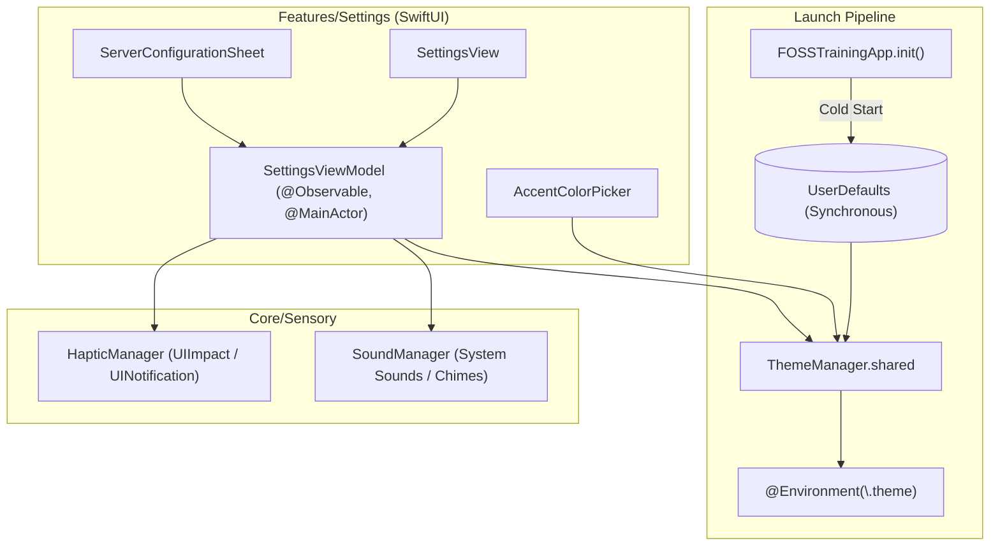

# Implementation Plan: SPEC-08 — Theming, Settings & Ecosystem

**Module:** `SPEC-08_THEMING_AND_SETTINGS`  
**Status:** Completed  
**Target:** iOS 26+ (Swift 6, SwiftUI, UserDefaults, AudioToolbox, Swift Testing)  
**Spec Document:** [SPEC-08_THEMING_AND_SETTINGS.md](../SPEC-08_THEMING_AND_SETTINGS.md)  

---

## 1. Architectural Approach & Boundaries

### Architectural Invariants
1. **Zero-Flash Launch Guarantee:** Theme values (`AppAccentColor`, `SurfaceStyle`, `hapticsEnabled`) **must never** be stored in SwiftData. They are persisted in `UserDefaults` via `ThemeManager`, ensuring synchronous initialization during `App.init()`.
2. **Swift 6 Strict Concurrency:** `ThemeManager` is `@Observable` and isolated to `@MainActor` for UI bindings, or conforms to `@unchecked Sendable` with thread-safe property access.
3. **Sensory Isolation:** Haptics and sound engines respect user toggles and iOS system preferences (Silent Mode / Low Power Mode).

---

## 2. Data Contracts & State Management

### 2.1 Theme Tokens
- `AppAccentColor`: Raw values for 6 gym accent colors (`volt`, `amber`, `electricBlue`, `crimson`, `violet`, `monochrome`).
- `SurfaceStyle`: Background and card surfaces (`oledBlack`, `charcoal`, `systemAdaptive`).
- `HapticIntensity`: (`disabled`, `subtle`, `crisp`, `heavy`).

### 2.2 Connection Mode
- `AppConnectionMode`: `localOffline` (pure SwiftData) vs `remoteCloud` (Spring Boot API).

---

## 3. Files to Create / Modify

### Core & Sensory
- `FOSSTraining/Core/Theme/ThemeManager.swift` (Already present; verify UserDefaults bindings)
- `FOSSTraining/Core/Theme/AppAccentColor.swift`
- `FOSSTraining/Core/Theme/SurfaceStyle.swift`
- `FOSSTraining/Core/Theme/ViewModifiers+Theme.swift`
- `FOSSTraining/Core/Sensory/HapticManager.swift`
- `FOSSTraining/Core/Sensory/SoundManager.swift`

### Features & Presentation
- `FOSSTraining/Features/Settings/ViewModels/SettingsViewModel.swift`
- `FOSSTraining/Features/Settings/Views/SettingsView.swift`
- `FOSSTraining/Features/Settings/Views/AccentColorPicker.swift`
- `FOSSTraining/Features/Settings/Views/ServerConfigurationSheet.swift`

### Test Target (`FOSSTrainingTests/`)
- `FOSSTrainingTests/Core/ThemeManagerTests.swift`
- `FOSSTrainingTests/Features/SettingsViewModelTests.swift`

---

## 4. Testing Strategy

1. **Synchronous Persistence Tests:** Verify changing `selectedAccent` and `surfaceStyle` writes immediately to `UserDefaults.standard` without delay.
2. **Settings ViewModel Tests:** Verify connection ping testing and operating tier switching update app environment state cleanly.
