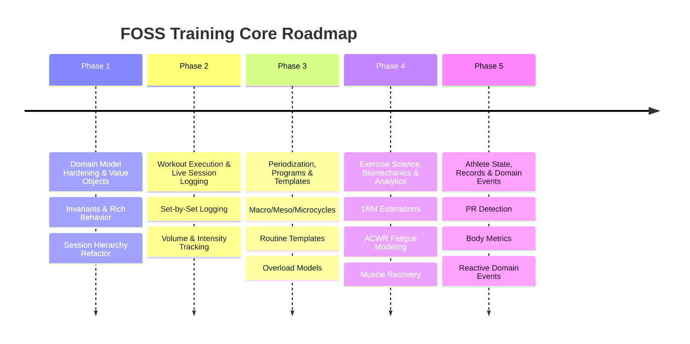
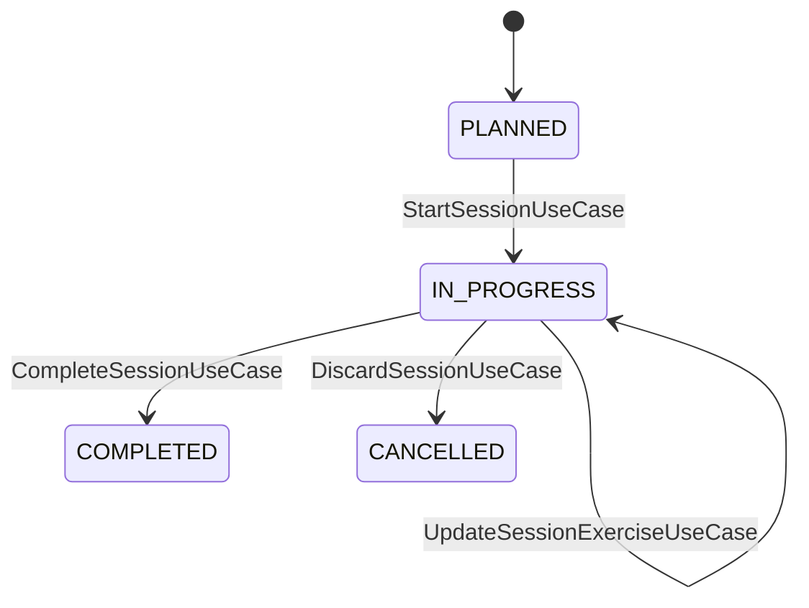
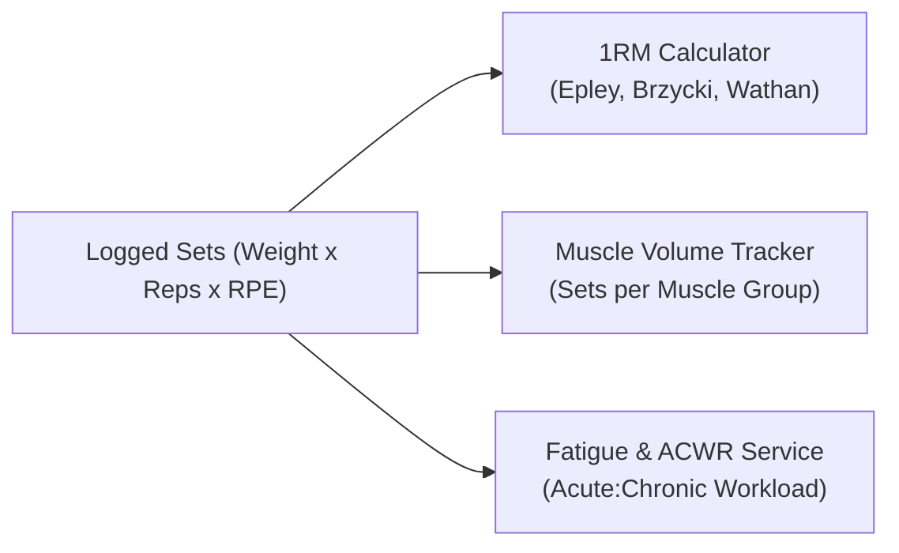

# Domain & Application Layer Roadmap: FOSS Training API

## Vision
To build a scientifically rigorous, extensible, and clean **Domain and Application core** for physical training management. The core will support multi-disciplinary training (Resistance, Endurance, Mobility), intelligent workout tracking, periodized training plans, and biomechanical analytics—entirely free of database and web framework dependencies.

---

## Roadmap Overview



---

## Phase 1: Domain Hardening, Value Objects & Rich Entities

**Goal**: Transform anemic data models into rich DDD aggregates with encapsulated state and validation invariants.

### 1.1 First-Class Value Objects (Domain Layer)
Extract primitive types into immutable, self-validating Value Objects:
* `Weight`: Encapsulates value + unit (`KG`, `LBS`) with built-in conversion (`weight.toKg()`, `weight.toLbs()`).
* `Distance`: Encapsulates distance (`METERS`, `KM`, `MILES`) with unit conversions.
* `Duration`: Time span in seconds/minutes with formatted display helpers.
* `Pace`: Time per unit distance (e.g., `4:30 min/km`).
* `Rpe`: Rate of Perceived Exertion (1.0 to 10.0 scale) and Reps in Reserve (`RIR`).
* `Tempo`: Parser and validator for eccentric-pause-concentric-pause cadences (e.g., `"3-1-1-0"`).
* `HeartRateZone`: Enum + VO for Zones 1–5 based on % HRmax / Lactate Threshold.

### 1.2 Fix Structural Flaws in Existing Models
* **Refactor `SessionExercise`**:
  * Implement clean polymorphism: `SessionExercise` (base) extended by `ResistanceSessionExercise`, `EnduranceSessionExercise`, `MobilitySessionExercise` (or a dedicated Set-based composition model).
* **Reposition `MovementPattern`**: Move from `model/exercise/mobility` to `model/exercise/common` or `model/exercise/resistance`.
* **Clean or Remove Empty Stubs**: Flesh out or remove [`Training.java`](file:///home/deivision/Projects/Programming/Spring/foss-training/foss-training-api/src/main/java/com/david13penalver/foss_training_api/domain/model/training/Training.java).

### 1.3 Add Rich Invariants to Entities
* Move validation rules into domain entities:
  * `Exercise`: Disallow negative rest times, enforce matching metrics with primary category, require valid instructions.
  * Factory methods: `Exercise.create(...)` with mandatory parameters.

---

## Phase 2: Workout Execution & Session Tracking

**Goal**: Implement the core session lifecycle and set-by-set logging use cases.



### 2.1 Session Aggregate Modeling (`domain/model/session/`)
* **`TrainingSession`**: Root Aggregate.
  * Fields: `id`, `name`, `startTime`, `endTime`, `status`, `notes`, `rpe`, `sessionParts`.
  * Business Methods: `session.start()`, `session.complete()`, `session.calculateDuration()`, `session.calculateTotalVolume()`.
* **`ExerciseSet` (Resistance)**:
  * Types: `WARMUP`, `WORKING`, `DROP_SET`, `MYOREP`, `FAILURE`.
  * Fields: `setNumber`, `weight`, `reps`, `targetReps`, `rpe`, `rir`, `restSecondsTaken`.
* **`EnduranceInterval` (Cardio)**:
  * Fields: `intervalNumber`, `distance`, `duration`, `avgHeartRate`, `avgPace`, `avgPower`, `cadence`.
* **`MobilitySet` (Flexibility)**:
  * Fields: `holdDuration`, `repetitions`, `bilateralSide` (`LEFT`, `RIGHT`, `BOTH`).

### 2.2 Application Use Cases (`application/usecases/session/`)
* `CreatePlannedSessionUseCase` / `CreatePlannedSessionService`
* `StartSessionUseCase` / `StartSessionService`
* `LogResistanceSetUseCase` / `LogResistanceSetService`
* `LogEnduranceIntervalUseCase` / `LogEnduranceIntervalService`
* `CompleteSessionUseCase` / `CompleteSessionService`
* `GetSessionSummaryUseCase` / `GetSessionSummaryService` (calculating total volume, sets, reps, elapsed time).

---

## Phase 3: Periodization, Training Plans & Workout Templates

**Goal**: Model structured long-term training programs, periodization cycles, and reusable workout templates.

```
domain/model/plan/
├── TrainingProgram       # 8-12 week overall program
├── Mesocycle             # 3-6 week block (Hypertrophy, Strength, Peaking, Deload)
├── Microcycle            # 1-week training schedule
├── WorkoutTemplate       # Reusable template (e.g. "Push Day A", "Upper Power")
└── ProgressionModel      # Linear progression, RPE-based auto-regulation, Wave loading
```

### 3.1 Domain Models
* **`WorkoutTemplate`**: Blueprint containing exercises, target rep ranges, prescribed RPE/percentages, and rest times.
* **`TrainingProgram`**: Hierarchical container: Program $\rightarrow$ Mesocycles $\rightarrow$ Microcycles $\rightarrow$ Planned Sessions.
* **`PeriodizationType`**: Enum (`LINEAR`, `UNDULATING_DAILY`, `UNDULATING_WEEKLY`, `BLOCK`).

### 3.2 Application Use Cases (`application/usecases/plan/`)
* `CreateWorkoutTemplateUseCase` / `CreateWorkoutTemplateService`
* `GenerateSessionFromTemplateUseCase` / `GenerateSessionFromTemplateService` (creates a live session pre-populated from a template).
* `CreateTrainingProgramUseCase` / `CreateTrainingProgramService`
* `ActivateUserProgramUseCase` / `ActivateUserProgramService`
* `CalculateProgramAdherenceUseCase` / `CalculateProgramAdherenceService` (compares planned vs actual logged sessions).

---

## Phase 4: Exercise Science, Biomechanics & Progression Analytics

**Goal**: Provide evidence-based sports science calculations and progress tracking.



### 4.1 Pure Domain Services (`domain/services/`)
* **`OneRepMaxCalculator`**:
  * Calculates estimated 1RM using standard formulas (Epley: $w \times (1 + r/30)$, Brzycki: $w \times (36 / (37 - r))$).
  * Generates percentage-based training loads (e.g., 70%, 80%, 85% of 1RM).
* **`MuscleVolumeAggregator`**:
  * Counts weekly "direct" and "indirect" working sets per muscle group (identifying under-trained or over-trained muscles vs. 10–20 weekly sets baseline).
* **`WorkloadRatioCalculator` (ACWR)**:
  * Computes Acute Workload (last 7 days) vs Chronic Workload (last 28 days) to flag overtraining injury risk ($ACWR > 1.5$).
* **`CardioZoneCalculator`**:
  * Karvonen heart rate reserve calculation: $HR_{target} = HR_{rest} + \% \times (HR_{max} - HR_{rest})$.

### 4.2 Application Use Cases (`application/usecases/analytics/`)
* `CalculateEstimated1RMUseCase`
* `GetWeeklyMuscleGroupVolumeUseCase`
* `CalculateFatigueScoreUseCase`
* `GetProgressionHistoryUseCase` (e.g. strength progression over time for Bench Press).

---

## Phase 5: Athlete Profile, Personal Records & Domain Events

**Goal**: Track athlete metrics, detect milestones, and publish domain events for reactive features.

### 5.1 Domain Models & Aggregates
* **`AthleteProfile`**: Bodyweight history, height, estimated body fat %, resting HR, max HR.
* **`PersonalRecord` (PR)**:
  * Types: `ESTIMATED_1RM`, `MAX_WEIGHT_AT_REPS`, `MAX_VOLUME_SESSION`, `FASTEST_DISTANCE`.
  * Fields: `exerciseId`, `recordType`, `value`, `achievedAt`, `sessionExerciseId`.

### 5.2 Domain Events (`domain/events/`)
Pure Java event objects emitted during state changes:
* `SessionCompletedEvent`: Contains session stats and exercises performed.
* `PersonalRecordAchievedEvent`: Triggered when a new PR is broken.
* `DeloadRecommendedEvent`: Triggered when volume/fatigue thresholds indicate overreaching.

### 5.3 Application Use Cases
* `DetectPersonalRecordsUseCase` (evaluates completed session against historical records).
* `UpdateAthleteProfileUseCase` / `LogBodyweightUseCase`.
* `GetPersonalRecordsByExerciseUseCase`.

---

## Suggested Implementation Sequence

| Priority | Feature Area | Key Deliverables | Effort |
|:---:|---|---|:---:|
| **Step 1** | **Phase 1: Domain Hardening** | `Weight`, `Duration`, `Pace`, `Rpe` value objects + `SessionExercise` hierarchy fix | Low |
| **Step 2** | **Phase 2: Session Logging** | `TrainingSession`, `ExerciseSet`, `StartSessionUseCase`, `LogSetUseCase`, `CompleteSessionUseCase` | Medium |
| **Step 3** | **Phase 4.1: 1RM & Volume** | `OneRepMaxCalculator` and `MuscleVolumeAggregator` domain services | Low |
| **Step 4** | **Phase 3: Templates & Plans** | `WorkoutTemplate`, `GenerateSessionFromTemplateUseCase` | Medium |
| **Step 5** | **Phase 5: PRs & Events** | `PersonalRecord` entity, `DetectPersonalRecordsUseCase`, domain events | Medium |
| **Step 6** | **Phase 3 & 4: Periodization** | Mesocycles, Microcycles, ACWR fatigue calculator | High |
